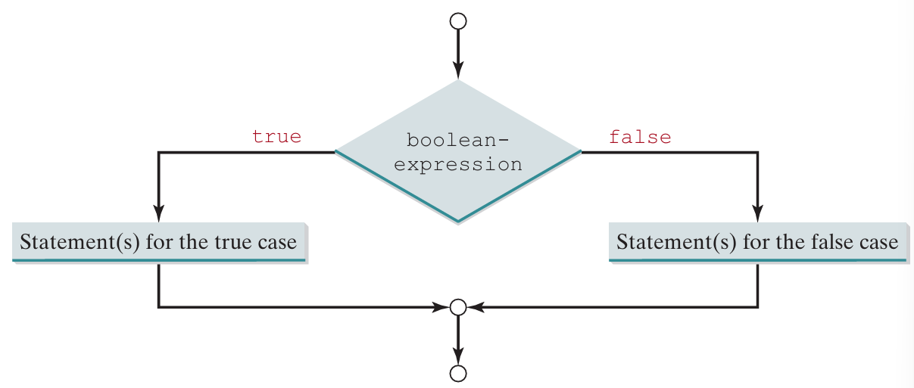
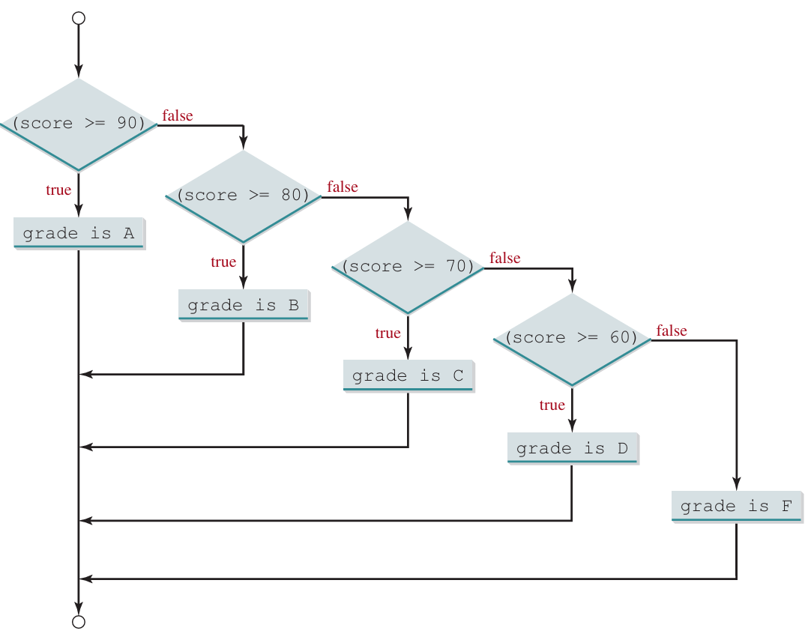
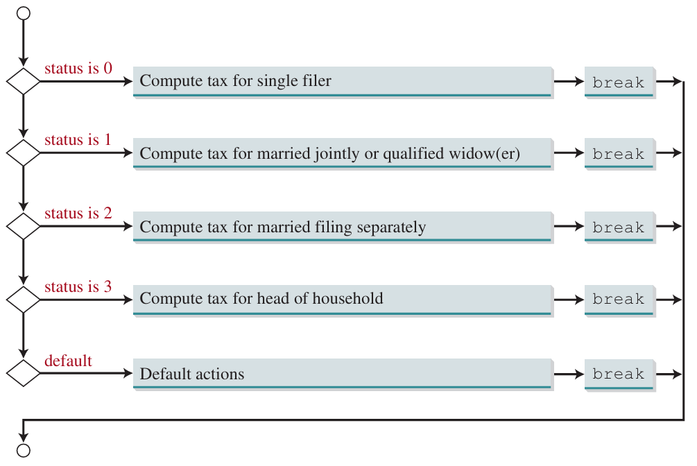

# Chapter 3: <br> Selection

---

## 3.1. Introduction

---

**Selection statements** are used to make decisions in a program based on certain conditions. They allow the program to choose between different paths of execution based on the evaluation of a boolean expression.

---

### Types of Selection Statements

- **if Statement**: Executes a block of code if a specified condition is true.
- **if-else Statement**: Executes one block of code if a condition is true, and another block if it is false.
- **switch Statement**: Allows a variable to be tested for equality against a list of values, each with its own block of code.
- **Conditional Operator (`?:`)**: A shorthand for `if-else` that returns one of two values based on a condition.

---

### Advantages

- **Control Flow Management**: Selection statements allow for better control over the flow of a program, enabling it to make decisions and execute different code paths based on conditions.
- **Readability**: They improve the readability of the code by clearly defining the conditions under which certain blocks of code will be executed.
- **Maintainability**: By using selection statements, code becomes easier to maintain and update, as changes to the decision-making logic can be made in one place.

---

- **Flexibility**: They provide flexibility in programming, allowing for complex decision-making processes and the ability to handle various scenarios.
- **Error Handling**: Selection statements can be used to handle errors and exceptional cases gracefully, ensuring the program behaves correctly under different conditions.
- **Efficiency**: They can improve the efficiency of a program by avoiding unnecessary computations and executing only the relevant code blocks.

---

## 3.2. boolean: <br> Data Type, Values, and Expressions

---

### Boolean Data Type

The boolean data type in Java is used to declare variables that can hold one of two values: `true` or `false`. These values are not keywords but are considered reserved words and cannot be used as identifiers.

---

### Relational Operators

**Relational operators** are used to compare two values. The result of a relational operation is a boolean value (`true` or `false`).

- **`<` (Less than)**: Checks if the value on the left is less than the value on the right.
- **`<=` (Less than or equal to)**: Checks if the value on the left is less than or equal to the value on the right.
- **`>` (Greater than)**: Checks if the value on the left is greater than the value on the right.

---

- **`>=` (Greater than or equal to)**: Checks if the value on the left is greater than or equal to the value on the right.
- **`==` (Equal to)**: Checks if the value on the left is equal to the value on the right.
- **`!=` (Not equal to)**: Checks if the value on the left is not equal to the value on the right.

---

### Boolean Variables

**Boolean variables** is a variable that holds a boolean value.

**Example**:

```java
boolean isRaining = true;
boolean isSunny = false;
```

---

### Boolean Expressions

**Boolean expression** is an expression that results in a boolean value (`true` or `false`).

**Example**:

```java
int x = 5;
int y = 3;
boolean result = x > y; // Evaluates to true
```

---

## 3.3. One-Way If Statements

---

**The `if` statement** is used to execute a block of code if a specified condition is true.

**Syntax**:

```java
if (boolean-expression) {
  // statement(s)
}
```

**Note:** If the `boolean-expression` is true, the statement(s) inside the if block are executed.

---

### Flowchart for One-Way If Statements


---

- A flowchart is used to describe the decision-making process of an if statement.
- The decision is represented as a diamond shape, and the flow of control is shown with arrows.

**Example**:

```java
if (radius >= 0) {
  area = radius * radius * PI;
  System.out.println("The area for the circle of radius "
    + radius + " is " + area);
}
```

**Note:** If the `radius` is greater than or equal to 0, the program calculates and displays the area.

---

### Common Mistakes

- Forgetting to include parentheses around the boolean expression.
- Misplacing the braces which group multiple statements inside the if block.

---

**Example**: Forgetting Parentheses

- Incorrect:

```java
if i > 0 {
  System.out.println("i is positive");
}
```

- Correct:

```java
if (i > 0) {
  System.out.println("i is positive");
}
```

---

**Example**: Misplacing Braces

- Not Realiable:

```java
if (i > 0)
  System.out.println("i is positive");
  System.out.println("i is integer");
```

- Realiable:

```java
if (i > 0) {
  System.out.println("i is positive");
  System.out.println("i is integer");
}
```

---

### Simplifying Code

**Braces** can be omitted if the if block contains only one statement.

**Example**: Simplified if statement

```java
if (i > 0)
  System.out.println("i is positive");
```

---

## 3.4. Two-Way if-else Statements

---

- **The `if-else` statement** is used to execute one block of code if a specified condition is `true` and another block if the condition is `false`.

**Syntax**:

```java
if (boolean-expression) {
  // statement(s)-for-the-true-case
}
else {
  // statement(s)-for-the-false-case
}
```

---

### Flowchart



---

**Explain:**

- If the `boolean-expression` is true, the statements for the true case are executed.
- If the `boolean-expression` is false, the statements for the false case are executed.

---

**Example**:

```java
if (radius >= 0) {
  area = radius * radius * PI;
  System.out.println("The area for the circle of radius " + radius + " is " + area);
}
else {
  System.out.println("Negative input");
}
```

**Explain:**

- If the `radius` is greater than or equal to 0, the program calculates and displays the area.

- If the `radius` is negative, the program displays an error message.

---

### Common Mistakes

**Example**: Misusing the `if` statement without an `else` can result in incomplete logic.

- Incorrect:

```java
if (number % 2 == 0)
  System.out.println(number + " is even.");
```

- Correct:

```java
if (number % 2 == 0)
  System.out.println(number + " is even.");
else
  System.out.println(number + " is odd.");
```

---

**Example**: Misplacing the `else` statement can lead to logical errors.

- Incorrect:

```java
if (number % 2 == 0)
  System.out.println(number + " is even.");
  System.out.println(number + " is odd.");
```

- Correct:

```java
if (number % 2 == 0)
  System.out.println(number + " is even.");
else
  System.out.println(number + " is odd.");
```

---

**Example**: Using the assignment operator `=` instead of the equality operator `==` in the condition.

- Incorrect:

```java
if (number = 0)
  System.out.println("The number is zero.");
```

- Correct:

```java
if (number == 0)
  System.out.println("The number is zero.");
```

---

## 3.5. Nested if and Multi-Way if-else Statements

---

### Nested if Statement

- **Nested if statement** is an `if` statement inside another `if` statement.

**Example**:

```java
if (i > k) {
  if (j > k)
    System.out.println("i and j are greater than k");
}
else
  System.out.println("i is less than or equal to k");
```

---

**Explain**:

- The `if (j > k)` statement is nested inside the `if (i > k)` statement.
- The program checks if `i` is greater than `k`.
- If true, it checks if `j` is also greater than `k`.
- If false, it prints that `i` is less than or equal to `k`.

---

### Multi-Way if-else Statements

- **Multi-way if-else statement** is used to test multiple conditions in sequence.

**Example**: Grading system

```java
if (score >= 90)
  System.out.print("A");
else if (score >= 80)
  System.out.print("B");
else if (score >= 70)
  System.out.print("C");
else if (score >= 60)
  System.out.print("D");
else
  System.out.print("F");
```

---

**Explain**:

- The program tests multiple conditions in sequence.
- The first condition `score >= 90` is checked.
- If false, the next condition `score >= 80` is checked, and so on.
- This avoids deep indentation and keeps the code readable.

---

### Flowchart



---

**Flowchart**: Describes the decision-making process of a multi-way if-else statement.

- If a condition is true, the corresponding block of code is executed.
- If all conditions are false, the final else block is executed.

---

## 3.6. Common Errors and Pitfalls

---

### Forgetting Necessary Braces

**Example**: Forgetting Necessary Braces

- Incorrect:

```java
if (radius >= 0)
  area = radius * radius * PI;
  System.out.println("The area is " + area);
```

- Correct:

```java
if (radius >= 0) {
  area = radius * radius * PI;
  System.out.println("The area is " + area);
}
```

---

### Wrong Semicolon at the if Line

**Example**: Wrong Semicolon at the if Line

- Incorrect:

```java
if (radius >= 0); { // Incorrect
  area = radius * radius * PI;
  System.out.println("The area is " + area);
}
```

- Correct:

```java
if (radius >= 0) { // Correct
  area = radius * radius * PI;
  System.out.println("The area is " + area);
}
```

---

### Redundant Testing of Boolean Values

**Example**: Redundant Testing of Boolean Values

- Redundant:

```java
boolean even = true;
if (even == true) // Redundant
  System.out.println("It is even.");
```

- Better approach:

```java
boolean even = true;
if (even) // Correct
  System.out.println("It is even.");
```

---

### Misunderstanding the if-else Structure

**Example**: Misunderstanding the if-else Structure

- Misunderstanding:

```java
if (i > j)
  if (i > k)
    System.out.println("A");
  else
    System.out.println("B"); // Matches the second if
```

---

- Understanding:

```java
if (i > j) {
  if (i > k)
    System.out.println("A");
}
else
  System.out.println("B"); // Matches the first if
```

---

### Equality Test of Two Floating-Point Values

**Example**: Equality Test of Two Floating-Point Values

- Unreliable approach:

```java
double x = 1.0 - 0.1 - 0.1 - 0.1 - 0.1 - 0.1;
System.out.println(x == 0.5);
```

- Better approach:

```java
final double EPSILON = 1E-14; // 1x10^-14
if (Math.abs(x - 0.5) < EPSILON)
  System.out.println(x + " is approximately 0.5");
```

---

### Simplifying Boolean Variable Assignment

**Example**: Simplifying Boolean Variable Assignment

- Traditional version:

```java
boolean even = (number % 2 == 0);
```

- Simplified version:

```java
boolean even = (number % 2 == 0);
```

---

### Avoiding Duplicate Code in Different Cases

**Example**: Avoiding Duplicate Code in Different Cases

- Traditional version:

```java
if (inState) {
  tuition = 5000;
  System.out.println("The tuition is " + tuition);
} else {
  tuition = 15000;
  System.out.println("The tuition is " + tuition);
}
```

---

- Improved version:

```java
if (inState) {
  tuition = 5000;
} else {
  tuition = 15000;
}
System.out.println("The tuition is " + tuition);
```

---

## 3.7. Generating Random Numbers

---

- The `Math.random()` method returns a random double value between 0.0 (inclusive) and 1.0 (exclusive).

**Example**:

```java
double randomValue = Math.random();
```

**Explain**: The value returned by `Math.random()` is a double value greater than or equal to 0.0 and less than 1.0.

---

### Generating Random Integers

- By multiplying the value returned by `Math.random()` by a certain range and casting it to an integer, you can generate random integers within a specified range.

**Example**: Generates a random integer between 0 and 9

```java
int randomInt = (int)(Math.random() * 10);
```

- To generate random integers in a different range, you can adjust the scaling and shifting accordingly.

**Example**: Generates a random integer between 50 and 99

```java
int randomInt = (int)(Math.random() * 50) + 50;
```

---

## 3.8. Case Study: <br> Computing Body Mass Index

Practice.

---

## 3.9. Case Study: <br> Computing Taxes

Practice.

---

## 3.10. Logical Operators

---

- **Logical AND (`&&`)**: Returns `true` if both operands are true.
- **Logical OR (`||`)**: Returns `true` if at least one of the operands is true.
- **Logical NOT (`!`)**: Inverts the value of a boolean expression.
- **Logical XOR (`^`)**: Returns `true` if exactly one of the operands is true, but not both.

---

### Truth Tables

- **Not Operator (`!`)**:

  - `!true`: `false`
  - `!false`: `true`

- **And Operator (`&&`)**:

  - `true && true`: `true`
  - `true && false`: `false`
  - `false && true`: `false`
  - `false && false`: `false`

---

- **Or Operator (`||`)**:

  - `true || true`: `true`
  - `true || false`: `true`
  - `false || true`: `true`
  - `false || false`: `false`

- **Exclusive Or Operator (`^`)**:

  - `true ^ true`: `false`
  - `true ^ false`: `true`
  - `false ^ true`: `true`
  - `false ^ false`: `false`

---

### Short-Circuit Evaluation

- When evaluating `&&`, Java stops evaluation if the first operand is false.
- When evaluating `||`, Java stops evaluation if the first operand is true.

---

**Example**:

```java
int x = 5;
int y = 0;
if (y != 0 && x / y > 2) {
  System.out.println("x / y is greater than 2");
}
```

**Explain:**

- Since `y` is 0, the first operand `y != 0` is false.
- Java does not evaluate the second operand `x / y > 2` because the first operand is false.
- This prevents a division by zero error.

---

### De Morgan's Laws

- De Morgan's laws are used to simplify boolean expressions.

**Syntax:**

- `!(condition1 && condition2)` is the same as `!condition1 || !condition2`
- `!(condition1 || condition2)` is the same as `!condition1 && !condition2`

**Example**:

```java
!(a && b) == (!a || !b)
!(a || b) == (!a && !b)
```

---

## 3.11. Case Study: <br> Determining Leap Year

Practice.

---

## 3.12. Case Study: <br> Lottery

Practice.

---

## 3.13. switch Statements

---

- **Switch statement** is used to select one of many code blocks to be executed based on the value of an expression.
- It is an alternative to using multiple `if-else` statements.

**Syntax**:

```java
switch (expression) {
  case value1:
    // statement(s)
    break;
  case value2:
    // statement(s)
    break;
  ...
  default:
    // statement(s)
}
```

---

### Flowchart



---

- The flowchart shows how the switch statement checks all cases and executes the statements in the matched case.

**Note**: If no cases match, the default case is executed.

---

### Key Rules

- The `switch-expression` must yield a value of `char`, `byte`, `short`, `int`, or `String`.
- The values in the case statements must have the same data type as the `switch-expression`.
- The `break` statement is used to end the switch statement and prevent fall-through behavior, where statements in subsequent cases are executed.

---

**Example**: Printing the day of the week based on a number.

```java
int day = 3;
switch (day) {
  case 1:
    System.out.println("Monday");
    break;
  case 2:
    System.out.println("Tuesday");
    break;
  case 3:
    System.out.println("Wednesday");
    break;
  default:
    System.out.println("Invalid day");
}
```

---

### Explain

- If `day` is 3, the program prints "Wednesday".
- If `day` is not 1, 2, or 3, it prints "Invalid day".

---

### Fall-Through Behavior

If the `break` statement is omitted, the program continues executing the statements in the subsequent cases until a `break` or the end of the switch statement is reached.

---

**Example**: Printing the day of the week based on a number.

```java
switch (day) {
  case 1:
  case 2:
  case 3:
  case 4:
  case 5:
    System.out.println("Weekday");
    break;
  case 0:
  case 6:
    System.out.println("Weekend");
}
```

---

**Explain:**

If `day` is 1, 2, 3, 4, or 5, the program prints "Weekday". If `day` is 0 or 6, it prints "Weekend".

---

## 3.14. Conditional Operators

---

**Conditional operators** are used to evaluate boolean expressions and return a value based on the result.

**Syntax**:

```java
boolean-expression ? expression1: expression2;
```

**Note**: If the `boolean-expression` evaluates to true, `expression1` is returned; otherwise, `expression2` is returned.

---

**Example**:

Comparing two numbers to find the maximum.

```java
int x = 5;
int y = (x > 0) ? 1: -1;
System.out.println(y); // Outputs: 1
```

**Explain:**

If `x` is greater than 0, `y` is assigned the value 1; otherwise, it is assigned -1.

---

**Example**:

Traditional if-else statement vs ternary operator.

- Traditional if-else statement:

```java
if (x > 0) {
  y = 1;
} else {
  y = -1;
}
```

- Ternary operator:

```java
y = (x > 0) ? 1: -1;
```

---

### Nested Conditional Operators

**Example**:

Comparing three numbers to find the maximum.

```java
int a = 3, b = 5, c = 7;
int max = (a > b) ? ((a > c) ? a: c): ((b > c) ? b: c);
System.out.println(max); // Outputs: 7
```

---

**Explain:**

- The nested conditional operator compares `a` with `c` if `a` is greater than `b`.
- If `a` is not greater than `b`, it compares `b` with `c`.
- The largest value among `a`, `b`, and `c` is assigned to `max`.
- In this case, `c` is the largest value.
- The program outputs `7`.

---

### Using Conditional Operators in Output Statements

- They can be used directly in print statements for conditional outputs:

```java
int num = 9;
System.out.println((num % 2 == 0) ? "Even": "Odd"); // Outputs: Odd
```

---

## 3.15. Operator Precedence and Associativity

---

- **Operator Precedence**: Determines the order in which operators are evaluated in an expression. Operators with higher precedence are evaluated before those with lower precedence.
- **Operator Associativity**: Defines the order in which operators of the same precedence level are evaluated. Most operators are left-associative, meaning they are evaluated from left to right. Assignment operators are right-associative, meaning they are evaluated from right to left.

---

### Operator Precedence

- **Java operators** are categorized into different levels of precedence.
- Operators within the same category have the same precedence.

---

<style scoped>
  table {
    zoom: 80%;
  }
  th, td {
    text-align: center;
    padding: 5px;
  }
</style>

| Level |      Operator(s)       | Type               | Description                                         |
| :---: | :--------------------: | :----------------- | :-------------------------------------------------- |
|   1   |       (), [], .        | Parentheses/Access | Grouping, array access, member access               |
|   3   |   ++, --, +, -, !, ~   | Prefix/Unary       | Pre-increment, pre-decrement, unary plus/minus, NOT |
|   4   |         (type)         | Cast               | Type conversion                                     |
|   5   |        \*, /, %        | Multiplicative     | Multiplication, division, remainder                 |
|   6   |          +, -          | Additive           | Addition, subtraction                               |
|   7   |      <, <=, >, >=      | Relational         | Comparison operators                                |
|   8   |         ==, !=         | Equality           | Equal to, not equal to                              |
|   9   |   &, ^, \|, &&, \|\|   | Bitwise/Logical    | Bitwise AND, XOR, OR; Logical AND, OR               |
|  10   |           ?:           | Conditional        | Ternary conditional operator                        |
|  11   | =, +=, -=, \*=, /=, %= | Assignment         | Simple and compound assignment                      |

---

**Example**: `3 + 4 * 4 > 5 * (4 + 3) - 1 && (4 - 3 > 5)`.

- **Step 1**: `3 + 16 > 5 * 7 - 1 && (4 - 3 > 5)`
- **Step 2**: `19 > 35 - 1 && (4 - 3 > 5)`
- **Step 3**: `19 > 34 && (4 - 3 > 5)`
- **Step 4**: `true && (1 > 5)`
- **Step 5**: `true && false`
- **Step 6**: `false`

---

### Operator Associativity

- **Left-Associative**: Most binary operators, such as addition (`+`) and subtraction (`-`), are evaluated from left to right.

- **Right-Associative**: Assignment operators, such as `=` and `+=`, are evaluated from right to left.

---

**Example**:

Left-Associative Operator

```java
int x = 5;
int y = 10;
int z = 15;
x = y + z;
System.out.println(x); // Outputs: 25
```

**Explain**:

The addition operator `+` is left-associative, so the value of `y` (10) is added to `z` (15), and the result is assigned to `x`.

---

**Example**:

Right-associative operator

```java
int x = 5;
int y = 10;
int z = 15;
x = y = z;
System.out.println(x); // Outputs: 15
```

**Explain**:

The assignment operator `=` is right-associative, so the value of `z` (15) is assigned to `y`, and then the value of `y` is assigned to `x`.

---

## 3.16. Debugging

---

### Debugging Process

**Debugging** is the process of finding and correcting errors in a program.

**Steps in Debugging**

1. **Identifying the Problem**: Understand the issue and its impact on the program's behavior.
2. **Locating the Error**: Determine the source of the error in the code.
3. **Fixing the Error**: Modify the code to correct the error.
4. **Testing the Fix**: Verify that the error has been resolved and the program behaves as expected.

---

### Common Types of Errors

- **Syntax Errors**: Detected by the compiler, these errors are relatively easy to fix as the compiler provides information about their location and cause.
- **Runtime Errors**: These occur during program execution and are usually displayed on the console when the program aborts.
- **Logic Errors**: The most challenging to find, these errors do not cause the program to crash but result in incorrect output.

---

### Debugging Techniques

- **Hand-Tracing**: Manually reading and tracing the program's execution to identify errors.
- **Print Statements**: Inserting print statements to display variable values and the flow of execution, helping to understand the program's behavior.

---

### Using Debugger Tools

- Utilizing debugging tools available in Integrated Development Environments (IDEs) like Eclipse and NetBeans to follow the program's execution.

**Features:**

- **Executing Statements One at a Time**: Allows you to execute and observe each statement individually.
- **Stepping Into/Over Methods**: Lets you enter a method to debug it step-by-step or skip over it if it is known to work correctly.

---

- **Setting Breakpoints**: Pauses the program at specific statements to examine the current state and flow.
- **Displaying Variables**: Continuously updates and displays the values of selected variables during debugging.
- **Displaying Call Stacks**: Shows all method calls, providing a broader picture of the execution flow.
- **Modifying Variables**: Some debuggers allow you to change variable values during debugging to test different scenarios without modifying the code.

---

## End of the Chapter

<!-- style: |

  section {
  font-family: Nokora;
  }
  h1 {
  color: black;
  font-size: 50px;
  text-align: center;
  }
  h2 {
  font-size: 40px;
  text-align: center;
  }
  h3 {
  font-size: 30px;
  position: absolute;
  top: 60px;
  }
  h4 {
  font-size: 28px;
  }
  h5 {
  font-size: 28px;
  }
  h6 {
  font-size: 26px;
  }
  p {
  font-size: 26px;
  }
  li {
  font-size: 26px;
  }
  table {
  margin: auto;
  font-size: 20px;
  }
  img {
  display: block;
  margin: 0 auto;
  height: 500px;
  }
  section::after {
  font-size: 20px;
  }

-->
