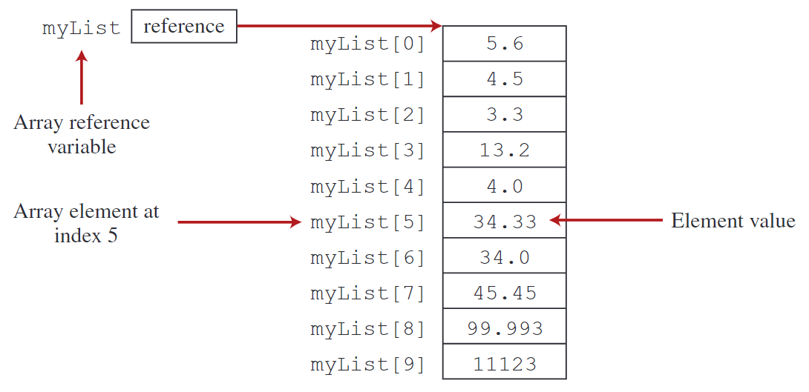
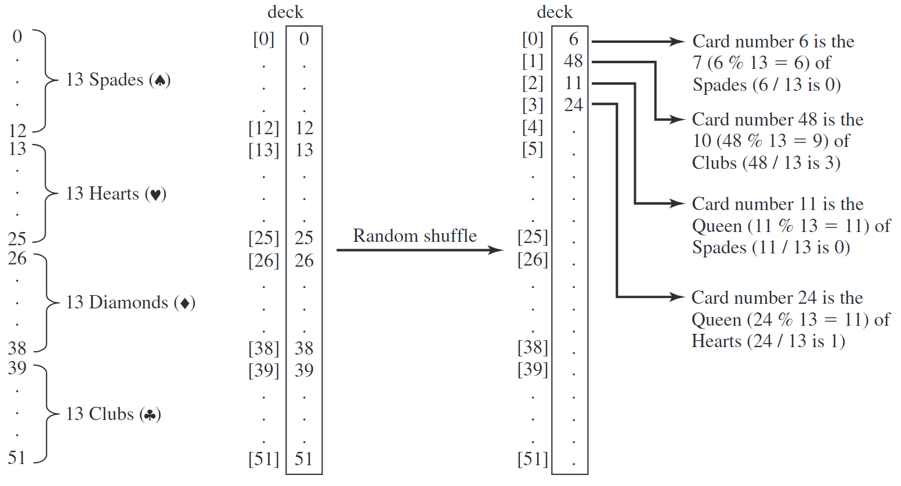
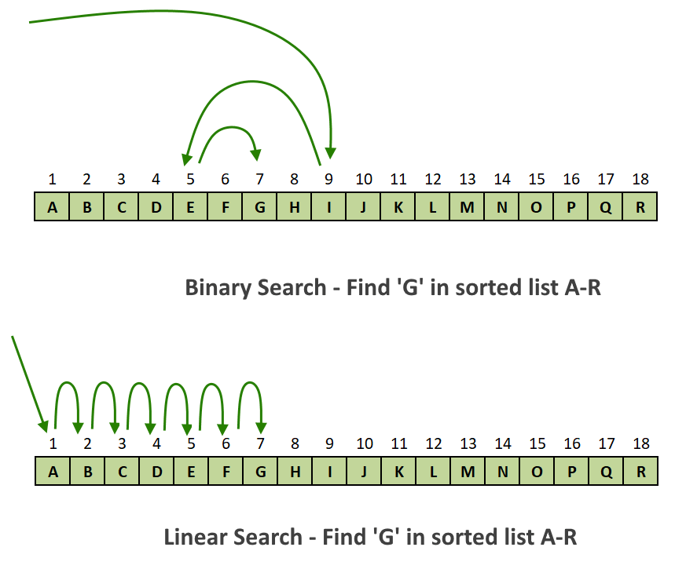
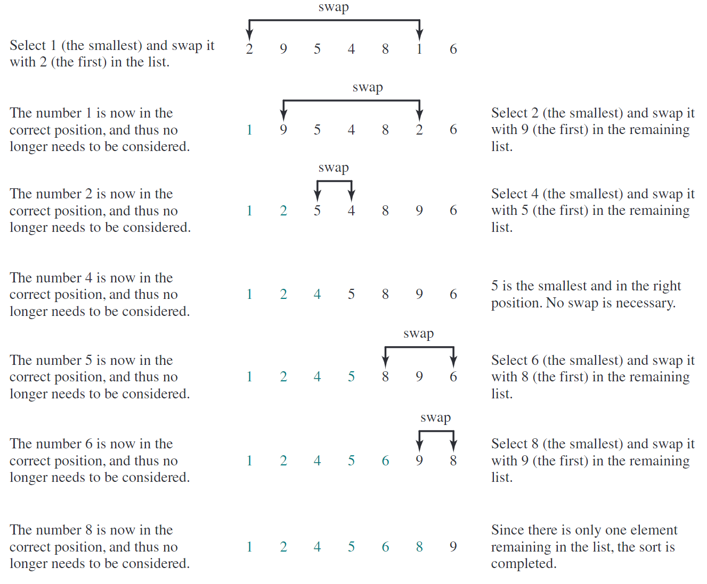

# Chapter 7: <br> Single-Dimensional Array

---

## 7.1. Introduction

---

### What is an Array?

- **Array** is a collection of elements of the same type stored in continue memory locations.

- Array can store primitive data types and objects.

---

### Why use Array?

- Store many values in one place.

- Useful for organizing data.

- Efficient for searching, sorting, and manipulating data.

- Widely used for data analysis, graphics, and game development.

---

### How Array work?

- Store in continuous memory locations.

- Each element is accessed using an index.

- The first element is at index `0`, the second at index `1`, and so on.

- The last element is at index `length - 1`.

---

### Types of Arrays

- **Single-Dimensional Array**: A linear list of elements, accessed using a single index.

- **Sparse Array**: Array with a large number of empty or default values, often used to save memory in cases where most elements are not needed.

- **Static Array**: Fixed-size Array that cannot change size after creation, such as standard Array in Java.

---

- **Multi-Dimensional Array**: Array with more than one dimension, such as 2D Array (matrices) or 3D Array (cubes).

- **Dynamic Array**: Array that can grow or shrink in size during runtime, typically implemented using data structures like `ArrayList` in Java.

- **Object Array**: Array that store objects of a specific class or type, allowing for more complex data structures.

- **Associative Array**: Array that use keys instead of indices to access elements, often implemented as hash tables or dictionaries.

- **Jagged Array**: Array of Array, where each sub-array can have a different length.

---

## 7.2. Array Basics

---

### Declaring Array Variables

- An array variable must be declared to reference the array and specify the element type.

**Syntax**: Single-Dimensional Array Declaration

```java
elementType[] arrayRefVar;
// or
elementType arrayRefVar[];
```

---

**Explanation**:

- The `elementType` specifies the type of elements in the array (e.g., `int`, `double`, `String`).

- The `arrayRefVar` is the name of the array reference variable.

- The brackets `[]` indicate that the variable is an array.

---

### Assigning Array Variables

- Declaring an array variable alone does not allocate memory for the array elements.
- To allocate memory, you must use the `new` operator to create the array.


**Syntax**: Creating an Array

```
arrayRefVar = new elementType[Arrayize];
// or combine declaration and creation:
elementType[] arrayRefVar = new elementType[Arrayize];
```

**Note**: If you don't use `new`, the array reference variable will be `null`.

---

**Example**: Creating a Double Array

```java
double[] myList = new double[10];
```

**Explanation**:

- This creates an array named `myList` that can hold 10 `double` values.

- The size of the array is specified in square brackets `[]` after the type.

- The array is created in memory, and the reference variable `myList` points to it.

- The array is initialized with default values (`0.0` for `double`).

---

### Array Size and Default Values

- The size of an array is fixed once it is created and accessed using `arrayRefVar.length`.

- **Default values**:

  - `0` for numeric types

  - `\u0000` for `char`

  - `false` for `boolean`

  - `null` for object references

---

### Accessing Array Elements

- You can access and modify elements in an array using the index.

- The index starts at `0` and goes up to `arrayRefVar.length - 1`.

**Example**: Modify an array element

```java
myList[0] = 5.6;
```

---

### Array Initializers

- Shorthand notation for declaring, creating, and initializing Array in one statement:

```java
elementType[] arrayRefVar = {value_0, value_1, ..., value_k};
```

**Example**:

```java
double[] myList = {
    5.6, 4.5, 3.3, 13.2, 4.0, 34.33,
    34.0, 45.45, 99.993, 11123
};
```

---



---

### Using Array

**Example**: Filling an Array with Random Values

```java
for (int i = 0; i < myList.length; i++) {
    myList[i] = Math.random() * 100;
}
```

**Explanation**: Fills `myList` with random values (0 to 100) using `Math.random()`, which generates a random double between 0.0 and 1.0, scaled by 100.

---

**Example**: Printing Array Elements

```java
for (int i = 0; i < myList.length; i++) {
    System.out.print(myList[i] + " ");
}
```

**Output**:

```
5.6 4.5 3.3 13.2 4.0 34.33 34.0 45.45 99.993 11123
```

**Explanation**: Prints each element of `myList` on the same line, separated by spaces.

---

**Example**: Calculating the Sum of Array Elements

```java
double total = 0;
for (int i = 0; i < myList.length; i++) {
    total += myList[i];
}
```

**Explanation**: Sums all elements in `myList` and stores the result in `total`.

---

**Example**: Finding the Maximum Value in an Array

```java
double max = myList[0];
for (int i = 1; i < myList.length; i++) {
    if (myList[i] > max) max = myList[i];
}
```

**Explanation**:

- Finds the maximum value in `myList` by comparing each element with the current maximum.

- Initializes `max` with the first element and updates it if a larger element is found.

---

### Foreach Loops

- The `foreach` loop is also known as the enhanced for loop in Java, which simplifies the syntax for iterating through Array and collections.

**Syntax**:

```java
for (elementType element : arrayRefVar) {
    // Code to process each element
}
```

**Note**: This simplifies the code and reduces the risk of index-related errors, making it a more readable and concise way to iterate through Array and collections.

---

**Example**: Using Foreach Loop

```java
for (double e : myList) {
    System.out.println(e);
}
```

**Explanation**:

- The `foreach` loop iterates through each element `e` in `myList`, printing each element without needing an index variable.

---

### Common Errors with Array

- **Off-by-One Error**: This occurs when indices are incorrectly calculated, so always ensure they range from `0` to `arrayRefVar.length - 1`.

- **ArrayIndexOutOfBoundsException**: This happens when trying to access an index outside the array's bounds; always validate index values before accessing elements.

- **NullPointerException**: Ensure the array reference is properly initialized before attempting to access or modify its elements.

---

- **Type Mismatch**: Verify that the array's declared type matches the type of values being assigned to its elements.

- **Uninitialized Elements**: Be cautious of default values in uninitialized array elements (e.g., `0` for `int`, `null` for objects).

- **Incorrect Array Size**: Always allocate an array size that fits the intended data to avoid insufficient or excessive memory usage.

---

## 7.3. Case Study: <br> Analyzing Numbers

Practice.

---

## 7.4. Case Study: <br> Deck of Cards

Practice.



---

## 7.5. Copying Array

---

### Assignment vs. Copying

- Using the assignment statement (`=`) does not copy array contents.

- It only copies the reference, causing both variables to refer to the same array.

**Example**: Assignment Statement

```java
list2 = list1;
```

**Explanation**:

- Both `list1` and `list2` will reference the same array after this statement.

---

### Methods to Copy Array

**Using a Loop**

- You can copy an array manually using a loop.

**Example**: Copying an Array Using a Loop

```java
int[] sourceArray = {2, 3, 1, 5, 10};
int[] targetArray = new int[sourceArray.length];
for (int i = 0; i < sourceArray.length; i++) {
    targetArray[i] = sourceArray[i];
}
```

---

**Using `System.arraycopy()`**

- You can use the `System.arraycopy()` method to copy an array efficiently.

**Syntax**:

```java
System.arraycopy(sourceArray, srcPos, targetArray, tarPos, length);
```

**Example**: Copying an Array Using `System.arraycopy()`

```java
int[] sourceArray = {2, 3, 1, 5, 10};
int[] targetArray = new int[sourceArray.length];
System.arraycopy(sourceArray, 0, targetArray, 0, sourceArray.length);
```

**Note**: `System.arraycopy()` is more efficient than a manual loop for copying large arrays.

---

**Using `clone()`**:

- You can use the `clone()` method to create a shallow copy of an array.

Note: It is important to understand that `clone()` creates a shallow copy of the array, meaning that if the array contains objects, only the references to those objects are copied, not the objects themselves.

<!-- - The `clone()` method creates a shallow copy of an array. -->
<!-- - It duplicates the array structure and elements, but for object elements, only references are copied, not the objects themselves. -->

**Example**: Cloning an Array

```java
int[] sourceArray = {2, 3, 1, 5, 10};
int[] clonedArray = sourceArray.clone();
```

---

**Explanation**:

- The `clonedArray` is a new array that contains the same elements as `sourceArray`.
- Changes made to the elements of `clonedArray` will not affect `sourceArray`, and vice versa.
- However, if the array contains objects, modifications to the objects will be reflected in both arrays since the references are shared.

**Note**: Use `clone()` method cautiously when working with arrays of objects to avoid unintended side effects.

---

### Important Notes

- **Shallow Copy**: Methods like `clone()` create a shallow copy, meaning they copy the elements but not any objects that the elements might reference.
- **Garbage Collection**: When an array reference is reassigned, the original array may become unreferenced and eligible for garbage collection.

---

## 7.6. Passing Array to Methods

---

### Passing an Array to a Method

- When passing an array to a method, the reference of the array is passed, not the actual array.
- This allows the method to modify the original array.

**Key Points**:

- Array can be passed as arguments to methods, similar to primitive type values.
- Passing an array means passing its reference, enabling the method to:
  - Access the array elements.
  - Modify the array elements directly.

---


---


---


---

**Example**: Method to Print Array Elements:

```java
public static void printArray(int[] array) {
    for (int i = 0; i < array.length; i++) {
        System.out.print(array[i] + " ");
    }
}
```

**Output**:

```
3 1 2 6 4 2
```

---

**Example**: Calling the `printArray` Method

- Pass an array as an argument to call this method.

```java
int[] numbers = {3, 1, 2, 6, 4, 2};
printArray(numbers);
```

- You can also pass an anonymous array directly.

```java
printArray(new int[]{3, 1, 2, 6, 4, 2});
```

---

### Passing-by-Value and Passing-by-Sharing

**Passing-by-Value**

- In Java, primitive types are passed by value.
- This means that a copy of the value is passed to the method, and changes made to the parameter do not affect the original variable.

---

**Passing-by-Sharing**

- In Java, all arguments are passed by value.
- But, when passing an array, the reference to the array is passed by value.
- This means that the method receives a copy of the reference, allowing it to modify the original array but not the reference itself.

---

**Example**: Demonstrating Pass-by-Sharing

```java
public class TestArrayArguments {
    public static void main(String[] args) {
        int x = 1;
        int[] y = new int[10];
        m(x, y);
        System.out.println("x is " + x);
        System.out.println("y[0] is " + y[0]);
    }

    public static void m(int number, int[] numbers) {
        number = 1001;
        numbers[0] = 5555;
    }
}                                                                   .
```

---

**Output**:

```
x is 1
y[0] is 5555
```

---

**Explanation**:

- After calling `m(x, y)`, `x` stays 1 because it is passed by value, while `y[0]` changes to 5555 since the array reference is passed.
- The method `m` can modify the array `y` directly, but changes to `number` do not affect `x` in the `main` method.
- Array are passed by reference, allowing modifications to the original array, while primitive types are passed by value.

---

### Array in Memory

- In Java, primitive types are stored in **Stack memory**.
  - **Stack memory** is a static memory area used for local variables and method calls.
- But, Array is stored in **Heap memory**.
  - **Heap memory** is a dynamic memory area used for objects and arrays.
- When an array is passed to a method, the reference to the array is passed, allowing the method to modify the original array.

---


---

**Example**: Swapping Elements in an Array

```java
public class SwapArrayElements {
    public static void main(String[] args) {
        int[] array = {1, 2, 3, 4};
        swap(array[0], array[1]); // This won't swap the elements
        swapFirstTwoInArray(array); // This will swap the elements
    }
    public static void swap(int x, int y) {
        int temp = x;
        x = y;
        y = temp;
    }
    public static void swapFirstTwoInArray(int[] array) {
        int temp = array[0];
        array[0] = array[1];
        array[1] = temp;
    }
}
```

---

**Explanation**:

- The first method `swap` attempts to swap the values of `x` and `y`, but it only swaps the local copies, not the original array elements.
- The second method `swapFirstTwoInArray` modifies the original array directly, swapping the first two elements.
- The output of the program will show that the first method does not change the array, while the second method successfully swaps the first two elements.

---

## 7.7. Returning an Array from a Method

---

### Method Declaration

- In Java, a method can return arrays.
- The method should return the array's reference.

**Syntax**:

```java
public static elementType[] methodName(argumentType) {
    // Method body
}
```

**Note**: The return type is specified as `elementType[]`, indicating that the method returns an array of the specified type.

---

### Using the `reverse` Array

**Example**: Reverse an Array

```java
public static int[] reverse(int[] list) {
    int[] result = new int[list.length];
    for (int i = 0, j = result.length - 1;
        i < list.length;
        i++, j--) {
        result[j] = list[i];
    }
    return result;
}
```

---

**Explanation**:

- The method `reverse` creates a new array `result` to store the reversed elements.
- A loop copies elements from the input array `list` to the `result` array in reverse order.
- The method returns the `result` array.

---

**Example**: To use the `reverse` method:

```java
int[] list1 = {1, 2, 3, 4, 5, 6};
int[] list2 = reverse(list1);
```

**Explanation**:

- The `list1` array contains the original elements.
- The `list2` array will contain the elements of `list1` in reverse order.

---

**Notes**:

- When a method returns an array, it returns a reference to the array. The caller can use this reference to access and modify the array elements.
- Returning a reference is efficient because it avoids copying the entire array.

---

## 7.8. Case Study: <br> Counting the Occurrences of Each Letter

Practice.

---

## 7.9. Variable-Length Argument Lists

---

### Syntax for Variable-Length Parameters

- Java allows methods to accept a variable number of arguments of the same type, which can be treated as an array.
- In the method declaration, use the ellipsis (`...`) to specify a variable-length parameter.

**Syntax**:

```java
typeName... parameterName
```

**Example**:

```java
public static void methodName(typeName... parameterName) {
    // Method body
}
```

---

### Rules for Variable-Length Parameters

- Only one variable-length parameter can be specified in a method.
- The variable-length parameter must be the last parameter in the method.
- Any regular parameters must precede it.

---

### Passing Arguments

- Java treats the variable-length parameter as an array.
- You can pass an array or a variable number of arguments to the variable-length parameter.

---

**Example**: Print Maximum Value from Variable-Length Arguments

```java
public class VarArgsDemo {
    public static void main(String[] args) {
        printMax(34, 3, 3, 2, 56.5);
        printMax(new double[]{1, 2, 3});
    }
    public static void printMax(double... numbers) {
        if (numbers.length == 0) {
            System.out.println("No argument passed");
            return;
        }
        double result = numbers[0];
        for (int i = 1; i < numbers.length; i++) {
            if (numbers[i] > result)
                result = numbers[i];
        }
        System.out.println("The max value is " + result);
    }
}                                                                                                 .
```

---

**Explanation**:

- The `printMax` method accepts a variable number of `double` arguments.
- It finds the maximum value among the passed arguments.
- The method can be called with a variable number of arguments or an array of `double` values.
- If no arguments are passed, it prints a message indicating that no argument was provided.
- The method uses a loop to iterate through the `numbers` array and find the maximum value.

**Note**: When invoking a method with a variable number of arguments, Java creates an array and passes the arguments to it.

---

## 7.10. Searching Array

---

- **Searching** is the process of looking for a specific element within an array.
- There are various algorithms for searching, including linear search and binary search.
  - **Linear Search**: A simple search algorithm that checks each element in the array sequentially.
  - **Binary Search**: A more efficient search algorithm that works on sorted arrays by dividing the search space in half.

---

### Linear Search

- **Linear Search** compares the key element sequentially with each element in the array.
  - If the key matches an element, the search ends, and the index of that element is returned.
  - If the key is not found, the search continues until all elements are checked.
  - If the key is not found, the method returns `-1`.

---

**Example**: Linear Search Implementation

```java
public class LinearSearch {
    public static int linearSearch(int[] list, int key) {
        for (int i = 0; i < list.length; i++) {
            if (key == list[i]) {
                return i;
            }
        }
        return -1;
    }
}
```

---

### Binary Search

- **Binary search** compares the key element with the middle element of a sorted array.
  - If the key is less than the middle element, the search continues in the left half of the array.
  - If the key is greater than the middle element, the search continues in the right half of the array.
  - This process is repeated until the key is found or the search space is empty.

---

**Example**: Binary Search Implementation

```java
public class BinarySearch {
    public static int binarySearch(int[] list, int key) {
        int low = 0;
        int high = list.length
        - 1;

        while (high >= low) {
            int mid = (low + high) / 2;
            if (key < list[mid]) {
                high = mid
                - 1;
            } else if (key == list[mid]) {
                return mid;
            } else {
                low = mid + 1;
            }
        }
        return -low
        - 1; // Key not found
    }
}                                                                                                 .
```

---



---

**Comparison**:

- **Linear Search**: Time complexity is $O(n)$, where n is the number of elements. It is suitable for small or unsorted Array.
- **Binary Search**: Time complexity is $O(\ln n)$, where n is the number of elements. It is efficient for large, sorted Array.

---

## 7.11. Sorting Array

---

- **Sorting** is a common task in computer programming, and many algorithms have been developed to accomplish it.

- Sorting algorithms can be classified into two main categories:

  - **Internal Sorting**: Sorting data that fits into memory.

  - **External Sorting**: Sorting data that does not fit into memory.

---

### Sorting Algorithms

- **Selection Sort Algorithm**
- **Bubble Sort Algorithm**
- **Insertion Sort Algorithm**
- **Merge Sort Algorithm**
- **Quick Sort Algorithm**
- **Heap Sort Algorithm**
- **Shell Sort Algorithm**
- **Radix Sort Algorithm**
- **Counting Sort Algorithm**
- **Bucket Sort Algorithm**
- etc.

---

### Selection Sort Algorithm

- **Selection Sort Algorithm** sorts an array by repeatedly finding the smallest element and swapping it with the element at the current position.

- The process is repeated for each position in the array until the entire array is sorted.

---

### Steps of Selection Sort

- **Step 1**: Start with the first element as the minimum.
- **Step 2**: Compare the minimum with the rest of the elements in the array.
- **Step 3**: If a smaller element is found, update the minimum.
- **Step 4**: Swap the minimum with the first element.
- **Step 5**: Move to the next element and repeat the process until the array is sorted.
- **Step 6**: Continue until the entire array is sorted.

**Example**: Sorting a List `{2, 9, 5, 4, 8, 1, 6}` using Selection Sort Algorithm

---



---

### Implementing Selection Sort

- The selection sort can be implemented in Java with a nested loop.
- The outer loop iterates through the array, while the inner loop finds the minimum element in the unsorted portion of the array.
- The minimum element is then swapped with the current element.

---

**Example**: Selection Sort Implementation

```java
public class SelectionSort {
    /** The method for sorting the numbers */
    public static void selectionSort(double[] list) {
        for (int i = 0; i < list.length - 1; i++) {
            // Find the minimum in the list[i..list.length-1]
            double currentMin = list[i];
            int currentMinIndex = i;
            for (int j = i + 1; j < list.length; j++) {
                if (currentMin > list[j]) {
                    currentMin = list[j];
                    currentMinIndex = j;
                }
            }
            // Swap list[i] with list[currentMinIndex] if necessary
            if (currentMinIndex != i) {
                list[currentMinIndex] = list[i];
                list[i] = currentMin;
            }
        }
    }
}                                                                                                 .
```

---

**Explanation**:

- This method sorts an array of double elements using selection sort.
- The outer loop iterates through each element in the array.
- The inner loop finds the minimum element in the unsorted portion of the array.
- If a smaller element is found, it swaps it with the current element.

---

### Tracing the Algorithm

- To trace the algorithm, you can print the array at each step to see how it changes.
- This helps visualize the sorting process and understand how selection sort works.

```java
double[] list = {1, 9, 4.5, 6.6, 5.7, -4.5};

SelectionSort.selectionSort(list);
```

---

### Modifying Selection Sort

- To understand the selection sort better, you can modify it to sort in different ways:
  - To sort numbers in increasing order, keep the current implementation.
  - To sort numbers in decreasing order, modify the selectionSort method to find the maximum instead of the minimum in each iteration.

---

## 7.12. The Array Class

---

- **The `Array` class** is part of the `java.util` package and provides methods for sorting, searching, comparing, filling, and converting arrays to strings.

---

- **Sorting**:
  - **The `sort` method**: Sorts an entire array or a specified range within an array.
  - **The `parallelSort` method**: Optimized for multi-core processors to sort arrays in parallel.
- **Searching**:
  - **The `binarySearch` method**: Searches for a key in a sorted array and returns its index. If not found, returns `- (insertionPoint + 1)`.

---

- **Comparing**:
  - **The `equals` method**: Checks if two arrays are strictly equal (same length and elements).
- **Filling**:
  - **The `fill` method**: Fills an entire array or a specified range within an array with a given value.
- **Converting to Strings**:
  - **The `toString` method**: Returns a string representation of the array.

---

### Sorting Array

- **The `sort` Method**: Sorts an entire array or a specified range within an array.

```java
double[] numbers = {6.0, 4.4, 1.9, 2.9, 3.4, 3.5};

java.util.Array.sort(numbers);
// Sorts the entire array

char[] chars = {'a', 'A', '4', 'F', 'D', 'P'};

java.util.Array.sort(chars, 1, 3);
// Sorts part of the array (chars[1] to chars[2])
// 1 stands for the starting index (inclusive)
// 3 stands for the ending index (exclusive)
```

---

- **Then `parallelSort` Method**: Similar to `sort` but optimized for multi-core processors.

```java
java.util.Array.parallelSort(numbers);
// Sorts the entire array in parallel

java.util.Array.parallelSort(chars, 1, 3);
// Sorts part of the array in parallel
```

---

### Searching Array

- `binarySearch` Method: Searches for a key in a sorted array and returns its index. If the key is not found, returns `-(insertionPoint + 1)`.

```java
int[] list = {2, 4, 7, 10, 11, 45, 50, 59, 60, 66, 69, 70, 79};

int index = java.util.Array.binarySearch(list, 11);
// Returns 4

int notFoundIndex = java.util.Array.binarySearch(list, 12);
// Returns -6
```

---

### Comparing Array

- `equals` Method: Checks if two Array are strictly equal (same length and elements).

```java
int[] list1 = {2, 4, 7, 10};
int[] list2 = {2, 4, 7, 10};

boolean areEqual = java.util.Array.equals(list1, list2);
// Returns true
```

---

### Filling Array

- `fill` Method: Fills an entire array or a specified range within an array with a given value.

```java
int[] list = new int[10];

java.util.Array.fill(list, 5);
// Fills entire array with 5

java.util.Array.fill(list, 2, 5, 8);
// Fills list[2] to list[4] with 8
```

---

### Converting Array to Strings

- `toString` Method: Returns a string representation of the array.

**Example**: Converting an Array to a String

```java
int[] list = {2, 4, 7, 10};
String Arraytring = java.util.Array.toString(list);
```

**Output**:

```
[2, 4, 7, 10]
```

---

## 7.13. Command-Line Arguments

---

- Command-line arguments in Java allow passing information to a program during execution.
- These arguments are passed as a `String[]` to the `main` method, the program's entry point.
- They enable customization of program behavior or provide input data without altering the code.

**Note**: You can execute a Java program by using another programming language.

---

### The `main` Method

- The `main` method in Java can receive command-line arguments as an array of strings (`String[] args`).

**Syntax**:

```java
public static void main(String[] args) {
    // Code to process args
}
```

---

### Passing Arguments

- Command-line arguments are passed when executing a program from the command line.

**Example**: Command to run a Java program with arguments

```
java TestMain arg0 arg1 arg2
```

- The `arg0`, `arg1`, and `arg2` are the arguments passed to `TestMain`.

---

### Tip for Using Command-Line Arguments

**Example**: Use Python code to run Java code with command-line arguments.

- Java code `JavaMain.java`:

```java
public class JavaMain {
    public static void main(String[] args) {
        System.out.println("Hello, " + args[0]);
    }
}                                                                                                 .
```

---

- Python code `PythonMain.py`:

```python
import subprocess

# Execute the Java program with command-line arguments
result = subprocess.run(
    ["java", "JavaMain.java", "arg0"],
    capture_output=True,
    text=True
)

# Print the output of the Java program
print(result.stdout)                                                                              .
```

---

**Usage**:

```
python PythonMain.py                                                                              .
```

**Output**:

```
Hello, arg0                                                                                       .
```

---

### Handling Arguments in the `main` Method

- You can access and process each argument using `args` array in the `main` method.

**Example**: Printing Command-Line Arguments.

```java
public class TestMain {
    public static void main(String[] args) {
        for (int i = 0; i < args.length; i++) {
            System.out.println(args[i]);
        }
    }
}
```

---

### Creating Array for Arguments

- The Java interpreter creates an array to hold the command-line arguments and passes it to `args`.
- If no arguments are passed, the array length is 0.

**Example**: Simple Calculator

- Create a program to perform basic arithmetic operations using command-line arguments.

---

**Example**: Simple Calculator Program

```java
public class Calculator {
    public static void main(String[] args) {
        if (args.length != 3) {
            System.out.println("java Calculator num1 operator num2");
            return;
        }
        int num1 = Integer.parseInt(args[0]);
        int num2 = Integer.parseInt(args[2]);
        char op = args[1].charAt(0);
        int result = switch (op) {
            case '+' -> num1 + num2;
            case '-' -> num1 - num2;
            case '*' -> num1 * num2;
            case '/' -> num1 / num2;
            default -> throw new IllegalArgumentException("Invalid");
        };
        System.out.println(num1 + " " + op + " " + num2 +
            " = " + result);
    }
}                                                                                                 .
```

---

**Usage**:

```
java Calculator 5 + 3
```

**Output**:

```
5 + 3 = 8
```

**Explanation**: The program accepts two numbers and an operator as command-line arguments, performs the specified operation, and outputs the result.
**Notes**: All command-line arguments are treated as strings, even if they represent numbers.

---

## End of the Chapter

<!-- style: |

    section {
    font-family: Nokora;
    }

    h1 {
    color: black;
    font-size: 50px;
    text-align: center;
    }
    h2 {
    font-size: 40px;
    text-align: center;
    }
    h3 {
    font-size: 30px;
    position: absolute;
    top: 60px;
    }
    h3::before {
    content: "👉"; /* Unicode for bullet */
    }
    h4 {
    font-size: 26px;
    }
    h5 {
    font-size: 26px;
    }
    h6 {
    font-size: 26px;
    }
    p {
    font-size: 26px;
    }
    li {
    font-size: 26px;
    }
    table {
    margin: auto;
    font-size: 20px;
    }
    img {
    display: block;
    margin: 0 auto;
    }
    section::after {
    font-size: 20px;
    }
    ul {
    list-style-type: "✨";
    padding-left: 20px;
    margin-left: 20px;
    }

-->
