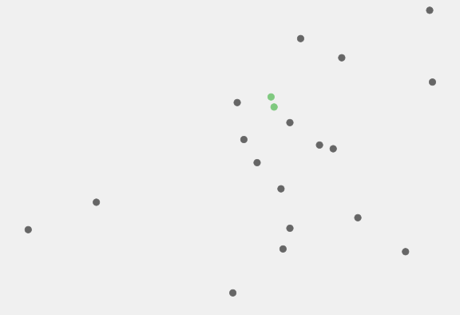

# Chapter 8: Multi-Dimensional Array

---

## 8.1. Introduction

---

### What are Multi-Dimensional Array?

- **Multi-Dimensional Array** are arrays that hold other arrays, allowing data to be organized in multiple levels or dimensions.
- A common example is a **two-dimensional array**, which looks like a table with rows and columns. It is useful for storing data like matrices or spreadsheets.
- These arrays help organize and work with complex data easily, such as performing calculations or visualizing data.
- They can store numbers, text, or objects, making them flexible for different tasks.

---

## 8.2. Two-Dimensional Array Basic

---

### Declaring Two-Dimensional Array

**Syntax**: There are two ways to declare a two-dimensional array.

```java
elementType[][] arrayRefVar;
```

or

```java
elementType arrayRefVar[][];
```

**Explanation**:

- The first way is the most common and clear for declaring a two-dimensional array. It shows that `arrayRefVar` is an array of arrays.
- The second way works too, but it is less clear and not recommended.
- Use the first style for easier understanding and better readability.

---

### Create Two-Dimensional Array

**Example**: Creating a two-dimensional array of 5-by-5 `int` values.

```java
int[][] matrix = new int[5][5];
```

**Noted**: Row index and Column index, both starting from 0.

---

### Assign Values to Two-Dimensional Array

**Example**: Assigning values to a two-dimensional array.

```java
matrix[2][1] = 7;
```

**Noted**:

- The first index represents the row, and the second index represents the column.
- The value `7` is assigned to the element located at row index `2` and column index `1` in the `matrix` array.

---

### Initial Two-Dimensional Array

**Example**: Creating a two-dimensional array with initial values.

```java
int[][] array = {
    {1, 2, 3},
    {4, 5, 6},
    {7, 8, 9},
    {10, 11, 12}
};
```

**Noted**: The first row has 3 elements, the second row has 3 elements, and so on.

---

### Visualization


---

### Two-Dimensional Array as Table

**Example**: A two-dimensional array can be used to store the distances between cities in a table format.

|     City     | Chicago | Boston | New York | Atlanta | Miami | Dallas | Houston |
| :----------: | :-----: | :----: | :------: | :-----: | :---: | :----: | :-----: |
| **Chicago**  |    0    |  983   |   787    |   714   | 1375  |  967   |  1087   |
|  **Boston**  |   983   |   0    |   214    |  1102   | 1763  |  1723  |  1842   |
| **New York** |   787   |  214   |    0     |   888   | 1549  |  1548  |  1627   |
| **Atlanta**  |   714   |  1102  |   888    |    0    |  661  |  781   |   810   |
|  **Miami**   |  1375   |  1763  |   1549   |   661   |   0   |  1426  |  1187   |
|  **Dallas**  |   967   |  1723  |   1548   |   781   | 1426  |   0    |   239   |
| **Houston**  |  1087   |  1842  |   1627   |   810   | 1187  |  239   |    0    |

---

**Code:** This code snippet represents the above table in a two-dimensional array.

```java
double[][] distances = {
    {0,    983,  787,  714,  1375,  967,  1087},
    {983,  0,    214,  1102, 1763,  1723, 1842},
    {787,  214,  0,    888,  1549,  1548, 1627},
    {714,  1102, 888,  0,    661,   781,  810},
    {1375, 1763, 1549, 661,  0,     1426, 1187},
    {967,  1723, 1548, 781,  1426,  0,    239},
    {1087, 1842, 1627, 810,  1187,  239,  0}
};
```

---

**Explanation**:

- The `distances` variable is a two-dimensional array of type `double`, which stores the distances between cities.
- Each row represents a city, and each column represents the distance to another city.
- The first row and column represent Chicago, the second row and column represent Boston, and so on.
- The value at `distances[0][1]` represents the distance from Chicago to Boston, which is 983 miles.
- The value at `distances[3][4]` represents the distance from Atlanta to Miami, which is 661 miles.

---

### Ragged Array

- **Ragged arrays** are two-dimensional arrays where each row can have a different number of columns.

**Example**: A ragged array with different row lengths:


---

**Code**: This code snippet represents the above ragged array.

```java
int[][] triangleArray = {
    {1, 2, 3, 4, 5},
    {2, 3, 4, 5},
    {3, 4, 5},
    {4, 5},
    {5}
};
```

---

**Example**: Creating a ragged array without initial values but with known sizes.

```java
int[][] triangleArray = new int[5][];
triangleArray[0] = new int[5];
triangleArray[1] = new int[4];
triangleArray[2] = new int[3];
triangleArray[3] = new int[2];
triangleArray[4] = new int[1];
```

**Explanation**:

- The first row has 5 elements, the second row has 4 elements, and so on.
- The last row has only 1 element.

---

### Length of Two-Dimensional Array

**Example**: Accessing the lengths of a two-dimensional array.

```java
int[][] matrix = {
    {1, 2, 3},
    {4, 5, 6, 7},
    {8, 9}
};

System.out.println("Number of rows: " + matrix.length);
System.out.println("Number of columns in row 0: " + matrix[0].length);
System.out.println("Number of columns in row 1: " + matrix[1].length);
System.out.println("Number of columns in row 2: " + matrix[2].length);
```

---

**Output**:

```raw
Number of rows: 3
Number of columns in row 0: 3
Number of columns in row 1: 4
Number of columns in row 2: 2
```

**Explanation**:

- `matrix.length` gives the number of rows in the two-dimensional array.
- `matrix[0].length` gives the number of columns in the first row.
- Each row can have a different number of columns, as shown in the example.
- This is particularly useful when working with ragged arrays.

---

## 8.3. Processing in Two-Dimensional Array

---

### Initializing Two-Dimensional Array with Input Values

- Nested for loops can be used to populate a two-dimensional array with input values.

**Example**: Code snippet to read values from the user and store them in a two-dimensional array.

```java
Scanner input = new Scanner(System.in);
for (int i = 0; i < matrix.length; i++) {
    for (int j = 0; j < matrix[i].length; j++) {
        matrix[i][j] = input.nextInt();
    }
}
```

---

### Initializing Two-Dimensional Array with Random Values

- Nested for loops can be used to initialize a two-dimensional array with random values.

**Example**: This code snippet initializes a two-dimensional array with random integers between 0 and 99.

```java
for (int row = 0; row < matrix.length; row++) {
    for (int column = 0; column < matrix[row].length; column++) {
        matrix[row][column] = (int)(Math.random() * 100);
    }
}
```

**Explanation**: The outer loop iterates through each row of the array, while the inner loop iterates through each column of the current row.

---

### Printing Two-Dimensional Array

- Nested for loops can be used to print each element in a two-dimensional array.

**Example**: Code snippet prints the elements of a two-dimensional array in a grid format.

```java
for (int row = 0; row < matrix.length; row++) {
    for (int column = 0; column < matrix[row].length; column++) {
        System.out.print(matrix[row][column] + " ");
    }
    System.out.println();
}
```

**Explanation**: The outer loop iterates through each row of the array, while the inner loop iterates through each column of the current row.

---

### Summing All Elements in Two-Dimensional Array

- Use a variable to keep track of the total sum.
- Add each element in the array to this variable as it go through the array.

**Example**: This code snippet calculates the sum of all elements in a two-dimensional array.

```java
int total = 0;
for (int row = 0; row < matrix.length; row++) {
    for (int column = 0; column < matrix[row].length; column++) {
        total += matrix[row][column];
    }
}
System.out.println("Sum of all elements is " + total);
```

**Explanation**: The outer loop iterates through each row of the array, while the inner loop iterates through each column of the current row.

---

### Summing Elements in Two-Dimensional Array by Column

- Use a 1-Dimensional array to store the sum of each column.
- For each column, calculate the total by adding all elements in that column.
- Store the result in the corresponding index of the 1-Dimensional array.

**Example**: This code snippet calculates the sum of each column in a two-dimensional array.

```java
int[] columnSums = new int[matrix[0].length];
for (int column = 0; column < matrix[0].length; column++) {
    int total = 0;
    for (int row = 0; row < matrix.length; row++) {
        total += matrix[row][column];
    }
    columnSums[column] = total;
}
```

---

**Explanation**:

- An array `columnSums` is introduced to store the sum of each column.
- The outer loop iterates through each column, while the inner loop iterates through each row of the current column.
- The sum of each column is calculated and stored in the `columnSums` array.
- The sum of each column is printed after it is calculated.
- This approach makes the code more structured and reusable.

---

### Finding the Min/Max Elements in a Two-Dimensional Array

**Example**: Finding the maximum element in a two-dimensional array.

```java
int maxRow = 0; int indexOfMaxRow = 0;
for (int column = 0; column < matrix[0].length; column++) {
    maxRow += matrix[0][column];
}
for (int row = 1; row < matrix.length; row++) {
    int totalOfThisRow = 0;
    for (int column = 0; column < matrix[row].length; column++) {
        totalOfThisRow += matrix[row][column];
    }
    if (totalOfThisRow > maxRow) {
        maxRow = totalOfThisRow;
        indexOfMaxRow = row;
    }
}
```

---

**Explanation**:

- The first loop calculates the sum of the first row and stores it in `maxRow`.
- The second loop iterates through the remaining rows, calculating their sums.
- If a row's sum is greater than `maxRow`, it updates `maxRow` and `indexOfMaxRow` to the current row's index.

---

### Random Shuffling of Two-Dimensional Array

**Example**: Randomly shuffling the elements of a two-dimensional array.

```java
for (int i = 0; i < matrix.length; i++) {
    for (int j = 0; j < matrix[i].length; j++) {
        int i1 = (int)(Math.random() * matrix.length);
        int j1 = (int)(Math.random() * matrix[i].length);
        int temp = matrix[i][j];
        matrix[i][j] = matrix[i1][j1];
        matrix[i1][j1] = temp;
    }
}
```

---

**Explanation**:

- The outer loop iterates through each element of the two-dimensional array.
- For each element, it generates random indices `i1` and `j1` to swap the current element with another randomly chosen element in the array.
- This process continues until all elements have been shuffled.

---

## 8.4. Pass Two-Dimensional Array to Methods

---

### Pass Two-Dimensional Array to a Method

- A two-dimensional array can be passed to a method just like a one-dimensional array.
- The method can process the array using nested loops to go through rows and columns.
- Methods can also return two-dimensional arrays as results.
- This makes the code easier to reuse and organize when working with two-dimensional arrays.

---

**Example**: Passing a two-dimensional array to a method.

```java
public class ArrayExample {
    public static void main(String[] args) {
        int[][] matrix = {{1, 2, 3}, {4, 5, 6}, {7, 8, 9}};
        printMatrix(matrix);
    }
    public static void printMatrix(int[][] array) {
        for (int[] row : array) {
            for (int element : row) System.out.print(element + " ");
            System.out.println();
        }
    }
}
```

---

**Explanation**:

- The `printMatrix` method takes a two-dimensional array as a parameter.
- It uses nested loops to iterate through the rows and columns of the array.
- Each element is printed in a grid format.

---

### Returning Two-Dimensional Array from a Method

- A method can return a two-dimensional array, allowing for dynamic creation and manipulation of data structures.
- Use nested loops to populate the array before returning it.
- Returning arrays from methods promotes code reusability and modularity.

---

**Example**: Returning a two-dimensional array from a method.

```java
public class ArrayExample {
    public static void main(String[] args) {
        int[][] matrix = createMatrix(3, 3);
        printMatrix(matrix);
    }
    public static int[][] createMatrix(int rows, int columns) {
        int[][] array = new int[rows][columns];
        for (int i = 0; i < rows; i++)
            for (int j = 0; j < columns; j++)
                array[i][j] = i * j;
        return array;
    }
    public static void printMatrix(int[][] array) {
        for (int[] row : array) {
            for (int element : row) System.out.print(element + " ");
            System.out.println();
        }
    }
}                                                                                      .
```

---

**Explanation**:

- The `createMatrix` method generates a two-dimensional array with values based on the product of row and column indices.
- The generated array is returned to the caller and printed using the `printMatrix` method.

---

## 8.5. Case Study: <br> Grading a Multiple-Choice Test

Practice.

---


---

## 8.6. Case Study: <br> Finding the Closest Pair

Practice.

---

### Visualization



---

## 8.7. Case Study: <br> Sudoku

Practice.

---

### Visualization


---

## 8.8. Multi-Dimensional Array

---

### Types of Multi-Dimensional Array

- **Two-Dimensional Array**:
  - Think of it as a table with rows and columns, where data is organized in a grid-like structure.
  - Useful for representing matrices, spreadsheets, or tabular data.
- **Three-Dimensional Array**:
  - Visualize it as a cube or a stack of 2D tables, where each layer represents a different dimension.
  - Commonly used for 3D modeling, simulations, or storing multi-layered data.

---

- **N-Dimensional Array**:
  - Represents a collection of arrays with multiple levels of nesting, allowing for complex data structures.
  - Each dimension can have a different size, making it flexible for various applications.
- **Array of Arrays**:
  - A flexible structure where each array can have a different length, forming a jagged or ragged array.
  - Useful for scenarios where rows or groups of data have varying sizes.

---

### Declaring `N`-Dimensional Array

**Syntax**: To declare a `N`-dimensional array.

```java
elementType[][]...[] arrayRefVar;
```

or

```java
elementType arrayRefVar[][]...[];
```

**Explanation**:

- The first syntax is the most common and recommended for clarity.
- The second syntax is valid but less commonly used and can be confusing.
- Use the first style for better readability and maintainability in your code.

---

### Create Three-Dimensional Array

**Example**: A three-dimensional array can be used to represent a 3D grid of values.

```java
int[][][] grid = {
    {{1, 2, 3}, {4, 5, 6}},
    {{7, 8, 9}, {10, 11, 12}},
    {{13, 14, 15}, {16, 17, 18}}
};
```

**Explanation**:

- `grid[0] = {{1, 2, 3}, {4, 5, 6}}` represents the first layer of the grid.
- `grid[0][0] = {1, 2, 3}` represents the first row of the first layer.
- `grid[0][0][0] = 1` represents the first element of the first row of the first layer.

---

### Declare Array of Arrays

**Example**: An array of arrays can be used to represent a **collection** of lists.

```java

int[][] jaggedArray = {
    {1, 2, 3},
    {4, 5},
    {6, 7, 8, 9}
};
```

---

**Explanation**:

- The first row has 3 elements: `{1, 2, 3}`.
- The second row has 2 elements: `{4, 5}`.
- The third row has 4 elements: `{6, 7, 8, 9}`.
- This structure is useful when rows have varying lengths, such as representing data with different group sizes.

---

### Tracking Algorithm Progress

**Scenario**: Tracking the progress of a Bubble sorting algorithm.

**Example**: Using a two-dimensional array to store the state of the array after each iteration.

```java
public static void main(String[] args) {
    int[] array = {5, 3, 8, 6, 2};
    int[][] progress = trackBubbleSort(array);

    for (int i = 0; i < progress.length; i++) {
        System.out.print("Iteration " + (i + 1) + ": ");
        for (int value : progress[i]) System.out.print(value + " ");
        System.out.println();
    }
}
```

---

```java
public static int[][] trackBubbleSort(int[] array) {
    int n = array.length;
    int[][] progress = new int[n - 1][n];
    int[] tempArray = array.clone();

    for (int i = 0; i < n - 1; i++) {
        for (int j = 0; j < n - 1 - i; j++) {
            if (tempArray[j] > tempArray[j + 1]) {
                int temp = tempArray[j];
                tempArray[j] = tempArray[j + 1];
                tempArray[j + 1] = temp;
            }
        }
        progress[i] = tempArray.clone();
    }
    return progress;
}
```

---

**Output**:

```raw
Iteration 1: 3 5 6 2 8
Iteration 2: 3 5 2 6 8
Iteration 3: 3 2 5 6 8
Iteration 4: 2 3 5 6 8
```

---

**Explanation**:

- The `trackBubbleSort` method performs a bubble sort while storing the state of the array after each iteration in a two-dimensional array.
- Each row in the `progress` array represents the state of the array at a specific iteration.
- This approach is useful for visualizing or debugging the sorting process.
- The `main` method prints the progress of the sorting algorithm for better understanding.

---

**Note**: The output shows how the array evolves after each iteration of the bubble sort algorithm.

---

## End of the Chapter

<!-- style: |

    section {
    font-family: Nokora;
    }

    h1 {
    color: black;
    font-size: 50px;
    text-align: center;
    }
    h2 {
    font-size: 40px;
    text-align: center;
    }
    h3 {
    font-size: 30px;
    position: absolute;
    top: 60px;
    }
    h3::before {
    content: "👉"; /* Unicode for bullet */
    }
    h4 {
    font-size: 26px;
    }
    h5 {
    font-size: 26px;
    }
    h6 {
    font-size: 26px;
    }
    p {
    font-size: 26px;
    }
    li {
    font-size: 26px;
    }
    table {
    margin: auto;
    font-size: 20px;
    }
    img {
    display: block;
    margin: 0 auto;
    }
    section::after {
    font-size: 20px;
    }
    ul {
    list-style-type: "✨";
    padding-left: 20px;
    margin-left: 20px;
    }

-->
