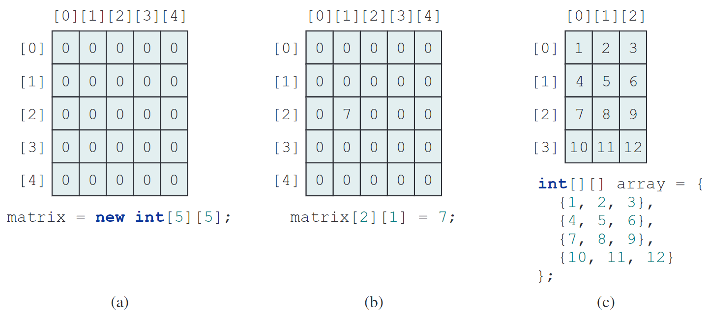

# Chapter 8: Multi-Dimensional Arrays

---

## 8.1. Introduction

---

### What are Multi-Dimensional Arrays?

- **Multi-Dimensional Arrays** are arrays of arrays, enabling the storage of data in multiple dimensions.
- **Multi-Dimensional arrays** can store various types of data, including numbers, strings, and objects.
- The most common type is the two-dimensional array, which can be visualized as a grid or table. They are useful for representing complex data structures, such as matrices or tables.

---

## 8.2. Two-Dimensional Array Basics

---

### Declaring and Creating Two-Dimensional Arrays

**Syntax**: To declare a two-dimensional array.

```java
elementType[][] arrayRefVar;
```

or

```java
elementType arrayRefVar[][];
```

---

**Explanation**:

- The first syntax is the preferred style for declaring a two-dimensional array, as it clearly indicates that `arrayRefVar` is a reference to an array of arrays.
- The second syntax is also valid but less commonly used and not recommended for clarity and readability.
- Both styles are valid, but the first style is generally preferred for better code maintainability.

---

### Creating Two-Dimensional Arrays

**Example**: Creating a two-dimensional array of 5-by-5 `int` values.

```java
int[][] matrix = new int[5][5];
```

**Noted**: Row index and Column index, both starting from 0.

---

### Initializing Two-Dimensional Arrays

- Two-dimensional arrays can be assigned two different ways.



---

### Example of Two-Dimensional Arrays

**Example**: A two-dimensional array can be used to store the distances between cities in a table format.

|     City     | Chicago | Boston | New York | Atlanta | Miami | Dallas | Houston |
| :----------: | :-----: | :----: | :------: | :-----: | :---: | :----: | :-----: |
| **Chicago**  |    0    |  983   |   787    |   714   | 1375  |  967   |  1087   |
|  **Boston**  |   983   |   0    |   214    |  1102   | 1763  |  1723  |  1842   |
| **New York** |   787   |  214   |    0     |   888   | 1549  |  1548  |  1627   |
| **Atlanta**  |   714   |  1102  |   888    |    0    |  661  |  781   |   810   |
|  **Miami**   |  1375   |  1763  |   1549   |   661   |   0   |  1426  |  1187   |
|  **Dallas**  |   967   |  1723  |   1548   |   781   | 1426  |   0    |   239   |
| **Houston**  |  1087   |  1842  |   1627   |   810   | 1187  |  239   |    0    |

---

**Code:** This code snippet represents the above table in a two-dimensional array.

```java
double[][] distances = {
    {0,    983,  787,  714,  1375,  967,  1087},
    {983,  0,    214,  1102, 1763,  1723, 1842},
    {787,  214,  0,    888,  1549,  1548, 1627},
    {714,  1102, 888,  0,    661,   781,  810},
    {1375, 1763, 1549, 661,  0,     1426, 1187},
    {967,  1723, 1548, 781,  1426,  0,    239},
    {1087, 1842, 1627, 810,  1187,  239,  0}
};
```

---

**Explanation**:

- The `distances` variable is a two-dimensional array of type `double`, which stores the distances between cities.
- Each row represents a city, and each column represents the distance to another city.
- The first row and column represent Chicago, the second row and column represent Boston, and so on.
- The value at `distances[0][1]` represents the distance from Chicago to Boston, which is 983 miles.
- The value at `distances[3][4]` represents the distance from Atlanta to Miami, which is 661 miles.

---

### Ragged Arrays

- Ragged arrays are two-dimensional arrays where each row can have a different number of columns.

**Example**: A ragged array with different row lengths:


---

**Snippet Code**:

```java
int[][] triangleArray = {
    {1, 2, 3, 4, 5},
    {2, 3, 4, 5},
    {3, 4, 5},
    {4, 5},
    {5}
};
```

---

**Example**: Creating a ragged array without initial values but with known sizes.

```java
int[][] triangleArray = new int[5][];
triangleArray[0] = new int[5];
triangleArray[1] = new int[4];
triangleArray[2] = new int[3];
triangleArray[3] = new int[2];
triangleArray[4] = new int[1];
```

**Explanation**:

- The first row has 5 elements, the second row has 4 elements, and so on.
- The last row has only 1 element.

---

### Lengths of Two-Dimensional Arrays

**Example**: Accessing the lengths of a two-dimensional array.

```java
int[][] matrix = {
    {1, 2, 3},
    {4, 5, 6, 7},
    {8, 9}
};

System.out.println("Number of rows: " + matrix.length);
System.out.println("Number of columns in row 0: " + matrix[0].length);
System.out.println("Number of columns in row 1: " + matrix[1].length);
System.out.println("Number of columns in row 2: " + matrix[2].length);
```

---

**Output**:

```raw
Number of rows: 3
Number of columns in row 0: 3
Number of columns in row 1: 4
Number of columns in row 2: 2
```

**Explanation**:

- `matrix.length` gives the number of rows in the two-dimensional array.
- `matrix[0].length` gives the number of columns in the first row.
- Each row can have a different number of columns, as shown in the example.
- This is particularly useful when working with ragged arrays.

---

## 8.3. Processing in Two-Dimensional Arrays

---

### Initializing Two-Dimensional Arrays with Input Values

- Nested for loops can be used to populate a two-dimensional array with input values.

**Example**: Code snippet to read values from the user and store them in a two-dimensional array.

```java
Scanner input = new Scanner(System.in);
for (int i = 0; i < matrix.length; i++) {
    for (int j = 0; j < matrix[i].length; j++) {
        matrix[i][j] = input.nextInt();
    }
}
```

---

### Initializing Two-Dimensional Arrays with Random Values

- Use nested for loops to initialize a two-dimensional array with random values.

**Example**: This code snippet initializes a two-dimensional array with random integers between 0 and 99.

```java
for (int row = 0; row < matrix.length; row++) {
    for (int column = 0; column < matrix[row].length; column++) {
        matrix[row][column] = (int)(Math.random() * 100);
    }
}
```

**Explanation**: The outer loop iterates through each row of the array, while the inner loop iterates through each column of the current row.

---

### Printing Arrays

- Use nested for loops to print each element in a two-dimensional array.

**Example**: Code snippet prints the elements of a two-dimensional array in a grid format.

```java
for (int row = 0; row < matrix.length; row++) {
    for (int column = 0; column < matrix[row].length; column++) {
        System.out.print(matrix[row][column] + " ");
    }
    System.out.println();
}
```

**Explanation**: The outer loop iterates through each row of the array, while the inner loop iterates through each column of the current row.

---

### Summing All Elements in a Two-Dimensional Array

- Use a variable to store the sum and add each element in the array to the variable.

**Example**: This code snippet calculates the sum of all elements in a two-dimensional array.

```java
int total = 0;
for (int row = 0; row < matrix.length; row++) {
    for (int column = 0; column < matrix[row].length; column++) {
        total += matrix[row][column];
    }
}
System.out.println("Sum of all elements is " + total);
```

**Explanation**: The outer loop iterates through each row of the array, while the inner loop iterates through each column of the current row.

---

### Summing Elements in a Two-Dimensional Array by Column

**Example**: This code snippet calculates the sum of each column in a two-dimensional array.

```java
for (int column = 0; column < matrix[0].length; column++) {
    int total = 0;
    for (int row = 0; row < matrix.length; row++) {
        total += matrix[row][column];
    }
    System.out.println("Sum for column " + column + " is " + total);
}
```

---

**Explanation**:

- The outer loop iterates through each column of the array, while the inner loop iterates through each row of the current column.
- The `total` variable is initialized to 0 and is updated by adding each element in the column.
- After all elements in a column have been processed, the total sum for that column is printed.

---

### Finding the Minimum and Maximum Elements in a Two-Dimensional Array

**Example**: Track the largest sum and the index of the row with the largest sum.

```java
int maxRow = 0; int indexOfMaxRow = 0;
for (int column = 0; column < matrix[0].length; column++) {
    maxRow += matrix[0][column];
}
for (int row = 1; row < matrix.length; row++) {
    int totalOfThisRow = 0;
    for (int column = 0; column < matrix[row].length; column++) {
        totalOfThisRow += matrix[row][column];
    }
    if (totalOfThisRow > maxRow) {
        maxRow = totalOfThisRow;
        indexOfMaxRow = row;
    }
}
System.out.println("Row " + indexOfMaxRow + " has the maximum sum of " + maxRow);
```

---

**Explanation**:

- The first loop calculates the sum of the first row and stores it in `maxRow`.
- The second loop iterates through the remaining rows, calculating their sums.
- If a row's sum is greater than `maxRow`, it updates `maxRow` and `indexOfMaxRow` to the current row's index.
- Finally, it prints the index of the row with the maximum sum and the sum itself.

---

### Random Shuffling in a Two-Dimensional Arrays

**Example**: Randomly generate indices and swap elements in the array to shuffle them.

```java
for (int i = 0; i < matrix.length; i++) {
    for (int j = 0; j < matrix[i].length; j++) {
        int i1 = (int)(Math.random() * matrix.length);
        int j1 = (int)(Math.random() * matrix[i].length);
        int temp = matrix[i][j];
        matrix[i][j] = matrix[i1][j1];
        matrix[i1][j1] = temp;
    }
}
```

---

## 8.4. Passing Two-Dimensional Arrays to Methods

---

### Passing Two-Dimensional Arrays to Methods

- Two-dimensional arrays can be passed to methods as parameters, allowing for flexible data manipulation.
- The method can accept a two-dimensional array as an argument and perform operations on it.
- The method can return a two-dimensional array as a result.
- The method can also return a single value, such as the sum of all elements in the array.

**Noted**: The method can accept a two-dimensional array as an argument and perform operations on it.

---

**Example**: Passing a two-dimensional array to a method and summing its elements.

```java
import java.util.Scanner;

public class PassTwoDimensionalArray {
    public static void main(String[] args) {
        int[][] m = getArray(); // Get an array

        // Display the sum of elements
        System.out.println("\nSum of all elements is " + sum(m));
    }
```

---

```java
    // Method to get the array from user input
    public static int[][] getArray() {
        Scanner input = new Scanner(System.in);
        int[][] m = new int[3][4];
        System.out.println("Enter " + m.length + " rows and "
            + m[0].length + " columns: ");
        for (int i = 0; i < m.length; i++) {
            for (int j = 0; j < m[i].length; j++) {
                m[i][j] = input.nextInt();
            }
        }
        return m;
    }
```

---

```java
    // Method to sum all elements in the array
    public static int sum(int[][] m) {
        int total = 0;
        for (int[] row : m) {
            for (int element : row) {
                total += element;
            }
        }
        return total;
    }
}
```

---

**Explanation**:

- The `getArray` method prompts the user to enter values for a 3x4 two-dimensional array and returns this array.
- The `sum` method takes a two-dimensional array as a parameter and returns the sum of all its elements.
- In the `main` method, the `getArray` method is called to obtain the array, and then the `sum` method is called to compute and display the total sum of the array elements.

---

## 8.5. Case Study: <br> Grading a Multiple-Choice Test

Practice.

---

## 8.6. Case Study: <br> Finding the Closest Pair

Practice.

---

## 8.7. Case Study: <br> Sudoku

Practice.

---


---

## 8.8. Multi-Dimensional Arrays

---

- **Multi-Dimensional Arrays in Java**:
  - **Two-Dimensional Arrays**:
    - An array of one-dimensional arrays.
  - **Three-Dimensional Arrays**:
    - An array of two-dimensional arrays.
  - **Arrays of arrays**:
    - Multi-Dimensional arrays can have different lengths for each row or column.

---

### Declaring and Creating Multi-Dimensional Arrays

**Syntax**: To declare a three-dimensional array.

```java
elementType[][][] arrayRefVar;
```

or

```java
elementType arrayRefVar[][][];
```

or

```java
elementType[][][] arrayRefVar = new elementType[size1][size2][size3];
```

---

or

```java
elementType[][][] arrayRefVar = {
    { {value1, value2}, {value3, value4} },
    { {value5, value6}, {value7, value8} }
};
```

or

```java
elementType[][][] arrayRefVar = new elementType[size1][size2][size3];
```

---

**Explanation**:

- The first two syntaxes are used to declare a three-dimensional array, where `arrayRefVar` is a reference to an array of arrays of arrays.
- The third syntax initializes a three-dimensional array with specified sizes for each dimension.
- The fourth syntax initializes a three-dimensional array with specific values, where each inner array represents a two-dimensional array.

---

### Example of Three-Dimensional Arrays

**Example**: A three-dimensional array can be used to represent a 3D grid of values.

```java
int[][][] grid = {
    {{1, 2, 3}, {4, 5, 6}},
    {{7, 8, 9}, {10, 11, 12}},
    {{13, 14, 15}, {16, 17, 18}}
};
```

**Explanation**:

- `grid[0] = {{1, 2, 3}, {4, 5, 6}}` represents the first layer of the grid.
- `grid[0][0] = {1, 2, 3}` represents the first row of the first layer.
- `grid[0][0][0] = 1` represents the first element of the first row of the first layer.

---

## End of the Chapter

<!-- style: |

    section {
    font-family: Nokora;
    }

    h1 {
    color: black;
    font-size: 50px;
    text-align: center;
    }
    h2 {
    font-size: 40px;
    text-align: center;
    }
    h3 {
    font-size: 30px;
    position: absolute;
    top: 60px;
    }
    h3::before {
    content: "👉"; /* Unicode for bullet */
    }
    h4 {
    font-size: 26px;
    }
    h5 {
    font-size: 26px;
    }
    h6 {
    font-size: 26px;
    }
    p {
    font-size: 26px;
    }
    li {
    font-size: 26px;
    }
    table {
    margin: auto;
    font-size: 20px;
    }
    img {
    display: block;
    margin: 0 auto;
    }
    section::after {
    font-size: 20px;
    }
    ul {
    list-style-type: "✨";
    padding-left: 20px;
    margin-left: 20px;
    }

-->
