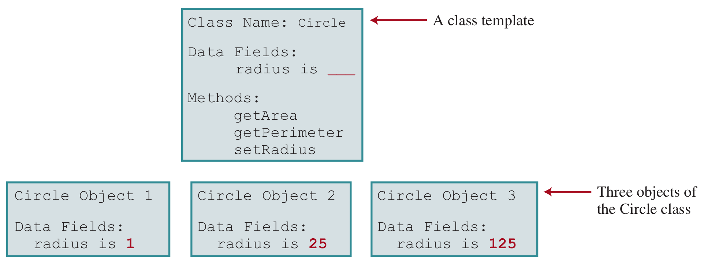
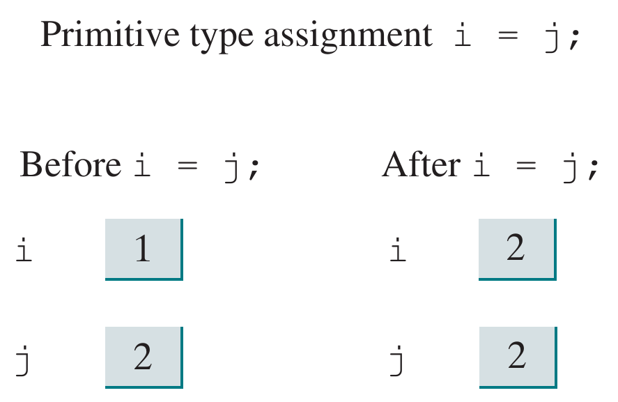

# Chapter 9: <br> Objects and Classes <br> Part - I

---

### What is Object-Oriented Programming (OOP)?

- **Object-Oriented Programming (OOP)** is a way to design programs by using "objects" that group data and actions together to make coding easier and more organized.
- OOP helps make code easier to reuse, organize, and maintain, especially in large projects.
- It is commonly used in programming languages like Java, C++, and Python.

---

### Basic Concepts of OOP

|   **Concepts**    | **Description**                                                                                             |
| :---------------: | ----------------------------------------------------------------------------------------------------------- |
|     **Class**     | A blueprint for creating objects, defining their attributes and behaviors.                                  |
|    **Object**     | An instance of a class that contains both data (attributes) and methods (functions) to operate on the data. |
| **Encapsulation** | Bundling data and methods that operate on the data <br> within one unit (class) and restricting access.     |
|  **Inheritance**  | Mechanism where one class acquires the properties and <br> behaviors of another class.                      |
| **Polymorphism**  | Ability of a single interface to represent different <br> underlying forms (e.g., method overriding).       |
|  **Abstraction**  | Hiding implementation details and showing only essential <br> features of an object.                        |

---

## 9.1. Introduction

---

### What is Class?

- A **Class** is a blueprint for creating objects.
- It defines the data (attributes) and actions (methods) that objects will have.
- Classes help organize and manage code by grouping related data and functionality together.
- They allow code reuse through inheritance and support polymorphism for flexibility.
- Classes are a key part of object-oriented programming (OOP) and help model real-world things in software.

---

### What is Object?

- An **Object** is a unit that combines data and methods to work with that data.
- Objects are created from classes, which define their structure and behavior.
- Objects can represent things like a Button, a Label, a TextField, a CheckBox, etc.
- They group data and methods together, making programs easier to manage and reuse.

---

### Example of Objects in JavaFx


---

## 9.2. Defining Class for Object

---

### Introduction to Class

- A **Class** is a blueprint for creating objects.
- There are two main components in a class:
  - **Attributes**: represent the state or properties of an object.
  - **Methods**: represent the behavior or actions that can be performed on the object.
- Classes model real-world entities and solve complex problems in software.

---

**Example:** A simple `Circle` class.

```java
class Circle {
    // Attribute
    double radius;

    // Method to calculate the area of the circle
    double getArea() {
        return Math.PI * radius * radius;
    }
}
```

**Noted**: Classes can have multiple attributes and methods.

---

### Defining a Class

**Syntax**:

```java
class ClassName {
    dataType fieldName; // Attribute
    returnType methodName(parameters) { /* Method */ }
}
```

**Note**:

- A class is defined using the `class` keyword followed by the class name and a pair of curly braces `{}`.
- Inside the class, you can define attributes (fields) and methods (functions).

---

**Example**: A class named `Circle` with a field `radius` and a method `getArea()`.

```java
class Circle {
    double radius;
    double getArea() { return Math.PI * radius * radius; }
}
```

**Explain**: The `Circle` class has one attribute `radius` and one method `getArea()` that calculates the area of the circle using the formula πr².

---

### Declaring and Creating Object from Class

**Syntax**: Declaring an object from a class.

```java
// Declaring an object
ClassName objectName;
```

**Note**: This only declares the object but does not create it.

**Syntax**: Creating an object from a class.

```java
// Create an object
ClassName objectName = new ClassName();
```

**Note**: Use the `new` keyword to create an object from a class.

---

**Example**: Creating a `Circle` object.

```java
// Creates a Circle object
Circle myCircle = new Circle();
```

**Explain**:

- This line creates a new `Circle` object named `myCircle`.
- The `new` keyword allocates memory for the object, and the constructor initializes it.
- The default value of `radius` is 0.0 until explicitly set.

---

### Access Field and Method of Object

**Syntax**: Accessing a field of an object.

```java
objectName.fieldName; // Accessing a field
```

**Note**: Use the dot operator (`.`) with `fieldName` to access a field of an object.

**Syntax**: Calling a method of an object.

```java
objectName.methodName(arguments); // Calling a method
```

**Note**: Use the dot operator (`.`) with `MethodName()` to call a method on an object.

---

**Example**: Accessing `radius` field and `getArea()` method of a `Circle` object.

```java
Circle myCircle = new Circle(); // Creates a Circle object
myCircle.radius = 5.0; // Sets the radius to 5.0
double radius = myCircle.radius; // Accesses the radius field
double area = myCircle.getArea(); // Calls the getArea() method
```

**Explain**:

- The `myCircle` object is created from the `Circle` class.
- The `radius` field is set to 5.0.
- The `radius` field is accessed using the dot operator.
- The `getArea()` method is called to calculate the area of the circle.
- The area is calculated using the formula πr², where `r` is the radius.

---

### Visualization of Class and Object



---

### Tips

- A `ClassName.java` file can contain multiple classes, but only one public class and the public class name must match the file name.
- When compiling a `ClassName.java` file, the compiler creates multiple `.class` files for each class.


---

## 9.3. Example: <br> Defining Class and Creating Object

---

### Define a `TV` Class


---

**Example**: A simple `TV` class with attributes and methods.

```java
public class TV {
    private int channel = 1, volumeLevel = 1;
    private boolean on = false;
    public void turnOn() { on = true; }
    public void turnOff() { on = false; }
    public void setChannel(int c) { if (on && c >= 1 && c <= 120) channel = c; }
    public void setVolume(int v) { if (on && v >= 1 && v <= 7) volumeLevel = v; }
    public void channelUp() { if (on && channel < 120) channel++; }
    public void channelDown() { if (on && channel > 1) channel--; }
    public void volumeUp() { if (on && volumeLevel < 7) volumeLevel++; }
    public void volumeDown() { if (on && volumeLevel > 1) volumeLevel--; }
    public int getChannel() { return channel; }
    public int getVolumeLevel() { return volumeLevel; }
    public boolean isOn() { return on; }
}
```

---

### Create a multiple `TV` objects

**Example**: Creating and using multiple `TV` objects.

```java
TV tv1 = new TV(), tv2 = new TV();
tv1.turnOn(); tv1.setChannel(30); tv1.setVolume(3);
tv2.turnOn(); tv2.setChannel(3); tv2.setVolume(2);
System.out.println("TV1's channel: " + tv1.getChannel()
    + ", volume: " + tv1.getVolumeLevel());
System.out.println("TV2's channel: " + tv2.getChannel()
    + ", volume: " + tv2.getVolumeLevel());
```

---

**Output:**

```raw
TV1's channel is 30 and volume level is 3
TV2's channel is 3 and volume level is 2
```

**Note**:

- The `TV` class encapsulates the state and behavior of a television.
- Methods like `turnOn`, `setChannel`, and `volumeUp` allow controlled interaction with the TV.
- The `TestTV` class demonstrates creating and using multiple `TV` objects.

---

## 9.4. Constructing Objects Using a Constructor

---

### What is a Constructor?

- **Constructor** is a special method used to create and initialize objects at the time of their creation.
- A constructor is automatically called when you create an object using the `new` keyword.

- **Constructor Rules**:
  - The name of the constructor must be the same as the class name.
  - Constructors do not have a return type (not even `void`).

---

### Types of Constructors

- Constructors can be categorized into two main types:
  - **No-Argument Constructor**: Initializes default values for an object.
  - **Parameterized Constructor**: Accepts arguments to initialize an object with specific values.

---

### No-Argument Constructor

- Initializes default values for an object.

**Example**: A no-arg constructor for the `Circle` class.

```java
class Circle {
    double radius;

    // No-arg constructor
    Circle() {
        radius = 1.0;
    }
}
```

---

### Parameterized Constructor

- Accepts arguments to initialize an object with specific values.

**Example**: A parameterized constructor for the `Circle` class.

```java
class Circle {
    double radius;

    // Parameterized constructor
    Circle(double newRadius) {
        radius = newRadius;
    }
}
```

---

### Default Constructor

- If no constructor is defined, Java automatically provides a **default constructor** with an empty body.

**Example**:

```java
class Test {
    // Java automatically provides: Test() { }
}
```

---

### Constructor Can Overloading

- A class can have multiple constructors with different parameter lists (overloading).

**Example**: A class with both no-arg and parameterized constructors.

```java
class Circle {
    double radius;

    // No-arg constructor
    Circle() {
        radius = 1.0;
    }

    // Parameterized constructor
    Circle(double newRadius) {
        radius = newRadius;
    }
}
```

---

### Common Mistake

- A constructor initializes objects and shares the same name as the class.
- It has no return type and can be overloaded for flexibility.
- Java provides a default constructor if none is defined.
- Adding a return type turns it into a regular method.
- Constructors ensure proper object setup and improve code clarity.

---

### Visualization of Class with Constructor


---

## 9.5: Accessing Objects via Reference Variables

---

### Primitive vs. Reference Variable Types


**Explain**:

- `int i = 1;` is a primitive type variable, which directly holds the value `1`.
- `c.radius = 1;` is a reference type variable, which refers to an object and accesses its `radius` field.

---

### Primitive Variable Assignment



**Note**: Primitive variables store actual values. When assigned to another variable, a copy of the value is made.

---

### Reference Variables

- **Reference variables** store the address of an object in memory.
- They are declared using the class name and can be assigned an object using the `new` keyword.

---

### Reference Variable Assignment


**Note**:

- After using `=` to assign `c1` to `c2`, both `c1` and `c2` refer to the same object in memory.
- Changing the value of `c1` will also change the value of `c2`, as they point to the same object.

---

### Instance Variables and Methods

- **Instance Variables** belong to specific objects and hold unique data for each object.
- **Instance Methods** operate on an object’s data and must be called on an instance.

**Example**: Instance variable and method

```java
class Circle {
    // Instance variable
    double radius;

    // Instance method
    double getArea() {
        return Math.PI * radius * radius;
    }
}
```

---

### Anonymous Objects

- An **anonymous object** is an object that is created without a reference variable.
- It is useful for one-time use, such as passing an object to a method or performing a quick operation.

**Example**:

```java
// Create an anonymous object
new Circle().radius = 5.0; // Sets radius to 5.0
new Circle().getArea();
```

**Note**: Anonymous objects are useful for one-time use, such as passing an object to a method or performing a quick operation.

---

### Understanding `null` and Avoiding NullPointerException

- If an object reference variable is not assigned an object, it defaults to `null`.
- The `null` is a special value that indicates an object reference variable does not point to any object.
- Accessing methods or fields on `null` causes a `NullPointerException`.

---

**Example**:

```java
Circle myCircle;
System.out.println(myCircle.radius); // Causes an error
```

**Explain**:

- The variable `myCircle` is declared but not initialized, so it defaults to `null`.
- Attempting to access `myCircle.radius` results in a `NullPointerException` because `myCircle` does not reference any object.
- To fix this, initialize `myCircle` with a new `Circle` object before accessing its fields or methods:

---

### Garbage Collection

- Java automatically manages memory through **Garbage Collection**.
- When an object is no longer referenced, it becomes eligible for garbage collection.
- The garbage collector reclaims memory, preventing memory leaks.

---

**Example**:

```java
Circle myCircle = new Circle(); // Create an object
myCircle = null; // Dereference the object
```

**Explain**:

- The `myCircle` object is created and assigned to a reference variable.
- Setting `myCircle` to `null` dereferences the object, making it eligible for garbage collection.
- The garbage collector will reclaim the memory used by the object when it runs.

---

### Tip: Array of Objects

- Objects can be stored in arrays, allowing you to manage multiple objects of the same class easily.
- It allows you to manage multiple objects of the same class easily.
- Each element in the array is a reference to an object of the specified class.

**Example**:

```java
// Array of Circle objects
Circle[] circles = new Circle[5];
for (int i = 0; i < circles.length; i++) {
    // Create Circle objects
    circles[i] = new Circle();
}
```

---

### Tip: Object in Object

- Objects can contain other objects as attributes, allowing for complex data structures.
- This is useful for modeling real-world relationships between objects.

**Example**: The `Person` class contains an `Address` object.

```java
class Person {
    String name;
    Address address; // Object of Address class
}
class Address {
    String street;
    String city;
}
```

---

### Tip: Object in Java Collections Framework

- Java provides a rich set of classes and interfaces for working with collections of objects.

```java
import java.util.Arrays;        // For array manipulation
import java.util.List;          // For list manipulation
import java.util.ArrayList;     // For dynamic array
import java.util.Collections;   // For sorting and searching
import java.util.Iterator;      // For iterating over collections
import java.util.Set;           // For set manipulation
import java.util.Map;           // For key-value pairs
import java.util.Queue;         // For queue manipulation
import java.util.Stack;         // For stack manipulation
import java.util.Vector;        // For dynamic array
import java.util.Enumeration;   // For iterating over collections
...
```

---

**Example**: Using `ArrayList` to store objects.

```java
import java.util.ArrayList;
class Circle {
    double radius;
    Circle(double r) { radius = r; }
}
public class Main {
    public static void main(String[] args) {
        // Create an ArrayList of Circle objects
        ArrayList<Circle> circles = new ArrayList<>();
        circles.add(new Circle(1.0)); // Add Circle objects to the list
        circles.add(new Circle(2.0)); // Add Circle objects to the list
        for (Circle c : circles) {
            // Accessing object attributes
            System.out.println("Circle radius: " + c.radius);
        }
    }
}
```

---

**Explain**:

- The `ArrayList` class is part of the Java Collections Framework and allows dynamic resizing.
- The `<Circle>` in `ArrayList<Circle>` specifies that the list will hold `Circle` objects.
- The `add()` method is used to add `Circle` objects to the list.
- The `Circle` class has a constructor to initialize the `radius`.
- The `Main` class demonstrates creating an `ArrayList` of `Circle` objects and accessing their attributes.
- The `for` loop iterates through the list and prints the radius of each circle.
- The `ArrayList` class provides methods like `add()` to add elements and automatically resizes the array as needed.

---

## End of the Chapter

<!-- style: |

    section {
    font-family: Nokora;
    }

    h1 {
    color: black;
    font-size: 50px;
    text-align: center;
    }
    h2 {
    font-size: 40px;
    text-align: center;
    }
    h3 {
    font-size: 30px;
    position: absolute;
    top: 60px;
    }
    h3::before {
    content: "👉"; /* Unicode for bullet */
    }
    h4 {
    font-size: 26px;
    }
    h5 {
    font-size: 26px;
    }
    h6 {
    font-size: 26px;
    }
    p {
    font-size: 26px;
    }
    li {
    font-size: 26px;
    }
    table {
    margin: auto;
    font-size: 20px;
    }
    img {
    display: block;
    margin: 0 auto;
    }
    section::after {
    font-size: 20px;
    }
    ul {
    list-style-type: "✨";
    padding-left: 20px;
    margin-left: 20px;
    }

-->
