# Chapter 9: <br> Objects and Classes <br> Part - II

---

## 9.6. Using Classes from the Java Library

---

### Java API (Application Programming Interface)

- Java comes with many built-in classes you can use to make programming easier.
- These classes are grouped into packages, like toolboxes for different tasks.
- The Java API is a big collection of these classes and packages.
- You can look up [Java API](https://docs.oracle.com/en/java/javase/23/docs/api/index.html) to see what each class does and how to use it.
- Some common packages include:
  - `java.lang` (for Language features)
  - `java.util` (for Utilities)
  - `java.io` (for Input/Output )
  - `java.awt` (for Abstract Window Toolkit)

---

### Commonly Used Java Library Classes

- `Date` Class:
  - Represents a specific date and time.
  - Provides methods to manipulate and format dates.
- `Random` Class:
  - Generates random numbers.
  - Useful for simulations, games, and testing.
- `Arrays` Class:
  - Contains static methods for manipulating arrays.
  - Provides sorting, searching, and copying functionalities.
- `ArrayList` Class:
  - Implements a resizable array.
  - Allows dynamic storage of elements.

---

### `Date` Class `java.util.Date`

- `Date` represents a specific instant in time, with millisecond precision.

**Example**: Getting the current date and time.

```java
java.util.Date date = new java.util.Date();
System.out.println(date.toString());
```

**Output**:

```
Wed Oct 04 14:30:00 GMT 2023
```

**Explain**:

- `java.util.Date` is a class in the `java.util` package.
- The `toString()` method returns a string representation of the date.

---

### `Random` Class `java.util.Random`

- `Random` generates pseudo-random numbers.

**Example**: Generating a random integer.

```java
java.util.Random rand = new java.util.Random();
int randomNumber = rand.nextInt(100);
```

**Output**:

```
50
```

**Explain**:

- `java.util.Random` is a class in the `java.util` package.
- `nextInt(100)` generates a random integer between 0 and 99.

---

### `Arrays` Class `java.util.Arrays`

- `Arrays` provides static methods for manipulating arrays.

**Example**: Sorting an array.

```java
int[] numbers = {3, 1, 4, 1, 5};
java.util.Arrays.sort(numbers);
System.out.println(java.util.Arrays.toString(numbers));
```

**Output**:

```
[1, 1, 3, 4, 5]
```

**Explain**:

- `java.util.Arrays` is a class in the `java.util` package.
- `sort()` sorts the array in ascending order.

---

### `ArrayList` Class `java.util.ArrayList`

- `ArrayList` is a resizable array implementation of the `List` interface.

**Example**: Creating and using an `ArrayList`.

```java
java.util.ArrayList<String> list = new java.util.ArrayList<>();
list.add("Apple");
list.add("Banana");
list.add("Cherry");
System.out.println(list);
```

**Output**:

```
[Apple, Banana, Cherry]
```

---

**Explain**:

- `java.util.ArrayList` is a class in the `java.util` package.
- `add()` adds elements to the list.
- `toString()` returns a string representation of the list.

---

## 9.7. Static Variables, Constants, <br> and Methods

---

- In Java, the `static` keyword is used to define class-level variables and methods that are shared across all instances/objects of a class.

---

### Static Variables or Class Variables

- Static variables are shared among all instances/objects of a class.

**Example**: Using a static variable to count the number of `Circle` objects created.

```java
class Circle {
    double radius;
    static int numberOfObjects = 0; // Shared among all instances

    Circle(double newRadius) {
        radius = newRadius;
        numberOfObjects++; // Increment when a new object is created
    }
}
```

---

### Visualization


---

**Explain**:

- `numberOfObjects` is a static variable that keeps track of how many `Circle` objects have been created.
- It is shared among all instances of the `Circle` class.
- When a new `Circle` object is created, the constructor increments `numberOfObjects`.
- Static variables are initialized when the class is loaded, and they exist for the lifetime of the program.
- They can be accessed using the class name or through an instance of the class.

---

### Static Constants

- Static constants are declared with the `static final` keywords.
- They are shared among all instances and cannot be changed.

Example:

```java
class Circle {
    static final double PI = 3.14159; // Constant value of PI
}
```

---

### Static Methods

- Static methods belong to the class rather than any specific instance. They can be called without creating an instance of the class.
- Static methods can only access static variables and other static methods directly. They cannot access instance variables or instance methods directly.

**Example**: Using a static method to get the number of objects created.

```java
public static int getNumberOfObjects() {
    return numberOfObjects;
}
```

---

### Static vs. Instance Members

| Feature           | Static Members                       | Instance Members                  |
| ----------------- | ------------------------------------ | --------------------------------- |
| Declaration       | With `static` keyword                | Without `static` keyword          |
| Belongs To        | The class itself                     | Each object (instance)            |
| Shared By         | All instances of the class           | Only the specific instance        |
| Accessed By       | `ClassName.member` or object         | Only through an object            |
| Memory Allocation | Once per class                       | Once per object                   |
| Can Access        | Only static members directly         | Both static and instance members  |
| Example           | `static int count;`                  | `int radius;`                     |
| Use Case          | Constants, utility methods, counters | Object-specific data and behavior |

---

### Visualization


---

### Accessing Static Members

- Static members can be accessed using the class name or through an instance of the class. It is recommended to use the class name for clarity.

**Example**: Accessing static members.

```java
System.out.println(Circle.numberOfObjects);
```

---

### Common Mistakes

- Avoid using instance variables in static methods without creating an instance of the class.
- Static methods cannot access instance variables directly.
- Use static methods for utility functions that do not depend on instance data.
- Be cautious when using static variables, as they can lead to unexpected behavior if modified by multiple instances.

---

## 9.8. Visibility Modifiers

---

- **Visibility modifiers** in Java control access to classes, variables, and methods, ensuring data encapsulation and security.

| Modifier    | Description                                                                                    |
| ----------- | ---------------------------------------------------------------------------------------------- |
| `private`   | Accessible only within the same object.                                                        |
| (default)   | Also called package-private; accessible only within classes in the same package.               |
| `protected` | Accessible within the same package and by subclasses (even if they are in different packages). |
| `public`    | Accessible from any other class in any package.                                                |

<br>

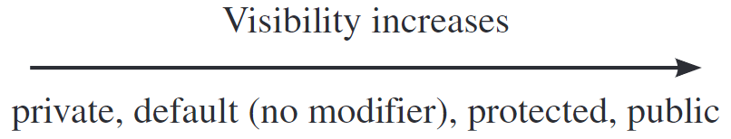

---

### Visibility Modifiers `private`

- The `private` modifier restricts access to the class itself. It cannot be accessed from outside the class, even by subclasses or classes in the same package.
- Used to encapsulate data and methods that should not be exposed to the outside world.

**Example**: Using `private` in a class.

```java
class Circle {
    private double radius;  // Only accessible inside the Circle class
}
```

---

### Default Visibility Modifiers (No Modifier Specified)

- If no visibility modifier is specified, the class, method, or variable is package-private (default).
- Accessible only within classes in the same package.

**Example**: Using default visibility.

```java
class Circle {  // Can be accessed only within the same package
    double radius;
}
```

---

### Visibility Modifiers `protected`

- The `protected` modifier allows access to subclasses and classes in the same package. It is useful for inheritance, allowing subclasses to access superclass members.

**Example**: Using `protected` in a class.

```java
class Circle {
    protected double radius;  // Accessible in subclasses and same package
}
```

---

### Visibility Modifiers `public`

- The `public` modifier allows access from any class in any package.

**Example**: Using `public` in a class.

```java
public class Circle {
    public double radius;  // Can be accessed from any class
}
```

---

### Accessibility of `public`, `private`, and `protected`

| Modifier    | Same Class | Same Package | Subclass (Different Package) | Other Packages |
| ----------- | ---------- | ------------ | ---------------------------- | -------------- |
| `public`    | Yes        | Yes          | Yes                          | Yes            |
| `protected` | Yes        | Yes          | Yes                          | No             |
| (default)   | Yes        | Yes          | No                           | No             |
| `private`   | Yes        | No           | No                           | No             |

<br>

**Notes**:

- Use `public` for members that should be accessible everywhere.
- Use `private` for encapsulation and data hiding.
- Use `protected` to allow controlled access for subclasses.

---

## 9.9. Data Field Encapsulation

---

### Encapsulation

- **Encapsulation** is a fundamental principle in object-oriented programming that involves restricting direct access to an object's data fields.
- Instead, access is provided through public methods, known as **Getters** and **Setters**.

- To prevent direct modification of data fields, they should be declared as `private`.
- This ensures that the data can only be accessed or modified through the methods provided by the class.

---

### Getter and Setter Methods

- **Getter**:

  - A method that lets you read the value of a private variable.
  - Usually named `getSomething()` (or `isSomething()` for `boolean`).

- **Setter**:

  - A method that lets you change the value of a private variable.
  - Usually named `setSomething(value)`.

---

### Benefits of Encapsulation

- **Data Hiding**: Prevents external code from directly accessing and modifying the internal state of an object.
- **Control**: Allows the class to control how its data is accessed and modified.
- **Validation**: Setters can include validation logic to ensure that only valid data is assigned to the fields.
- **Maintainability**: Changes to the internal representation of the class can be made without affecting external code that uses the class.
- **Flexibility**: Allows for future changes to the class without breaking existing code.
- **Security**: Protects sensitive data from being accessed or modified inappropriately.
- **Readability**: Makes the code more readable and understandable by clearly defining the interface for accessing and modifying data.

---

**Example**: Circle Class with Encapsulation.

```java
public class Circle {
    // Private data field
    private double radius = 1.0;

    // Getter for radius
    public double getRadius() {
        return radius;
    }

    // Setter for radius with validation
    public void setRadius(double newRadius) {
        radius = (newRadius >= 0) ? newRadius : 0;
    }

    // Method to calculate area
    public double getArea() {
        return radius * radius * Math.PI;
    }
}                                                                                                 .
```

---

## 9.10. Passing Objects to Methods

---

### Passing Objects to Methods

- In Java, when you pass an object to a method, you are passing a copy of the reference to that object. This means changes to the object's data inside the method will affect the original object.
- But if you make the reference point to a new object inside the method, it does not change the original reference outside the method.

---

### Pass-by-Value vs. Pass-by-Reference

- **Primitive Types**: When you pass a primitive type (e.g., `int`, `double`) to a method, the actual value is passed. Changes to the parameter inside the method do not affect the original variable.
- **Reference Types**: When you pass an object (a reference type) to a method, the reference to the object is passed. This means that changes to the object's state inside the method will affect the original object.

---

**Example**: Passing an Object to a Method.

```java
public class TestPassObject {
    // Method to print areas for increasing radius
    public static void printAreas(Circle c, int times) {
        System.out.println("Radius \t\tArea");
        while (times >= 1) {
            System.out.println(c.getRadius() + "\t\t" + c.getArea());
            c.setRadius(c.getRadius() + 1); // Modify the radius
            times--;
        }
    }
    public static void main(String[] args) {
        Circle myCircle = new Circle(1); // Create a Circle object with radius 1
        int n = 5;
        printAreas(myCircle, n); // Pass the Circle object and an integer to the method

        // Print the final radius and n
        System.out.println("\nRadius is " + myCircle.getRadius());
        System.out.println("n is " + n);
    }
}                                                                                                 .
```

---

**Output**:

```raw
Radius 		Area
1.0		3.141592653589793
2.0		12.566370614359172
3.0		28.274333882308138
4.0		50.26548245743669
5.0		78.53981633974483

Radius is 6.0
n is 5
```

---

**Explain**:

- The `printAreas` method takes a `Circle` object and an integer `times`.
- It prints the radius and area of the circle for `times` iterations, increasing the radius by 1 each time.
- After the method call, the radius of `myCircle` is modified to 6.0, demonstrating that the original object was affected by the changes made inside the method.
- The integer `n` remains unchanged because it is a primitive type passed by value.

---

## 9.11. Immutable Objects and Classes

---

### Immutable Objects

- An **immutable object** is an object whose state cannot be modified after it is created.
- Once an immutable object is created, its data cannot be changed.
- This is achieved by not providing any methods that modify the object's state, such as setters.
- Immutable objects are often used in concurrent programming and functional programming paradigms.

---

**Example**: Immutable Circle Class

```java
public class Circle {
    private final double radius; // Private and final data field
    // Constructor
    public Circle(double radius) {
        this.radius = radius; // Assign value in constructor
    }
    // Getter for radius (no setter provided)
    public double getRadius() {
        return radius;
    }
    // Method to calculate area
    public double getArea() {
        return radius * radius * Math.PI;
    }
}
```

---

**Explain**:

- The `Circle` class is immutable because:
  - The `radius` field is declared as `private` and `final`, meaning it cannot be changed after the object is created.
  - There are no setter methods to modify the `radius`.
  - The `getRadius()` method allows read access but does not allow modification.

**Note**: If setter methods were provided, the class would not be immutable.

---

### Immutable Classes

- An **immutable class** is a class that cannot be modified after it is created.
- All data fields in an immutable class should be declared as `private` and `final`.
- The class should not provide any setter methods that allow modification of the data fields.

---

**Example**: Immutable Student Class

```java
private class Student {
    private final int id; // Private and final data field
    private final String name; // Private and final data field
    private final java.util.Date dateCreated; // Private and final data field

    public Student(int id, String name) {
        this.id = id;
        this.name = name;
        this.dateCreated = new java.util.Date(); // Initialize dateCreated
    }
    public int getId() {
        return id;
    }
    public String getName() {
        return name;
    }
    public java.util.Date getDateCreated() {
        return new java.util.Date(dateCreated.getTime()); // Return a copy of the Date object
    }
}                                                                                                 .
```

---

### Benefits of Immutable Objects/Classes

- **Thread Safety**: Immutable objects are inherently thread-safe because their state cannot change after creation. This eliminates issues related to concurrent modifications.
- **Simplicity**: Immutable objects are easier to reason about since their state does not change over time.
- **Caching**: Immutable objects can be cached and reused, reducing memory overhead.
- **Security**: Immutable objects can help prevent accidental changes to the object's state, enhancing security and reliability.
- **Functional Programming**: Immutable objects align well with functional programming principles, where functions do not have side effects and do not modify the input data.
- **Ease of Use**: Immutable objects can be passed around without worrying about their state being changed unexpectedly, making them easier to use in APIs and libraries.

---

**Example**: Immutable Circle Class

```java
public class Circle {
    private double radius; // Private data field

    // Constructor
    public Circle(double radius) {
        this.radius = radius;
    }

    // Getter for radius (no setter provided)
    public double getRadius() {
        return radius;
    }

    // Method to calculate area
    public double getArea() {
        return radius * radius * Math.PI;
    }
}                                                                                                 .
```

---

## 9.12. The Scope of Variables

---

### Scope of Variables

- The **scope of a variable** refers to the region of the code where the variable can be accessed.
- In Java, variables can be classified into three main types based on their scope:
  - **Instance Variables**: Declared inside a class but outside any method. They are accessible from all methods, constructors, and blocks in the class. Their scope is the entire class.
  - **Static Variables**: Similar to instance variables but declared with the `static` keyword. They are shared among all instances of the class and have the same scope as instance variables.
  - **Local Variables**: Declared inside a method, constructor, or block. They are only accessible within the method, constructor, or block where they are declared. Their scope is limited to the block in which they are declared.

---

### Scope Rules

- **Class-Level Variables** (Instance and Static): Can be accessed from anywhere within the class, regardless of where they are declared. However, if a local variable with the same name exists in a method, the local variable will take precedence (this is called variable shadowing).
- **Local Variables**: Only accessible within the block they are declared in. They cannot be accessed outside that block.

---

### Variable Shadowing

- **Variable Shadowing** occurs when a local variable has the same name as an instance or static variable. In this case, the local variable takes precedence within its scope.
- To access the class-level variable, you can use the `this` keyword for instance variables or the class name for static variables.

---

**Example**:

```java
public class F {
    private int x = 0; // Instance variable
    private int y = 0; // Instance variable

    public F() {
        // Constructor
    }

    public void p() {
        int x = 1; // Local variable (shadows the instance variable x)
        System.out.println("x = " + x); // Refers to the local variable x
        System.out.println("y = " + y); // Refers to the instance variable y
    }
}
```

---

**Output**:

```
x = 1
y = 0
```

**Explain**:

- The local variable `x` in the method `p()` shadows the instance variable `x`. Therefore, `System.out.println("x = " + x);` prints the value of the local variable `x`, which is `1`.
- The instance variable `y` is not shadowed, so `System.out.println("y = " + y);` prints the value of the instance variable `y`, which is `0`.

---

## 9.13. The `this` Reference

---

### The `this` Keyword

- The `this` keyword in Java is a reference to the current object, allowing access to instance variables and methods of the current class.
- It is commonly used to resolve naming conflicts between instance variables and method parameters or local variables.
- The `this` keyword can also be used to invoke another constructor in the same class (constructor chaining).

---

### Using `this` to Access Instance Members

- When a method parameter or local variable has the same name as an instance variable, you can use `this` to refer to the instance variable.
- This helps avoid confusion and makes it clear that you are referring to the instance variable.
- Using `this` improves code readability and clarity.

---

**Example**: Using `this` to Access Instance Variables

```java
public class Circle {
    private double radius; // Instance variable

    public Circle(double radius) {
        this.radius = radius; // Use 'this' to refer to the instance variable
    }

    public void setRadius(double radius) {
        this.radius = radius; // Use 'this' to refer to the instance variable
    }
}
```

---

### Using `this` to Invoke Another Constructor

- The `this` keyword can be used to call one constructor from another constructor in the same class. This is known as constructor chaining.
- The call to another constructor must be the first statement in the constructor.

---

**Example**: Using `this` for Constructor Chaining

```java
public class Circle {
    private double radius;

    // No-arg constructor
    public Circle() {
        this(1.0); // Invoke the parameterized constructor with a default radius of 1.0
    }

    // Parameterized constructor
    public Circle(double radius) {
        this.radius = radius; // Use 'this' to refer to the instance variable
    }
}
```

---

**Explain**:

- The no-arg constructor `Circle()` calls the parameterized constructor `Circle(double radius)` using `this(1.0)`, passing a default value of `1.0` for the radius.
- This allows for constructor chaining, where one constructor can initialize the object using another constructor's logic.

---

### The `this` Reference in Java

- **Instance Members**: Use `this` to access instance variables and methods.
- **Constructor Chaining**: Use `this(arg-list)` to invoke another constructor in the same class.
- **Avoiding Shadowing**: Use `this` to avoid confusion when local variables or parameters shadow instance variables.

---

## Tips: Type of Data Structure

---

- **Array**: A fixed-size collection of elements of the same type, accessed by index.

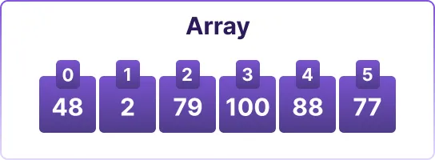

**Usage**:

- Arrays are used to store a fixed number of elements of the same type.

---

- **2D Array**: A collection of elements arranged in rows and columns, accessed by two indices.

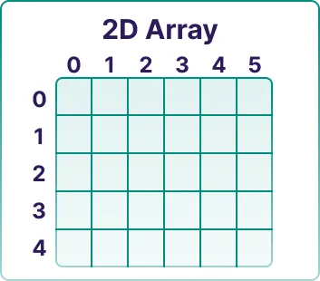

**Usage**:

- 2D arrays are used to represent matrices or grids, where each element can be accessed using two indices (row and column).

---

- **Queue**: A collection of elements that follows the First In First Out (FIFO) principle, where elements are added at the end and removed from the front.

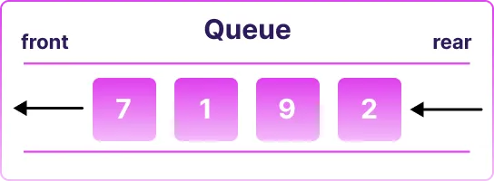

**Usage**:

- Queues are used for tasks like scheduling, breadth-first search algorithms, and managing resources in a first-come, first-served manner.

---

- **Stack**: A collection of elements that follows the Last In First Out (LIFO) principle, where elements are added and removed from the top.

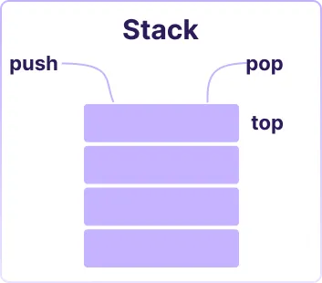

**Usage**:

- Stacks are used for tasks like undo operations, expression evaluation, and backtracking algorithms.

---

- **Graph**: A collection of nodes (vertices) connected by edges, used to represent relationships between objects.

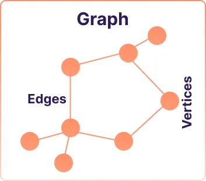

**Usage**:

- Graphs are used to represent networks, such as social networks, transportation systems, and web pages.

---

- **Tree**: A hierarchical data structure with a root node and child nodes, where each node can have multiple children but only one parent.

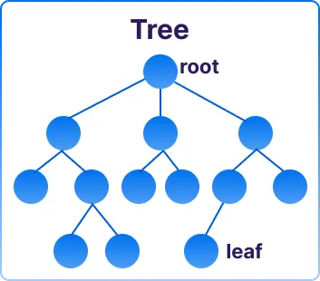

**Usage**:

- Trees are used to represent hierarchical data, such as file systems, organizational structures, and decision trees.

---

- **Linked List**: A collection of nodes where each node contains data and a reference to the next node, allowing for dynamic memory allocation.

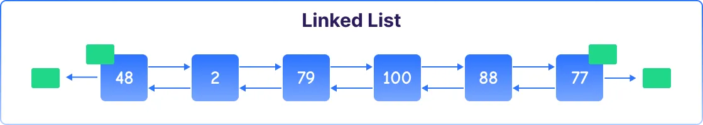

**Usage**:

- Linked lists are used for dynamic data structures where elements can be added or removed efficiently, such as in queues and stacks.

---

- **Trie**: A specialized tree structure where each node can have multiple children, often used for hierarchical data representation.

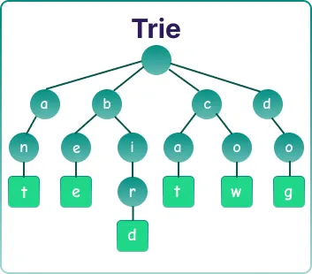

**Usage**:

- Tries are used for efficient retrieval of strings, such as in autocomplete systems and spell checkers.

---

- **HashMap**: A collection of key-value pairs that allows for fast retrieval of values based on their keys, using a hash function.

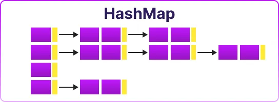

**Usage**:

- HashMaps are used for fast lookups, such as in caching, indexing, and associative arrays.

---

- **HashSet**: A collection of unique elements that uses a hash table for fast access, ensuring no duplicate values.

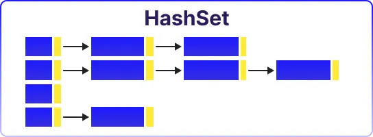

**Usage**:

- HashSets are used to store unique elements, such as in sets, where duplicates are not allowed.

---

- **Max Heap**: A complete binary tree where the value of each node is greater than or equal to the values of its children, used to implement priority queues.

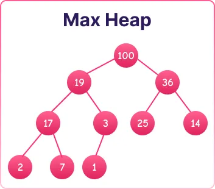

**Usage**:

- Max heaps are used to efficiently retrieve the maximum element, such as in priority queues and scheduling algorithms.

---

## End of the Chapter

<!-- style: |

    section {
    font-family: Nokora;
    }

    h1 {
    color: black;
    font-size: 50px;
    text-align: center;
    }
    h2 {
    font-size: 40px;
    text-align: center;
    }
    h3 {
    font-size: 30px;
    position: absolute;
    top: 60px;
    }
    h3::before {
    content: "👉"; /* Unicode for bullet */
    }
    h4 {
    font-size: 26px;
    }
    h5 {
    font-size: 26px;
    }
    h6 {
    font-size: 26px;
    }
    p {
    font-size: 26px;
    }
    li {
    font-size: 26px;
    }
    table {
    margin: auto;
    font-size: 20px;
    }
    img {
    display: block;
    margin: 0 auto;
    }
    section::after {
    font-size: 20px;
    }
    ul {
    list-style-type: "✨";
    padding-left: 20px;
    margin-left: 20px;
    }

-->
