# Chapter 10: <br> Object-Oriented Thinking <br> Part I

---

## 10.1. Introduction

---

### What is Object-Oriented Thinking?

- **Object-oriented thinking** is a programming paradigm that focuses on designing software using objects, which are instances of classes that encapsulate both data and behavior.
- It emphasizes the use of classes to model real-world entities and their interactions, making it easier to manage complexity in software development.

**Example**: In a banking application, you might have classes like `Account`, `Customer`, and `Transaction`, each representing a real-world entity with properties and methods relevant to that entity.

---

### Procedural Programming vs. Object-Oriented Programming

| Aspect              | Procedural Programming      | Object-Oriented Programming (OOP)     |
| ------------------- | --------------------------- | ------------------------------------- |
| Main Focus          | Functions and procedures    | Objects (from classes)                |
| Data and Actions    | Separate                    | Combined in objects                   |
| Organization        | Around steps and actions    | Around objects and their interactions |
| Reusability         | Limited                     | High (reuse classes and objects)      |
| Real-World Modeling | Less natural                | More natural                          |
| Extensibility       | Harder to change and extend | Easier to extend (inheritance, etc.)  |
| Encapsulation       | Not enforced                | Enforced (access control)             |
| Maintenance         | Can get messy as code grows | Easier due to modular design          |

---

## 10.2. Class Abstraction and Encapsulation

---

### Class Abstraction

- **Class abstraction** is the separation of class implementation from its use. The user of a class does not need to know how the class is implemented; they only need to know how to use it.

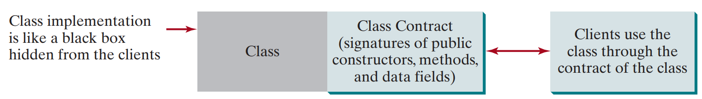

---

**Example**: A Loan Class

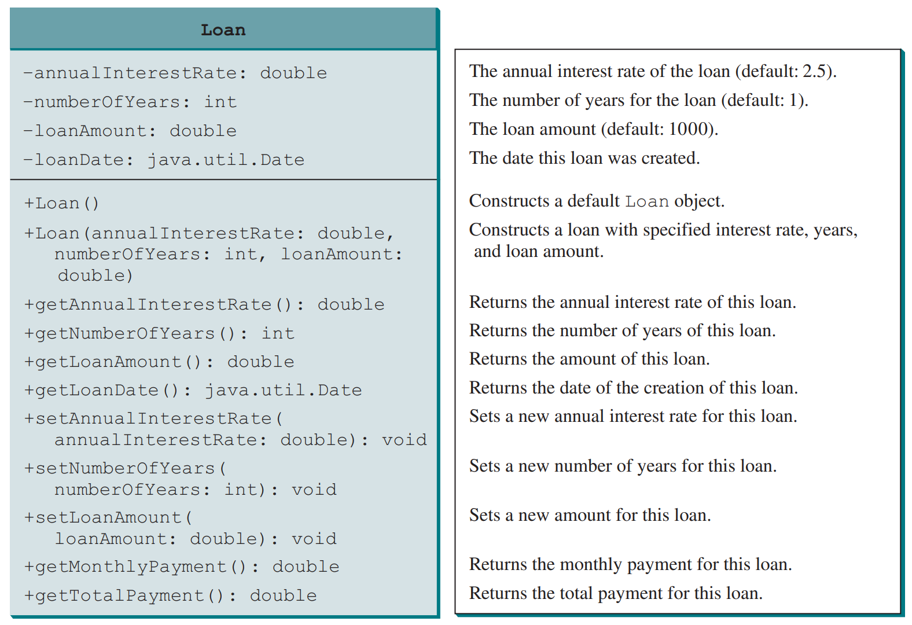

---

**Explain**:

- The `Loan` class encapsulates properties like `annualInterestRate`, `numberOfYears`, `loanAmount`, and `loanDate`, along with methods to calculate monthly and total payments.
- Users can create a `Loan` object and call methods like `getMonthlyPayment()` without needing to understand the underlying calculations.
- The class provides a clear contract for how to interact with it, allowing users to focus on using the class rather than its implementation details.
- The class can be reused in different contexts, such as calculating loan payments for different interest rates or loan amounts, demonstrating the power of abstraction and encapsulation in object-oriented programming.

---

<!--
### Class Encapsulation

- Definition: Encapsulation is the process of hiding the internal details of a class from the user. The implementation details are encapsulated and hidden, exposing only the necessary methods and properties.
- Example: In a computer system, components like the CPU, memory, and disk are encapsulated. You only need to know how to use them, not how they work internally.
- Class Contract: The public constructors, methods, and fields that are accessible from outside the class, along with their expected behavior, form the class's contract. Users interact with the class through this contract.

---

### Real-Life Analogies

- Computer System: Each component (e.g., CPU, memory) can be viewed as an object with properties and methods. You don't need to know how each component works internally to use them.
- Loan Example: A loan can be modeled as an object of a `Loan` class, with properties like interest rate, loan amount, and loan period, and methods to calculate monthly and total payments.

---

### UML Class Diagram

- The UML diagram for the `Loan` class shows the properties (e.g., `annualInterestRate`, `loanAmount`) and methods (e.g., `getMonthlyPayment`, `getTotalPayment`).
- The UML diagram serves as the contract for the class, showing how users can interact with it.

---

### Implementation Example

- The `Loan` class is implemented with constructors, getter and setter methods, and methods to calculate monthly and total payments.
- The class is designed to be reusable and customizable through its constructors and methods.

---

### Important Pedagogical Tip

- Using UML Diagrams: You can write a test program using the UML diagram for a class (e.g., `Loan`) without knowing its implementation. This demonstrates that developing a class and using it are separate tasks, and it helps in understanding how to implement a class by first using it.

---

### Key Questions

- Immutable Classes: If you redefine the `Loan` class without setter methods, it becomes immutable, meaning its state cannot be changed after creation.

---
-->

## 10.3. Thinking in Objects

---

### Why do We Need to Think in Objects?

- We know that OOP enables us to model real-world entities as objects, grouping related data and behavior within classes.
- **Thinking in objects** helps us create software that aligns with how we naturally perceive and interact with the world.
- This approach allows us to create abstractions that simplify complex systems, making them easier to design, understand, and manage.
- By encouraging modular, organized, and reusable code, OOP promotes maintainability and better organization in software development.

---

### How to design a Body Mass Index (BMI) Class? "Thinking..."

- **Problem**: In procedural programming, BMI is calculated by passing weight and height to a function. However, this approach makes it difficult to associate additional information, such as a person's name or age, with the BMI calculation.
- **Solution**: Creating a `BMI` class allows storing a person's name, age, weight, and height together as a single object. The class provides methods to calculate BMI and determine the weight status (underweight, normal, or overweight). This approach results in more organized and maintainable code.

---

- **Design**: The `BMI` class encapsulates properties like `name`, `age`, `weight`, and `height`, along with methods `getBMI` and `getStatus` to calculate BMI and determine weight status.

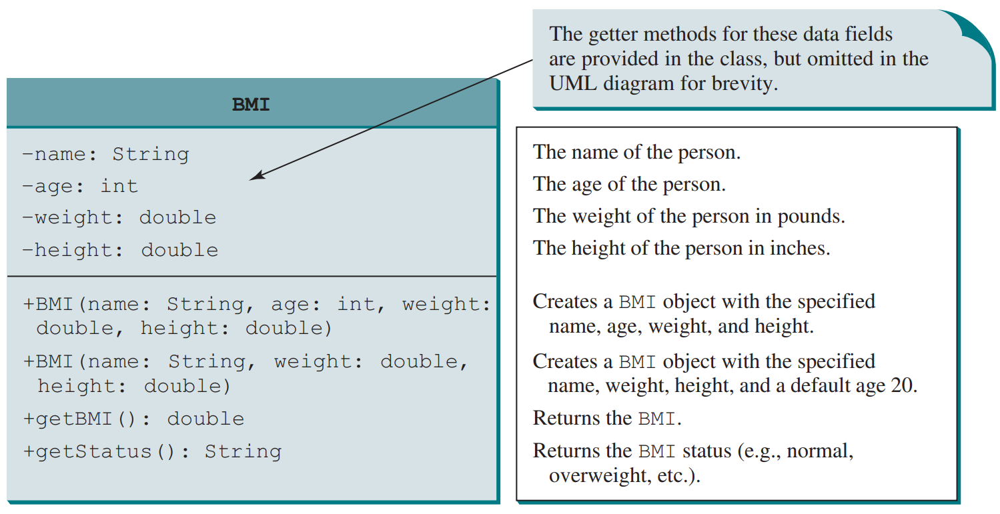

---

- **Implementation**

```java
public class BMI {
    private String name; private int age; private double weight, height;

    public BMI(String name, double weight, double height) {
        this(name, 0, weight, height);
    }

    public BMI(String name, int age, double weight, double height) {
        this.name = name; this.age = age; this.weight = weight; this.height = height;
    }

    public double getBMI() { return weight / (height * height); }

    public String getStatus() {
        double bmi = getBMI();
        return bmi < 18.5 ? "Underweight" : (bmi < 25 ? "Normal" : "Overweight");
    }
}
```

---

## 10.4. Class Relationships

---

### What are Class Relationships?

- **Class relationships** define how classes interact and collaborate in object-oriented programming.
- Common relationships: **Association**, **Directed Association**, **Reflexive Association**, **Multiplicity**, **Aggregation**, **Composition**, **Inheritance/Generalization**, **Realization**.
- Understanding these relationships is crucial for designing robust and maintainable software systems.

---

### Association

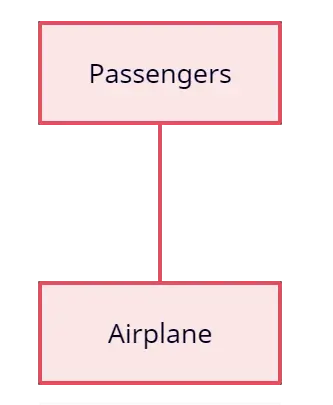

- **Association** is a basic relationship between two classes that shows how they are connected or interact.
- It means one class uses or works with another class, but both can exist on their own.
- Association is a loose connection—removing one class does not affect the other.

---

**Example**: Airplane and Passenger Association

- An `Airplane` class can have an association with a `Passenger` class, representing that an airplane carries passengers.
- The relationship is bi-directional: an airplane can have multiple passengers, and a passenger can be associated with a specific airplane (or none).
- This association models the real-world scenario where airplanes and passengers interact, but each can exist independently.

---

**Snippet**:

```java
public class Airplane {
    private List<Passenger> passengers;
    // ...
}

public class Passenger {
    private Airplane airplane;
    // ...
}
```

---

### Directed Association

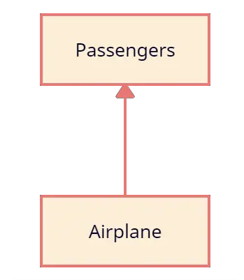

- **Directed association** is a specific type of association where the relationship has a direction, indicating which class uses or depends on the other.
- In a directed association, one class is aware of and uses another class, but not necessarily vice versa.
- This means that while one class may hold a reference to another, the reverse is not required.

---

**Example**: Airplane and Passenger Directed Association

- In a directed association, one class is aware of and uses another class, but not necessarily vice versa.
- For instance, an `Airplane` class may maintain a list of `Passenger` objects, but the `Passenger` class does not need to know about the `Airplane`.

---

**Snippet**:

```java
public class Airplane {
    private List<Passenger> passengers;
    // methods to add/remove passengers, etc.
}

public class Passenger {
    private String name;
    // Passenger does not reference Airplane
}
```

---

**Explain**:

- In this example, the `Airplane` class has a list of `Passenger` objects, indicating that it uses the `Passenger` class.
- The `Passenger` class does not reference the `Airplane`, demonstrating a directed association where the `Airplane` is aware of its passengers, but passengers do not need to know about the airplane.

---

### Reflexive Association

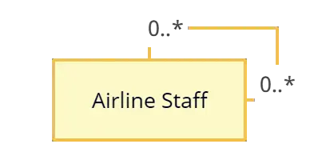

- **Reflexive association** is a special case where a class has a relationship with itself.
- This means that an object of the class can reference another object of the same class.
- A class can reference itself, forming a self-referential relationship.
- `0..*` means an object can be linked to zero or more other objects—there’s no minimum or maximum.

---

**Example**: Airline Staff Reflexive Association

- In an airline, a `Staff` member may have a supervisor who is also a `Staff` member.
- This models a hierarchical relationship where each staff member can reference another staff member as their supervisor.

---

**Snippet**:

```java
public class Staff {
    private String name;
    private Staff supervisor; // Reflexive association

    public Staff(String name, Staff supervisor) {
        this.name = name;
        this.supervisor = supervisor;
    }

    // getters and setters
}
```

---

**Explain**:

- In this example, the `Staff` class has a field of its own type, allowing staff members to be linked in a supervisory chain.

---

### Multiplicity

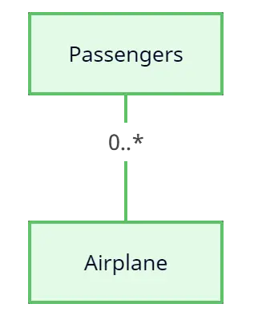

- **Multiplicity** defines how many instances of one class can be associated with instances of another class.
- It specifies the number of objects that can be involved in a relationship.
- Common multiplicity notations include:
  - `0..1`: Zero or one instance (optional)
  - `1`: Exactly one instance (mandatory)
  - `0..*`: Zero or many instances (optional)
  - `1..*`: One or many instances (mandatory)

---

**Example**: Airplane and Passenger Multiplicity

- An `Airplane` can have multiple `Passenger` objects associated with it, while a `Passenger` can be associated with one or no `Airplane`.
- This can be represented as `Airplane 1..*` and `Passenger 0..1`, indicating that an airplane can have many passengers, but a passenger may not be associated with any airplane.

---

**Snippet**:

```java
public class Airplane {
    private List<Passenger> passengers; // 1..* relationship
}
public class Passenger {
    private Airplane airplane; // 0..1 relationship
}
```

---

**Explain**:

- In this example, the `Airplane` class has a list of `Passenger` objects, indicating that it can have multiple passengers (`1..*`).
- The `Passenger` class has a reference to an `Airplane`, but it can also exist without being associated with any airplane (`0..1`).

---

### Aggregation

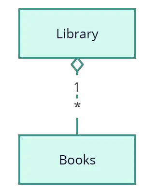

- **Aggregation** is a special type of association that represents a "whole-part" relationship between two classes.
- It indicates that one class (the whole) contains or is composed of another class (the part), but the part can exist independently of the whole.
- In aggregation, the lifetime of the part is not tied to the lifetime of the whole.
- Aggregation is often represented with a hollow diamond shape in UML diagrams.

---

**Example**: Library and Books Aggregation

- A `Library` class can aggregate multiple `Book` objects. The `Book` objects can exist independently of the `Library`—removing a library does not destroy the books.

---

**Snippet**:

```java
public class Library {
    private List<Book> books;
    public Library(List<Book> books) {
        this.books = books;
    }
    // Other methods...
}

public class Book {
    private String title;
    private String author;
    public Book(String title, String author) {
        this.title = title;
        this.author = author;
    }
    // Other methods...
}
```

---

**Explain**:

- In this example, the `Library` class contains a collection of `Book` objects, but each `Book` can exist outside the context of a `Library`.
- This models aggregation: a "whole-part" relationship where the part (Book) is not dependent on the whole (Library) for its existence.

---

### Composition

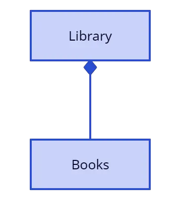

- **Composition** is a stronger form of aggregation where the part's lifecycle is tied to the whole.
- In composition, if the whole is destroyed, the parts are also destroyed.
- It represents a "strong whole-part" relationship where the part cannot exist independently of the whole.
- Composition is often represented with a filled diamond shape in UML diagrams.

---

**Example**: Library and Books Composition

- In composition, a `Library` class may create and manage its `Book` objects. When the `Library` is destroyed, its `Book` objects are also destroyed, as they cannot exist independently.

---

**Snippet**:

```java
public class Library {
    private List<Book> books;
    public Library() {
        books = new ArrayList<>();
        books.add(new Book("Java Programming"));
        books.add(new Book("Data Structures"));
    }
    // Other methods...
}

class Book {
    private String title;
    public Book(String title) {
        this.title = title;
    }
    // Other methods...
}
```

---

**Explain**:

- Here, the `Library` class is responsible for creating and managing its `Book` objects.
- The `Book` instances are tightly bound to the `Library`—if the `Library` is deleted, its books are also deleted.
- This models composition: a strong "whole-part" relationship where the part (Book) cannot exist without the whole (Library).

---

### Inheritance/Generalization

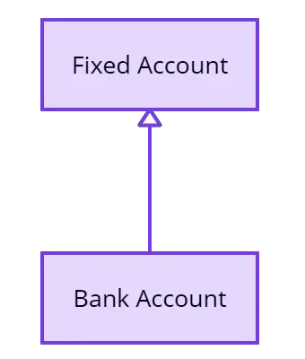

- **Inheritance/Generalization** is a relationship where one class (the subclass) inherits properties and behavior from another class (the superclass).
- It allows for code reuse and the creation of hierarchical relationships between classes.
- The subclass can extend or override the behavior of the superclass, adding or modifying functionality.
- Inheritance is represented with a solid line and a closed arrowhead pointing from the subclass to the superclass in UML diagrams.

---

**Example**: Fixed Account and Bank Account Inheritance

- Suppose we have a base class `BankAccount` that represents a general bank account, and a subclass `FixedAccount` that extends `BankAccount` to represent a fixed deposit account with additional properties.

**Snippet**:

```java
// Superclass
public class BankAccount {
    protected String accountNumber;
    protected double balance;
}

// Subclass
public class FixedAccount extends BankAccount {
    private int termInMonths;
    private double interestRate;
}
```

---

**Explain**:

- In this example, `FixedAccount` inherits all properties and methods from `BankAccount` and adds its own specific fields and methods.
- This demonstrates inheritance/generalization: `FixedAccount` **is a** `BankAccount` with additional features.

---

### Realization

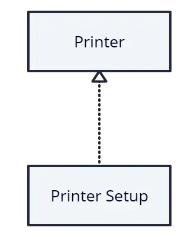

- **Realization** is a relationship between an interface and a class that implements that interface.
- It indicates that a class provides concrete implementations for the methods defined in an interface.
- Realization is represented with a dashed line and an open arrowhead pointing from the class to the interface in UML diagrams.

---

**Example**: Printer and Printer Setup Realization

- Suppose we have a `PrinterSetup` interface that defines the contract for printer setup operations, and a `Printer` class that implements this interface.

**Snippet**:

```java
// Interface
public interface PrinterSetup {
    void configure();
    void testPage();
}

// Implementation
public class Printer implements PrinterSetup {
    public void configure() { /* ... */ }
    public void testPage() { /* ... */ }
}
```

---

**Explain**:

- In this example, the `Printer` class realizes the `PrinterSetup` interface by providing concrete implementations for its methods.
- This demonstrates the realization relationship: `Printer` **implements** the contract defined by `PrinterSetup`.

---

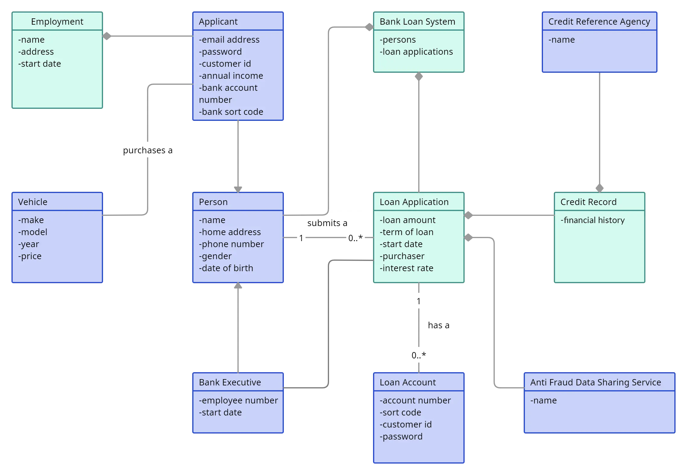

---

## 10.5. Case Study: <br> Designing the Course Class

Practice.

---

## 10.6. Case Study: <br> Designing a Class for Stacks

Practice.

---

## End of the Chapter

<!-- style: |

    section {
    font-family: Nokora;
    }

    h1 {
    color: black;
    font-size: 50px;
    text-align: center;
    }
    h2 {
    font-size: 40px;
    text-align: center;
    }
    h3 {
    font-size: 30px;
    position: absolute;
    top: 60px;
    }
    h3::before {
    content: "👉"; /* Unicode for bullet */
    }
    h4 {
    font-size: 26px;
    }
    h5 {
    font-size: 26px;
    }
    h6 {
    font-size: 26px;
    }
    p {
    font-size: 26px;
    }
    li {
    font-size: 26px;
    }
    table {
    margin: auto;
    font-size: 20px;
    }
    img {
    display: block;
    margin: 0 auto;
    }
    section::after {
    font-size: 20px;
    }
    ul {
    list-style-type: "✨";
    padding-left: 20px;
    margin-left: 20px;
    }

-->
