# Chapter 12: Exception Handling and Text I/O

---

## 12.1. Introduction:

---

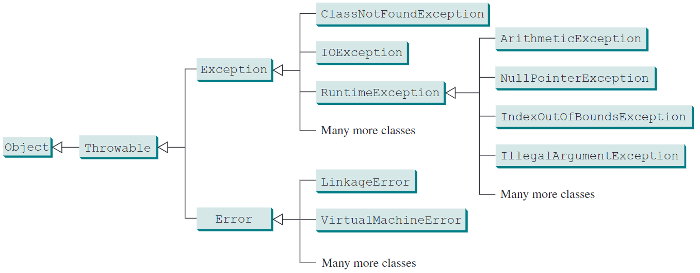

---

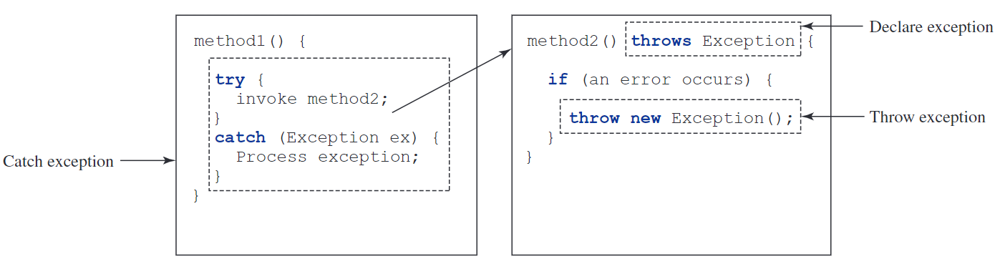

---

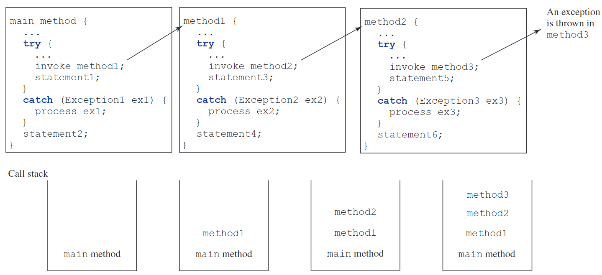

---

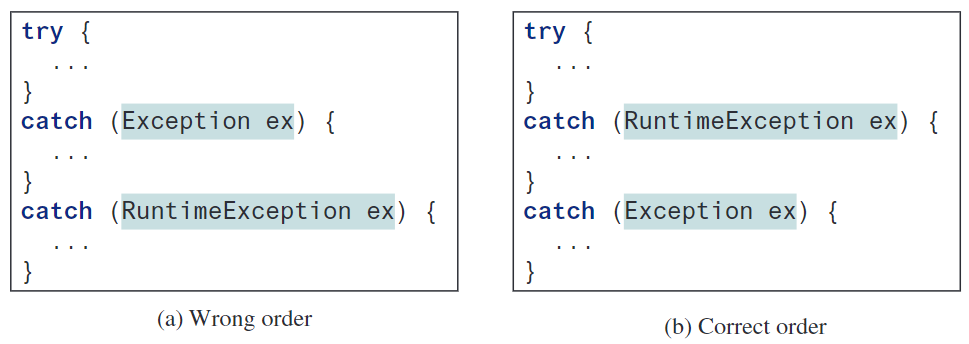

---

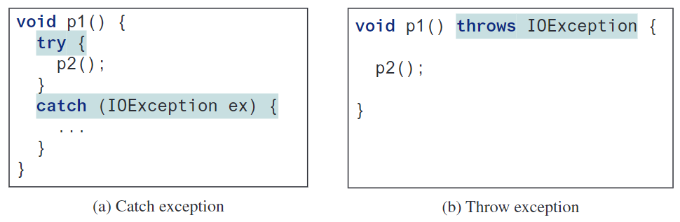

---

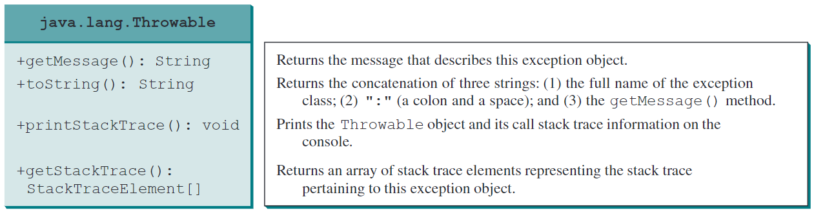

---

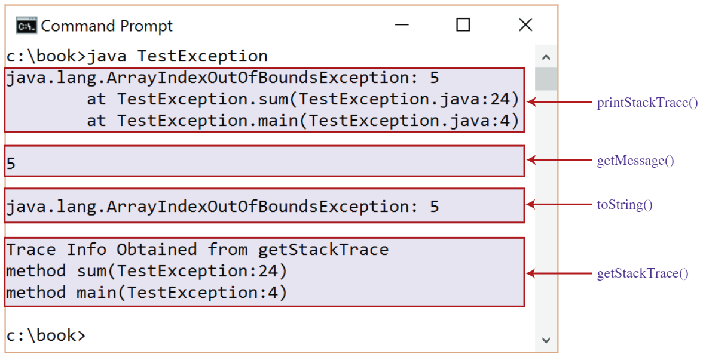

---

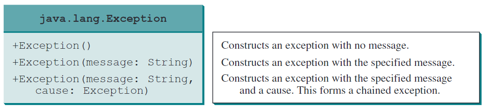

---

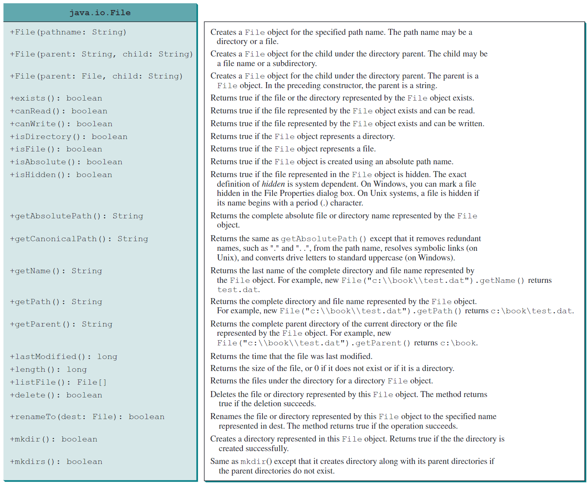

---

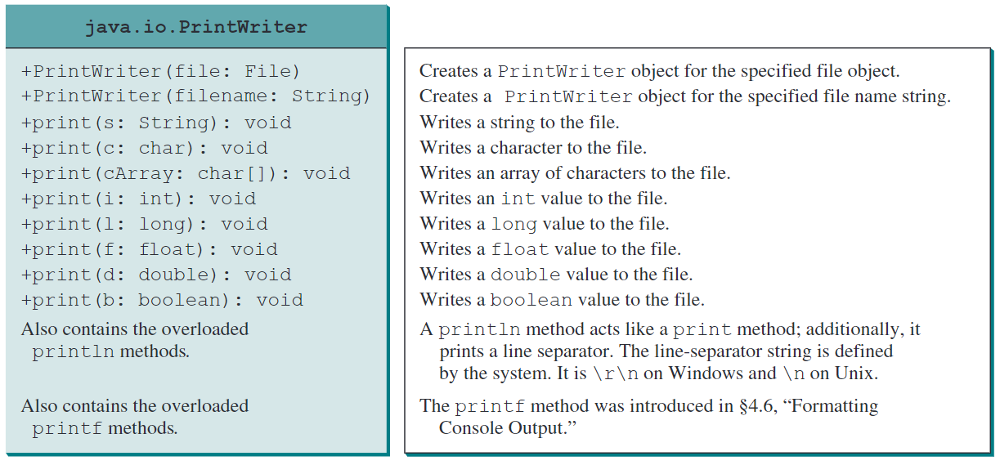

---

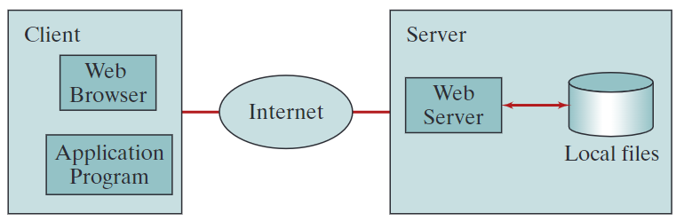

---

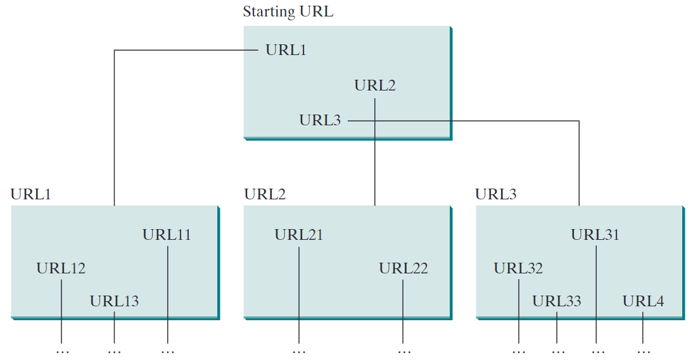

---

Introduction to Exception Handling

### What are Exceptions?

- Runtime errors that disrupt normal program flow.
- Examples: Dividing by zero, invalid input, out-of-bounds access.

### Exception Handling:

- Helps manage runtime errors without crashing the program.
- Allows for graceful error recovery.

### Java Exception Model:

- Java throws exceptions as objects.
- Unhandled exceptions terminate the program.
- Can be caught and managed using `try-catch`.

### Example of an Exception:

```java
int[] numbers = {1, 2, 3};
System.out.println(numbers[5]); // ArrayIndexOutOfBoundsException
```

### Why Learn Exception Handling?

- Improves program stability.
- Makes debugging easier.
- Separates error handling from normal logic.

### Visual Idea:

- A diagram showing program flow with and without exception handling.
- Example of a `try-catch` block in Java.

---

## 12.2. Exception-Handling Overview

---

### Exception-Handling Overview

### What is Exception Handling?

- Mechanism to detect, catch, and handle runtime errors.
- Prevents program crashes and enables error recovery.

### How Does Exception Handling Work?

- Throwing an Exception: Error is detected, and an exception is raised.
- Catching an Exception: The program handles the exception to avoid abrupt termination.

### Basic `try-catch` Structure:

```java
try {
    int result = 10 / 0; // Error: Division by zero
} catch (ArithmeticException e) {
    System.out.println("Cannot divide by zero.");
}
```

### Flow of Exception Handling

1. Program encounters an error.
2. An exception is thrown.
3. The exception is caught in a `catch` block.
4. Program continues execution safely.

### Advantages of Exception Handling

✅ Improves program reliability.  
 ✅ Separates normal logic from error-handling code.  
 ✅ Provides meaningful error messages.

### Visual Idea:

- A flowchart showing exception propagation and handling.
- Diagram of `try`, `catch`, and `finally` blocks.

---

## 12.3. Exception Types

---

from your document. I will include key points and visuals to make it engaging.

---

### Introduction to Exceptions

- Exceptions are objects in Java, defined using classes.
- The root class for all exceptions is `java.lang.Throwable`.
- Exceptions help handle runtime errors gracefully.

---

### Hierarchy of Exceptions

(Include a visual of the exception hierarchy from Figure 12.1)

- `Throwable` (Root class)
  - `Error` (System errors, fatal)
  - `Exception` (Can be handled)
    - `Checked Exceptions` (Must be handled in code)
    - `Unchecked Exceptions` (Runtime exceptions, programming errors)

---

### System Errors (`Error` Class)

- Thrown by the JVM, usually fatal.
- Examples:
  - `LinkageError` (Class dependency issues)
  - `VirtualMachineError` (JVM resource exhaustion)
- Cannot be handled by the program.

---

### Exceptions (`Exception` Class)

- Caused by external factors or programming logic.
- Must be handled using `try-catch` or declared with `throws`.
- Examples:
  - `ClassNotFoundException` (Missing class file)
  - `IOException` (File read/write issues)

---

### Runtime Exceptions (`RuntimeException` Class)

- Usually due to bad programming logic.
- Unchecked exceptions (not required to be caught).
- Examples:
  - `ArithmeticException` (Divide by zero)
  - `NullPointerException` (Accessing an object via `null`)
  - `IndexOutOfBoundsException` (Invalid array index)

---

### Checked vs. Unchecked Exceptions

| Type      | Examples                                      | Handling Required?      |
| --------- | --------------------------------------------- | ----------------------- |
| Checked   | `IOException`, `SQLException`                 | ✅ Yes                  |
| Unchecked | `NullPointerException`, `ArithmeticException` | ❌ No (but recommended) |

---

### Why Exception Handling?

- Prevents abrupt program termination.
- Allows error recovery and debugging.
- Makes code more readable and maintainable.

---

### Summary

- Exceptions are classified into Errors, Checked Exceptions, and Unchecked Exceptions.
- Checked exceptions must be handled explicitly.
- Unchecked exceptions indicate programming mistakes.

---

Would you like me to generate the slides in PowerPoint format, or do you need additional edits? 😊

---

## 12.4. Declaring, Throwing, and Catching Exceptions

---

from your document. This will include key concepts, visuals, and examples to make it engaging.

---

### Introduction

- Java’s exception-handling model is based on three key actions:
  1. Declaring exceptions
  2. Throwing exceptions
  3. Catching exceptions
- Helps in error recovery and program stability.

---

### Declaring Exceptions

- Methods must declare checked exceptions using the `throws` keyword.
- Syntax:
  ```java
  public void myMethod() throws IOException {
      // Method code
  }
  ```
- A method can declare multiple exceptions using commas.
- Unchecked exceptions (RuntimeException & subclasses) do not need to be declared.

---

### Throwing Exceptions

- Use the `throw` keyword to generate an exception.
- Syntax:
  ```java
  throw new Exception("Error message");
  ```
- Example: Throwing `IllegalArgumentException`:
  ```java
  public void setAge(int age) {
      if (age < 0) {
          throw new IllegalArgumentException("Age cannot be negative");
      }
  }
  ```

---

### Catching Exceptions

- Handle exceptions using `try-catch` blocks.
- Syntax:
  ```java
  try {
      // Code that might cause an exception
  } catch (ExceptionType ex) {
      // Handle the exception
  }
  ```
- Example:
  ```java
  try {
      int result = 10 / 0; // This will cause ArithmeticException
  } catch (ArithmeticException ex) {
      System.out.println("Cannot divide by zero.");
  }
  ```

---

### Exception Propagation

- If an exception is not caught, it propagates up the call stack.
- Example:

  ```java
  public void method1() throws Exception {
      method2();
  }

  public void method2() throws Exception {
      throw new Exception("Error in method2");
  }
  ```

- If no method handles it, the program crashes.

---

### Multiple Catch Blocks

- You can handle different exceptions separately.
- Example:
  ```java
  try {
      int[] arr = new int[5];
      System.out.println(arr[10]); // Out of bounds
  } catch (ArithmeticException ex) {
      System.out.println("Arithmetic error!");
  } catch (ArrayIndexOutOfBoundsException ex) {
      System.out.println("Index out of bounds!");
  }
  ```
- Always catch specific exceptions before generic ones (`Exception`).

---

### The `finally` Block

- Executes always, whether an exception occurs or not.
- Used for resource cleanup.
- Example:
  ```java
  try {
      // Open file
  } catch (IOException ex) {
      System.out.println("Error!");
  } finally {
      // Close file
  }
  ```

---

### Summary

- Declaring Exceptions: Use `throws` for checked exceptions.
- Throwing Exceptions: Use `throw new ExceptionType("message")`.
- Catching Exceptions: Use `try-catch`, and handle different exceptions separately.
- Finally Block: Always executes, used for cleanup.

---

---

## 12.5. The `finally` Clause

---

from your document. This will include key points, explanations, and examples to make the concept clear.

---

---

### Introduction

- The `finally` block always executes, whether an exception occurs or not.
- Used for resource cleanup, such as closing files, releasing memory, or disconnecting from databases.

---

### Why Use `finally`?

- Ensures important cleanup code runs even if an exception occurs.
- Used in file handling, database connections, and network operations.
- Prevents resource leaks.

---

### Syntax of `finally`

```java
try {
    // Code that may throw an exception
} catch (ExceptionType ex) {
    // Handle the exception
} finally {
    // Code that will always execute
}
```

- The `finally` block executes regardless of exception occurrence.

---

### Example of `finally` Usage

```java
public class FinallyExample {
    public static void main(String[] args) {
        try {
            int result = 10 / 0; // This will throw an exception
        } catch (ArithmeticException ex) {
            System.out.println("Exception caught: " + ex.getMessage());
        } finally {
            System.out.println("This code runs no matter what.");
        }
    }
}
```

Output:

```
Exception caught: / by zero
This code runs no matter what.
```

---

### `finally` Without a `catch` Block

- `finally` can be used without a `catch` block.

```java
try {
    System.out.println("Try block executed.");
} finally {
    System.out.println("Finally block executed.");
}
```

Output:

```
Try block executed.
Finally block executed.
```

---

### When `finally` Does Not Execute

- The only scenarios where `finally` may not execute:
  - If `System.exit(0)` is called inside `try` or `catch`.
  - If the program crashes (e.g., infinite loop, power failure).

Example:

```java
try {
    System.exit(0);
} finally {
    System.out.println("This will NOT execute.");
}
```

---

### Common Use Cases of `finally`

- Closing file resources
  ```java
  try {
      FileReader file = new FileReader("test.txt");
  } catch (IOException ex) {
      System.out.println("File not found.");
  } finally {
      file.close(); // Ensures the file is closed
  }
  ```
- Releasing database connections
- Cleaning up memory (e.g., closing scanners)

---

### Summary

✅ The `finally` block always executes, ensuring resource cleanup.  
✅ Used for closing files, database connections, and network resources.  
✅ Can be used without a `catch` block.  
✅ Will not execute only if `System.exit(0)` is called.

---

---

## 12.6. When to Use Exceptions

---

from your document. This will include key points, explanations, and examples to make the concept clear and engaging.

---

---

### Introduction

- Exceptions should be used when a method cannot complete its task in a normal way.
- Goal: Separate error-handling logic from normal program logic.
- Exception handling makes programs more readable and maintainable.

---

### When to Use Exceptions?

✅ For unexpected or serious errors  
✅ When an error needs to be handled by the caller  
✅ To separate error detection from error handling

❌ Do NOT use exceptions for simple flow control (e.g., checking if a value is null).

---

### Bad Example – Using Exceptions for Control Flow

❌ Inefficient way to check if a value is numeric:

```java
public static boolean isNumeric(String token) {
    try {
        Double.parseDouble(token);
        return true;
    } catch (NumberFormatException ex) {
        return false;
    }
}
```

Problem: Exceptions are expensive in terms of performance.

---

### Good Example – Using Normal Logic Instead

✅ Better way to check if a value is numeric:

```java
public static boolean isNumeric(String token) {
    for (char c : token.toCharArray()) {
        if (!Character.isDigit(c)) {
            return false;
        }
    }
    return true;
}
```

- Uses simple logic instead of exceptions.
- Improves performance.

---

### When NOT to Use Exceptions?

❌ For handling predictable conditions:

- Checking if a file exists
- Validating user input
- Loop termination

✅ Use if-else statements instead.

Example (Better Approach):

```java
if (file.exists()) {
    System.out.println("File found!");
} else {
    System.out.println("File not found.");
}
```

---

### Correct Use of Exceptions

✅ For serious or unpredictable errors:

- File not found:
  ```java
  try {
      FileReader file = new FileReader("data.txt");
  } catch (FileNotFoundException ex) {
      System.out.println("File not found!");
  }
  ```
- Invalid user input:
  ```java
  try {
      int age = Integer.parseInt(input);
  } catch (NumberFormatException ex) {
      System.out.println("Invalid number format.");
  }
  ```

---

### Key Takeaways

✅ Use exceptions for unexpected or serious errors.  
✅ Do NOT use exceptions for normal control flow.  
✅ Prefer if-else statements for simple conditions.  
✅ Use exception handling to improve code readability.

---

### Summary

- Exceptions should not replace regular logic checks.
- Handle predictable errors with if-else conditions.
- Use exceptions only when absolutely necessary.

---

---

## 12.7. Rethrowing Exceptions

---

from your document. This will include key points, explanations, and examples to make the concept clear and engaging.

---

---

### Introduction

- What is Rethrowing an Exception?
  - An exception is caught in a method but not fully handled, so it is thrown again to be handled elsewhere.
- Why rethrow an exception?
  - Allows the caller of a method to handle the exception.
  - Maintains the original exception details.

---

### Syntax for Rethrowing Exceptions

```java
try {
    // Code that may throw an exception
} catch (ExceptionType ex) {
    // Perform some operations before rethrowing
    throw ex;
}
```

- The `throw` statement sends the exception back to the caller.

---

### Example – Rethrowing an Exception

```java
public class RethrowExample {
    public static void method1() throws Exception {
        try {
            int result = 10 / 0; // Will cause ArithmeticException
        } catch (ArithmeticException ex) {
            System.out.println("Exception caught in method1.");
            throw ex; // Rethrow the exception
        }
    }

    public static void main(String[] args) {
        try {
            method1();
        } catch (Exception ex) {
            System.out.println("Exception handled in main.");
        }
    }
}
```

Output:

```
Exception caught in method1.
Exception handled in main.
```

---

### When to Rethrow an Exception?

✅ If the method cannot fully handle the exception.  
✅ When the exception should be handled by a higher-level method.  
✅ When you need to log or modify the exception before passing it.

---

### Preserving Exception Information

- Rethrowing an exception loses stack trace information.
- Use `throw ex;` to rethrow without modification.
- Use `throw new Exception("New message", ex);` to wrap the original exception.

Example:

```java
try {
    method1();
} catch (Exception ex) {
    throw new Exception("New info", ex); // Chained exception
}
```

---

### Example – Rethrowing with Additional Information

```java
public class ChainedExceptionExample {
    public static void method1() throws Exception {
        try {
            throw new NullPointerException("Null reference");
        } catch (NullPointerException ex) {
            throw new Exception("Error in method1", ex);
        }
    }

    public static void main(String[] args) {
        try {
            method1();
        } catch (Exception ex) {
            ex.printStackTrace(); // Shows original exception cause
        }
    }
}
```

Output:

```
java.lang.Exception: Error in method1
Caused by: java.lang.NullPointerException: Null reference
```

---

### Key Takeaways

✅ Rethrowing an exception allows a higher-level method to handle it.  
✅ Use `throw ex;` to rethrow without modifying the original exception.  
✅ Use `throw new Exception("Message", ex);` to add context.  
✅ Maintains clean and readable error handling.

---

### Summary

- Rethrowing is useful when an exception cannot be fully handled in a method.
- Preserve the original exception details for debugging.
- Use chained exceptions when adding more context.

---

---

## 12.8. Chained Exceptions

---

from your document. This will include key concepts, explanations, and examples to make the topic clear and engaging.

---

---

### Introduction

- What are Chained Exceptions?
  - When a new exception is thrown while handling an existing exception.
  - Allows preserving the original cause of an error.
- Why use Chained Exceptions?  
  ✅ Helps track the root cause of an error.  
  ✅ Provides more detailed debugging information.

---

### Syntax for Chained Exceptions

```java
throw new Exception("New exception message", originalException);
```

- The second parameter (`originalException`) stores the cause of the new exception.

---

### Example – Chaining Exceptions

```java
public class ChainedExceptionExample {
    public static void method1() throws Exception {
        try {
            throw new NullPointerException("Null reference error");
        } catch (NullPointerException ex) {
            throw new Exception("Error in method1", ex); // Chain exception
        }
    }

    public static void main(String[] args) {
        try {
            method1();
        } catch (Exception ex) {
            ex.printStackTrace(); // Displays chained exceptions
        }
    }
}
```

Output:

```
java.lang.Exception: Error in method1
Caused by: java.lang.NullPointerException: Null reference error
```

---

### Using `getCause()` to Retrieve Exception Cause

```java
try {
    method1();
} catch (Exception ex) {
    System.out.println("Main exception: " + ex.getMessage());
    System.out.println("Caused by: " + ex.getCause());
}
```

- The `getCause()` method retrieves the original exception that caused the current one.

---

### When to Use Chained Exceptions?

✅ When handling low-level errors that affect higher-level logic.  
✅ When adding more context to an error.  
✅ When reporting multiple related exceptions.

---

### Example – Adding More Context

```java
public class CustomChainedException {
    public static void validateAge(int age) throws Exception {
        if (age < 0) {
            throw new IllegalArgumentException("Negative age provided");
        }
    }

    public static void main(String[] args) {
        try {
            validateAge(-5);
        } catch (IllegalArgumentException ex) {
            throw new RuntimeException("Invalid input detected", ex);
        }
    }
}
```

- Enhances error messages while keeping the original cause.

---

### Key Takeaways

✅ Chained exceptions preserve the root cause of an error.  
✅ Use `throw new Exception("message", cause);` to link exceptions.  
✅ Use `getCause()` to retrieve original exceptions.  
✅ Helpful for debugging and providing better error messages.

---

### Summary

- Chained exceptions help track the true cause of an error.
- Use them when one exception leads to another.
- Preserve original errors to improve debugging.

---

---

## 12.9. Defining Custom Exception Classes

---

from your document. This will include key concepts, explanations, and examples to make the topic clear and engaging.

---

---

### Introduction

- What is a Custom Exception?
  - A user-defined exception that extends Java’s `Exception` class.
  - Used when predefined exceptions do not fully describe an error scenario.
- Why create custom exceptions?  
  ✅ Provides more meaningful error messages.  
  ✅ Makes error handling more specific.  
  ✅ Helps organize application-specific errors.

---

### How to Create a Custom Exception

- Extend `Exception` or `RuntimeException`
- Define constructors
- Provide useful methods if needed

---

### Example – Creating a Custom Exception

```java
// Step 1: Define a custom exception class
public class InvalidRadiusException extends Exception {
    private double radius;

    public InvalidRadiusException(double radius) {
        super("Invalid radius: " + radius);
        this.radius = radius;
    }

    public double getRadius() {
        return radius;
    }
}
```

- Extends `Exception` (making it a checked exception).
- Stores additional information (`radius`).
- Provides a constructor to set a custom message.

---

### Using the Custom Exception in a Class

```java
public class Circle {
    private double radius;

    public Circle(double radius) throws InvalidRadiusException {
        setRadius(radius);
    }

    public void setRadius(double radius) throws InvalidRadiusException {
        if (radius < 0) {
            throw new InvalidRadiusException(radius);
        }
        this.radius = radius;
    }
}
```

- The `setRadius()` method throws `InvalidRadiusException` if the radius is negative.

---

### Handling a Custom Exception

```java
public class TestCustomException {
    public static void main(String[] args) {
        try {
            Circle c = new Circle(-5); // Invalid radius
        } catch (InvalidRadiusException ex) {
            System.out.println("Exception: " + ex.getMessage());
        }
    }
}
```

Output:

```
Exception: Invalid radius: -5.0
```

- The program catches and handles the custom exception.

---

### Checked vs. Unchecked Custom Exceptions

| Exception Type | Extend Class       | Must be Handled? | Example                  |
| -------------- | ------------------ | ---------------- | ------------------------ |
| Checked        | `Exception`        | ✅ Yes           | `InvalidRadiusException` |
| Unchecked      | `RuntimeException` | ❌ No            | `InvalidInputException`  |

✅ Use checked exceptions when the caller must handle the error.  
✅ Use unchecked exceptions when the error is due to programming mistakes.

---

### Example – Unchecked Custom Exception

```java
public class NegativeNumberException extends RuntimeException {
    public NegativeNumberException(String message) {
        super(message);
    }
}
```

- Extends `RuntimeException`, so it is an unchecked exception.

---

### When to Use Custom Exceptions?

✅ When built-in exceptions do not describe the error well.  
✅ When you want to pass additional information with the error.  
✅ When creating a specific exception hierarchy for an application.

---

### Summary

- Custom exceptions provide clearer, application-specific error messages.
- Extend `Exception` for checked exceptions, `RuntimeException` for unchecked ones.
- Use them when built-in exceptions are not specific enough.

---

---

## 12.10. The File Class

---

from your document. This will include key concepts, explanations, and examples to make the topic clear and engaging.

---

---

### Introduction

- What is the `File` class?
  - A Java class for handling file and directory operations.
  - Part of the `java.io` package.
- What can it do?  
  ✅ Check file properties (size, permissions, last modified, etc.).  
  ✅ Create, delete, and rename files and directories.  
  ✅ List files in a directory.

---

### Creating a `File` Object

- The `File` class represents file and directory paths but does not handle file content.

```java
import java.io.File;

public class FileExample {
    public static void main(String[] args) {
        File myFile = new File("example.txt");
        System.out.println("File object created.");
    }
}
```

✅ Creates a `File` object (does not create an actual file).

---

### Checking If a File Exists

```java
File file = new File("example.txt");

if (file.exists()) {
    System.out.println("File exists.");
} else {
    System.out.println("File does not exist.");
}
```

- The `exists()` method checks if the file is available.

---

### File Properties & Methods

| Method           | Description                      |
| ---------------- | -------------------------------- |
| `exists()`       | Checks if file/directory exists. |
| `canRead()`      | Checks if file is readable.      |
| `canWrite()`     | Checks if file is writable.      |
| `isFile()`       | Checks if path is a file.        |
| `isDirectory()`  | Checks if path is a directory.   |
| `length()`       | Returns file size (bytes).       |
| `lastModified()` | Returns last modified time.      |

---

### Example – Checking File Properties

```java
File file = new File("example.txt");

if (file.exists()) {
    System.out.println("File Name: " + file.getName());
    System.out.println("Absolute Path: " + file.getAbsolutePath());
    System.out.println("Size: " + file.length() + " bytes");
    System.out.println("Writable: " + file.canWrite());
    System.out.println("Readable: " + file.canRead());
}
```

✅ Retrieves file details like name, path, size, and permissions.

---

### Creating and Deleting Files

```java
try {
    File file = new File("newfile.txt");
    if (file.createNewFile()) {
        System.out.println("File created.");
    } else {
        System.out.println("File already exists.");
    }
} catch (IOException e) {
    System.out.println("An error occurred.");
}
```

✅ Creates a new file using `createNewFile()`.  
✅ Handles errors with `IOException`.

```java
if (file.delete()) {
    System.out.println("File deleted.");
}
```

✅ Deletes a file with `delete()`.

---

### Working with Directories

```java
File dir = new File("myDirectory");

// Creating a directory
if (dir.mkdir()) {
    System.out.println("Directory created.");
}

// Listing files in a directory
String[] files = dir.list();
for (String file : files) {
    System.out.println(file);
}
```

✅ Creates a directory using `mkdir()`.  
✅ Lists files in a directory using `list()`.

---

### Summary

- The `File` class manages file and directory paths (but does not read/write data).
- Provides methods to check file properties (`exists()`, `length()`, `canRead()`).
- Allows creating and deleting files and directories.

---

---

## 12.11. File Input and Output

---

from your document. This will include key concepts, explanations, and examples to make the topic clear and engaging.

---

---

### Introduction to File I/O

- What is File I/O?
  - Process of reading from and writing to files.
  - Essential for data persistence in applications.
- Why use File I/O?  
  ✅ Store data permanently.  
  ✅ Read configurations or process large datasets.  
  ✅ Transfer information between applications.

---

### Java Classes for File I/O

✅ Reading Data:

- `Scanner` (reads text files)
- `FileReader` (reads characters from a file)
- `BufferedReader` (efficient line reading)

✅ Writing Data:

- `PrintWriter` (writes text to a file)
- `FileWriter` (writes characters to a file)
- `BufferedWriter` (writes efficiently)

---

### Writing Data to a File (`PrintWriter`)

```java
import java.io.*;

public class WriteToFile {
    public static void main(String[] args) throws IOException {
        PrintWriter writer = new PrintWriter("output.txt");
        writer.println("Hello, World!");
        writer.println(100);
        writer.close();
        System.out.println("Data written successfully.");
    }
}
```

✅ Creates a file and writes text to it.  
✅ Uses `println()` to write different data types.  
✅ Always close the file (`close()`).

---

### Reading Data from a File (`Scanner`)

```java
import java.io.*;
import java.util.Scanner;

public class ReadFromFile {
    public static void main(String[] args) throws IOException {
        File file = new File("output.txt");
        Scanner scanner = new Scanner(file);

        while (scanner.hasNextLine()) {
            System.out.println(scanner.nextLine());
        }
        scanner.close();
    }
}
```

✅ Uses `Scanner` to read text line by line.  
✅ Always close the file after reading.

---

### Checking If a File Exists Before Writing

```java
File file = new File("data.txt");

if (file.exists()) {
    System.out.println("File already exists.");
} else {
    System.out.println("File does not exist. Creating...");
}
```

✅ Prevents overwriting an existing file.

---

### Appending Data to a File (`FileWriter`)

```java
import java.io.*;

public class AppendToFile {
    public static void main(String[] args) throws IOException {
        FileWriter writer = new FileWriter("output.txt", true);
        writer.write("New data added.\n");
        writer.close();
    }
}
```

✅ Uses `FileWriter("file", true)` to append instead of overwrite.

---

### Handling Exceptions in File I/O

```java
try {
    File file = new File("nonexistent.txt");
    Scanner scanner = new Scanner(file);
} catch (FileNotFoundException e) {
    System.out.println("Error: File not found.");
}
```

✅ Use `try-catch` to handle errors like missing files.

---

### Summary

- Reading Files: Use `Scanner`, `FileReader`, or `BufferedReader`.
- Writing Files: Use `PrintWriter`, `FileWriter`, or `BufferedWriter`.
- Handle Errors: Always check if the file exists and use `try-catch`.

---

---

## 12.12. Reading Data from the Web

---

from your document. This will include key concepts, explanations, and examples to make the topic clear and engaging.

---

---

### Introduction

- What is Web Data Reading?
  - Accessing and retrieving data from online sources (e.g., websites, APIs).
  - Java provides built-in classes to handle network communication.
- Why Read Data from the Web?  
  ✅ Fetch real-time data (e.g., weather, stock prices).  
  ✅ Automate web scraping.  
  ✅ Interact with web services (APIs).

---

### Java Classes for Web Reading

- `URL` Class (Connects to a website)
- `URLConnection` Class (Manages the connection)
- `BufferedReader` Class (Reads text from the connection)

---

### Connecting to a Website (`URL` Class)

```java
import java.net.*;

public class URLExample {
    public static void main(String[] args) throws Exception {
        URL url = new URL("https://www.example.com");
        System.out.println("Protocol: " + url.getProtocol());
        System.out.println("Host: " + url.getHost());
        System.out.println("File: " + url.getFile());
    }
}
```

✅ Extracts parts of a URL.  
✅ Throws `MalformedURLException` if URL is incorrect.

---

### Reading Web Data (`URLConnection`)

```java
import java.net.*;
import java.io.*;

public class ReadWebData {
    public static void main(String[] args) throws Exception {
        URL url = new URL("https://www.example.com");
        BufferedReader reader = new BufferedReader(
            new InputStreamReader(url.openStream()));

        String line;
        while ((line = reader.readLine()) != null) {
            System.out.println(line);
        }
        reader.close();
    }
}
```

✅ Opens a stream to read web content.  
✅ Uses `BufferedReader` for efficiency.

---

### Handling Exceptions in Web Reading

```java
try {
    URL url = new URL("https://invalid.url");
    BufferedReader reader = new BufferedReader(
        new InputStreamReader(url.openStream()));
} catch (MalformedURLException e) {
    System.out.println("Invalid URL.");
} catch (IOException e) {
    System.out.println("Error reading data.");
}
```

✅ Catches malformed URLs and connection issues.

---

### Reading JSON Data from an API

```java
import java.net.*;
import java.io.*;

public class ReadAPI {
    public static void main(String[] args) throws Exception {
        URL url = new URL("https://api.example.com/data");
        BufferedReader reader = new BufferedReader(
            new InputStreamReader(url.openStream()));

        String jsonData = reader.readLine();
        System.out.println("Data: " + jsonData);
        reader.close();
    }
}
```

✅ Fetches structured data from APIs.  
✅ Can be processed using JSON libraries (`org.json`, `Gson`).

---

### Best Practices for Web Data Reading

✅ Always close the input stream (`reader.close()`).  
✅ Use `try-catch` to handle exceptions.  
✅ Check the website’s terms before scraping data.  
✅ For large data, consider paginated requests.

---

### Summary

- `URL` class connects to a web address.
- `URLConnection` and `BufferedReader` help read web content.
- Handle errors (`MalformedURLException`, `IOException`).
- Useful for fetching APIs, web scraping, and data automation.

---

---

## 12.13. Case Study: Web Crawler

---

## End of the Chapter

<!-- style: |

    section {
    font-family: Nokora;
    }

    h1 {
    color: black;
    font-size: 50px;
    text-align: center;
    }
    h2 {
    font-size: 40px;
    text-align: center;
    }
    h3 {
    font-size: 30px;
    position: absolute;
    top: 60px;
    }
    h3::before {
    content: "👉"; /* Unicode for bullet */
    }
    h4 {
    font-size: 26px;
    }
    h5 {
    font-size: 26px;
    }
    h6 {
    font-size: 26px;
    }
    p {
    font-size: 26px;
    }
    li {
    font-size: 26px;
    }
    table {
    margin: auto;
    font-size: 20px;
    }
    img {
    display: block;
    margin: 0 auto;
    }
    section::after {
    font-size: 20px;
    }
    ul {
    list-style-type: "✨";
    padding-left: 20px;
    margin-left: 20px;
    }

-->
