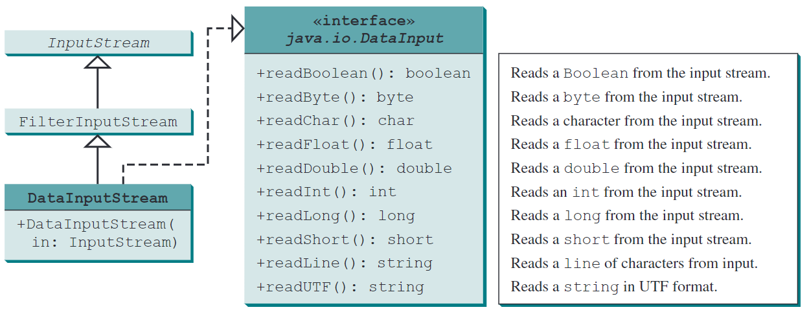

# Chapter 17: Binary I/O

---

## 17.1. Introduction

---


---


---


---



---


---


---


---


---


---


---


---


---


---

### Introduction to Binary I/O

- Java provides many classes for performing text I/O and binary I/O.
- Files can be classified as either text or binary.
- Text files can be processed using a text editor.
- Binary files are designed to be read by programs.

---

### Text Files vs. Binary Files

- Text files: Sequence of characters, readable by text editors.
- Binary files: Sequence of bits, readable by programs.
- Example: Java source programs are text files, Java class files are binary files.

---

### Efficiency of Binary Files

- Binary files are more efficient to process than text files.
- Text files use character-encoding schemes like ASCII or Unicode.
- Binary files store data in raw binary format.

---

### Java I/O Classes

- Java offers many classes for file input and output.
- Categorized into text I/O classes and binary I/O classes.
- Text I/O: Scanner and PrintWriter.
- Binary I/O: Introduced in this chapter.

---

### Summary

- Understanding the difference between text and binary files.
- Importance of binary files for efficiency.
- Overview of Java I/O classes for handling files.

---

## 17.2. How Is Text I/O Handled in Java?

---

### Introduction to Text I/O in Java

- Text data is read using the `Scanner` class.
- Text data is written using the `PrintWriter` class.
- `File` object encapsulates file properties but not methods for I/O.

---

### Writing Text to a File

- Create a `PrintWriter` object for the file.
- Example:
  ```java
  PrintWriter output = new PrintWriter("temp.txt");
  output.print("Java 101");
  output.close();
  ```

---

### Reading Text from a File

- Create a `Scanner` object for the file.
- Example:
  ```java
  Scanner input = new Scanner(new File("temp.txt"));
  System.out.println(input.nextLine());
  ```

---

### Input and Output Classes

- Input classes contain methods to read data.
- Output classes contain methods to write data.
- Examples: `PrintWriter` (output), `Scanner` (input).

---

### Java I/O Programming

- Input object reads a stream of data from a file.
- Output object writes a stream of data to a file.
- Illustrated in Figure 17.1 of the textbook.

---

## 17.3. Text I/O vs. Binary I/O

---

### Introduction to Text I/O vs. Binary I/O

- Binary I/O does not involve encoding or decoding.
- Binary I/O is more efficient than text I/O.
- All files are stored in binary format.

---

### Text I/O

- Built upon binary I/O.
- Provides abstraction for character encoding and decoding.
- JVM converts Unicode to file-specific encoding for text I/O.

---

### Binary I/O

- No conversions required.
- Exact value in memory is copied to the file.
- More efficient and portable across different machines.

---

### Example of Text I/O

- Writing string "199" to a file:
  - Unicode for '1' is 0x0031, '9' is 0x0039.
  - Stored as 0x31, 0x39, 0x39 in the file.

---

### Example of Binary I/O

- Writing byte value 199 to a file:
  - Stored as 0xC7 in the file.
  - No encoding or decoding involved.

---

### Summary

- Text I/O involves encoding/decoding, suitable for text files.
- Binary I/O is efficient, suitable for binary files.
- Use appropriate I/O based on file type and requirements.

---

## 17.4. Binary I/O Classes

---

### Introduction to Binary I/O Classes

- Java provides various classes for binary I/O.
- Root classes: `InputStream` and `OutputStream`.
- Specialized classes for different purposes.

---

### FileInputStream and FileOutputStream

- Used for reading/writing bytes from/to files.
- Constructors:
  ```java
  FileInputStream(file: File)
  FileOutputStream(file: File)
  ```
- Example:
  ```java
  FileInputStream input = new FileInputStream("temp.dat");
  FileOutputStream output = new FileOutputStream("temp.dat");
  ```

---

### BufferedInputStream and BufferedOutputStream

- Used to improve I/O performance.
- Wrap around other input/output streams.
- Constructors:
  ```java
  BufferedInputStream(in: InputStream)
  BufferedOutputStream(out: OutputStream)
  ```

---

### DataInputStream and DataOutputStream

- Used to read/write primitive data types and strings.
- Extend `FilterInputStream` and `FilterOutputStream`.
- Example:
  ```java
  DataInputStream input = new DataInputStream(new FileInputStream("data.dat"));
  DataOutputStream output = new DataOutputStream(new FileOutputStream("data.dat"));
  ```

---

### Example of Using Data Streams

- Writing data:
  ```java
  output.writeUTF("John");
  output.writeDouble(85.5);
  ```
- Reading data:
  ```java
  String name = input.readUTF();
  double score = input.readDouble();
  ```

---

### Summary

- Binary I/O classes provide efficient ways to handle binary data.
- Use `FileInputStream`/`FileOutputStream` for basic I/O.
- Use `BufferedInputStream`/`BufferedOutputStream` for performance.
- Use `DataInputStream`/`DataOutputStream` for primitive data types and strings.

---

## 17.5. Case Study: Copying Files

---

## 17.6. Object I/O

---

### Introduction to Object I/O

- ObjectInputStream/ObjectOutputStream classes for reading/writing objects.
- Supports serialization and deserialization of objects.
- Extends DataInputStream/DataOutputStream functionality.

---

### ObjectOutputStream

- Used to write objects to an output stream.
- Example:
  ```java
  ObjectOutputStream output = new ObjectOutputStream(new FileOutputStream("object.dat"));
  output.writeObject(new Date());
  output.close();
  ```

---

### ObjectInputStream

- Used to read objects from an input stream.
- Example:
  ```java
  ObjectInputStream input = new ObjectInputStream(new FileInputStream("object.dat"));
  Date date = (Date) input.readObject();
  input.close();
  ```

---

### Serializable Interface

- Objects must implement `Serializable` to be written to streams.
- Marker interface with no methods.
- Enables Java's serialization mechanism.

---

### Example of Object I/O

- Writing objects:
  ```java
  output.writeUTF("John");
  output.writeDouble(85.5);
  output.writeObject(new Date());
  ```
- Reading objects:
  ```java
  String name = input.readUTF();
  double score = input.readDouble();
  Date date = (Date) input.readObject();
  ```

---

### Handling Non-Serializable Fields

- Use `transient` keyword for non-serializable fields.
- Example:
  ```java
  private transient A nonSerializableField;
  ```

---

### Serializing Arrays

- Arrays are serializable if all elements are serializable.
- Example:
  ```java
  int[] numbers = {1, 2, 3, 4, 5};
  output.writeObject(numbers);
  ```

---

### Summary

- Object I/O supports reading/writing objects.
- Use `Serializable` interface for object serialization.
- Handle non-serializable fields with `transient`.
- Arrays can be serialized if elements are serializable.

---

## 17.7. Random-Access Files

---

### Introduction to Random-Access Files

- Allows reading and writing data at any location in the file.
- Provides more flexibility compared to sequential-access files.
- Useful for applications that require frequent updates to file contents.

---

### RandomAccessFile Class

- Implements `DataInput` and `DataOutput` interfaces.
- Supports both read and write operations.
- Example:
  ```java
  RandomAccessFile raf = new RandomAccessFile("file.dat", "rw");
  ```

---

### File Pointer

- Special marker indicating the current position in the file.
- Moves forward as data is read or written.
- Can be moved to any position using `seek()` method.
- Example:
  ```java
  raf.seek(0); // Move to the beginning of the file
  raf.seek(raf.length()); // Move to the end of the file
  ```

---

### Reading and Writing Data

- Read data using methods like `readInt()`, `readDouble()`.
- Write data using methods like `writeInt()`, `writeDouble()`.
- Example:
  ```java
  raf.writeInt(123);
  int value = raf.readInt();
  ```

---

### Example of RandomAccessFile

- Demonstrates creating, writing, reading, and modifying a file.
- Example code:
  ```java
  RandomAccessFile raf = new RandomAccessFile("example.dat", "rw");
  raf.writeInt(100);
  raf.seek(0);
  int value = raf.readInt();
  raf.close();
  ```

---

### Summary

- Random-access files provide flexibility for file operations.
- `RandomAccessFile` class supports both reading and writing.
- File pointer allows moving to any position in the file.
- Useful for applications requiring frequent file updates.

---

## End of the Chapter

<!-- style: |

    section {
    font-family: Nokora;
    }

    h1 {
    color: black;
    font-size: 50px;
    text-align: center;
    }
    h2 {
    font-size: 40px;
    text-align: center;
    }
    h3 {
    font-size: 30px;
    position: absolute;
    top: 60px;
    }
    h3::before {
    content: "👉"; /* Unicode for bullet */
    }
    h4 {
    font-size: 26px;
    }
    h5 {
    font-size: 26px;
    }
    h6 {
    font-size: 26px;
    }
    p {
    font-size: 26px;
    }
    li {
    font-size: 26px;
    }
    table {
    margin: auto;
    font-size: 20px;
    }
    img {
    display: block;
    margin: 0 auto;
    }
    section::after {
    font-size: 20px;
    }
    ul {
    list-style-type: "✨";
    padding-left: 20px;
    margin-left: 20px;
    }

-->
