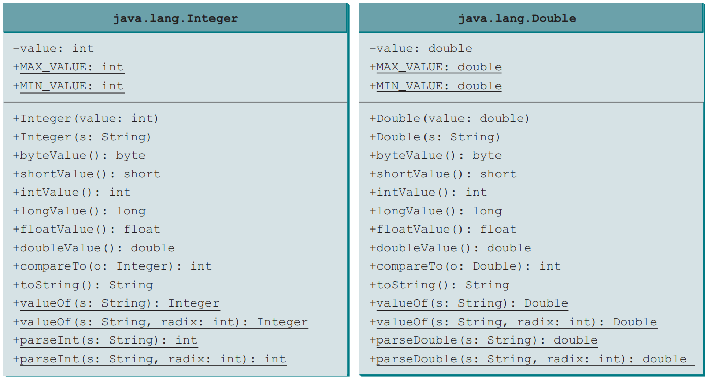
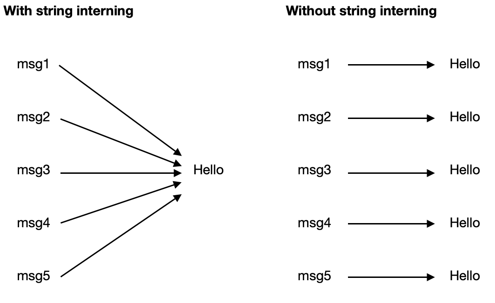

<!--  -->


# Chapter 10: <br> Object-Oriented Thinking <br> Part II

---

## 10.7. Processing <br> Primitive Data Type Values as Objects

---

- **A primitive-type value** is not an object, but it can be converted to an object using a wrapper class.
- **Wrapper classes** are classes that encapsulate primitive data types, allowing them to be treated as objects. Each primitive type has a corresponding wrapper class (e.g., `Integer` for `int`, `Double` for `double`, `Character` for `char`).
- Wrapper classes are part of the Java standard library and provide methods for converting between primitive types and objects, as well as useful constants and methods for manipulation.

---

### Numeric Wrapper Classes

- **Numeric Wrapper Classes**: These classes wrap primitive numeric types, allowing them to be treated as objects.
  - `Byte`: Represents a `byte` value as an object.
  - `Short`: Represents a `short` value as an object.
  - `Integer`: Represents an `int` value as an object.
  - `Long`: Represents a `long` value as an object.
  - `Float`: Represents a `float` value as an object.
  - `Double`: Represents a `double` value as an object.

---

### Useful Features of Wrapper Classes

- **Constants**: Each wrapper class provides constants for the minimum and maximum values of the corresponding primitive type (e.g., `Integer.MIN_VALUE`, `Integer.MAX_VALUE`).
- **Conversion Methods**: Wrapper classes provide methods to convert between primitive types and objects (e.g., `intValue()`, `doubleValue()`, `toString()`).
- **Parsing Methods**: Methods like `parseInt()` and `parseDouble()` allow conversion from strings to primitive types, enabling easy parsing of user input or data from external sources.
- **Comparison Methods**: The `compareTo` method allows comparison between two wrapper objects, returning `1`, `0`, or `-1` based on their relative values.

---

### Immutable Wrapper Objects

- Wrapper objects are immutable, meaning their state cannot be changed after creation. This ensures that once a wrapper object is created, its value remains constant throughout its lifetime.

**Example**:

```java
Integer x = Integer.valueOf(5);
System.out.println(x); // Output: 5
x = Integer.valueOf(10); // x now references a new Integer object
System.out.println(x); // Output: 10
```

**Explain**:

- In this example, the `Integer` object `x` is created with a value of `5`. When we assign a new value of `10` to `x`, it references a new `Integer` object, demonstrating immutability. The original object remains unchanged.

---

### Integer and Double Wrapper Classes



---

## 10.8. Automatic Conversion between <br> Primitive Types and Wrapper Class Types

---

- **A primitive-type value** can be automatically converted to an object using a wrapper class, and vice versa, depending on the context.
- This automatic conversion is known as **Autoboxing** and **Unboxing**.
  - **Autoboxing**: The automatic conversion of a primitive type to its corresponding wrapper class object.
  - **Unboxing**: The automatic conversion of a wrapper class object to its corresponding primitive type.

---

**Example**: Autoboxing and Unboxing

```java
Integer x = 5;  // Autoboxing: int to Integer
int y = x;      // Unboxing: Integer to int
```

**Explain**:

- In this example, the primitive `int` value `5` is automatically converted to an `Integer` object through autoboxing.
- Later, the `Integer` object `x` is automatically converted back to an `int` value through unboxing.

---

## 10.9. The BigInteger and BigDecimal Classes

---

### What are BigInteger and BigDecimal?

- BigInteger and BigDecimal classes are used for mathematical operations involving very large integers and high-precision floating-point numbers.
- Both classes are immutable and part of the `java.math` package.

---

### BigInteger

- **BigInteger** is a class that represents integers of arbitrary precision.
- It is used when the range of primitive integer types (like `int` and `long`) is insufficient for the required calculations.
- Common methods include `add()`, `subtract()`, `multiply()`, `divide()`, `mod()`, and `compareTo()`.

---

**Example**: BigInteger Addition

```java
import java.math.BigInteger;
public class BigIntegerExample {
    public static void main(String[] args) {
        BigInteger bigInt1 = new BigInteger("123456789012345678901234567890");
        BigInteger bigInt2 = new BigInteger("987654321098765432109876543210");

        BigInteger sum = bigInt1.add(bigInt2);
        System.out.println("Sum: " + sum);
    }
}
```

**Output**:

```
Sum: 1111111110111111111011111111100
```

---

**Explain**:

- In this example, two `BigInteger` objects are created with very large integer values.
- The `add()` method is used to calculate the sum of these two large integers, demonstrating how `BigInteger` can handle values beyond the limits of primitive types.
- The result is printed, showing the correct sum of the two large integers without any overflow issues.
- This illustrates the utility of `BigInteger` for high-precision arithmetic operations, especially when dealing with large numbers that exceed the range of standard integer types.

---

### BigDecimal

- **BigDecimal** is a class that represents decimal numbers with arbitrary precision.
- It is used for high-precision calculations, especially in financial applications where rounding errors must be avoided.
- Common methods include `add()`, `subtract()`, `multiply()`, `divide()`, `setScale()`, and `compareTo()`.

---

**Example**: BigDecimal Division

```java
import java.math.BigDecimal;
public class BigDecimalExample {
    public static void main(String[] args) {
        BigDecimal num1 = new BigDecimal("1");
        BigDecimal num2 = new BigDecimal("3");

        // Divide num1 by num2 with precision
        BigDecimal result = num1.divide(num2, 60, BigDecimal.ROUND_HALF_UP);
        System.out.println("Result: " + result);
    }
}
```

**Output**:

```
Result:0.333333333333333333333333333333333333333333333333333333333333
```

---

**Explain**:

- In this example, two `BigDecimal` objects are created to represent the numbers `1` and `3`.
- The `divide()` method is used to divide `num1` by `num2`, specifying a scale of `60` and a rounding mode of `ROUND_HALF_UP`.
- The result is printed, showing the high-precision decimal value of the division operation.
- This illustrates the utility of `BigDecimal` for performing precise arithmetic operations, especially in scenarios where rounding errors could lead to significant inaccuracies, such as in financial calculations.

---

### Tip: Large Factorial Calculation

```java
import java.math.BigInteger;
public class FactorialExample {
    public static void main(String[] args) {
        int n = 60; // Calculate factorial of 60
        BigInteger factorial = BigInteger.ONE;
        for (int i = 2; i <= n; i++) {
            factorial = factorial.multiply(BigInteger.valueOf(i));
        }
        System.out.println("Factorial of " + n + " is: " + factorial);
    }
}
```

**Output**:

```
Factorial of 60 is: 83209871127413901442763411832233643807541726063612459524492
77696409600000000000000000000
```

---

## 10.10. The String Class

---

### The String Class of Java

- The `String` class in Java represents a sequence of characters and is used to handle text data.
- It is part of the `java.lang` package and provides various methods for string manipulation.
- Strings in Java are immutable, meaning once a `String` object is created, its contents cannot be changed. Any modification results in the creation of a new `String` object.
- Common `String` Method: `length()`, `charAt()`, `substring()`, `indexOf()`, `toLowerCase()`, `trim()`, etc.

---

**Example**: Common String Operations

```java
String message = "Welcome to Java";
System.out.println("Length: " + message.length());
System.out.println("Character at index 4: " + message.charAt(4));
System.out.println("Substring (0, 7): " + message.substring(0, 7));
System.out.println("Index of 'Java': " + message.indexOf("Java"));
System.out.println("Lowercase: " + message.toLowerCase());
System.out.println("Trimmed: " + message.trim());
```

**Output**:

```
Length: 16
Character at index 4: o
Substring (0, 7): Welcome
Index of 'Java': 11
Lowercase: welcome to java
Trimmed: Welcome to Java
```

---

### Immutable String

- Strings in Java are **immutable**, meaning once a `String` object is created, its contents cannot be changed. Any operation that appears to modify a string actually creates a new `String` object.

**Example**:

```java
String str1 = "Hello";
String str2 = str1.concat(" World"); // Creates a new String object
System.out.println(str1); // Output: Hello
System.out.println(str2); // Output: Hello World
```

**Output**:

```
Hello
Hello World
```

---

### Interned Strings

- **Interned Strings** are strings that are stored in a special memory area called the "string pool" to optimize memory usage.
- When a string is interned, it is stored in the pool, and any subsequent creation of a string with the same content will refer to the same interned string rather than creating a new object.
- This helps save memory and improves performance when dealing with repeated string literals.

**Example**:

```java
String str1 = "Hello";
String str2 = "Hello"; // str1 and str2 refer to the same interned string
System.out.println(str1 == str2); // Output: true
```

---



---

### Replacing Strings

- `replace(char oldChar, char newChar)`: Returns a new string resulting from replacing all occurrences of `oldChar` with `newChar`.

Example: Replacing characters in a string.

```java
String s = "Hello World";
String replaced = s.replace('o', 'a');
System.out.println(replaced); // Output: Hella Warld
```

**Output**:

```
Hella Warld
```

---

### Splitting Strings

- `split(String regex)`: Splits this string around matches of the given regular expression and returns an array of strings.

**Example**: Splitting a string.

```java
String s = "Hello,World,Java";
String[] parts = s.split(",");
for (String part : parts) {
    System.out.println(part);
}
```

**Output**:

```
Hello
World
Java
```

---

### TIP: Regular Expressions (Regex)

- **Regular expressions** are powerful tools for pattern matching and manipulation in strings.
- They allow you to search, replace, and validate strings based on specific patterns.
- Java provides the `java.util.regex` package for working with regular expressions.
- Common regex operations include:
  - `matches()`: Checks if the entire string matches a regex pattern.
  - `find()`: Searches for occurrences of a pattern within a string.
  - `replaceAll()`: Replaces all occurrences of a pattern with a specified replacement.

---

### Basic Regex Syntax

- `.`: Matches any character except a newline.
- `*`: Matches zero or more occurrences of the preceding element.
- `+`: Matches one or more occurrences of the preceding element.
- `?`: Matches zero or one occurrence of the preceding element.
- `[abc]`: Matches any single character in the brackets (a, b, or c).
- `[^abc]`: Matches any single character not in the brackets (not a, b, or c).
- `[a-z]`: Matches any single character in the range from a to z.
- `[0-9]`: Matches any single digit from 0 to 9.
- `\\d`: Matches any digit (equivalent to `[0-9]`).
- `\\D`: Matches any non-digit character (equivalent to `[^0-9]`).

---

- `\\w`: Matches any word character (alphanumeric and underscore).
- `\\W`: Matches any non-word character (not alphanumeric or underscore).
- `\\s`: Matches any whitespace character (space, tab, newline).
- `\\S`: Matches any non-whitespace character.
- `^`: Matches the start of a string.
- `$`: Matches the end of a string.
- `|`: Acts as a logical OR operator in regex patterns.
- `{n}`: Matches exactly `n` occurrences of the preceding element.
- `{n,}`: Matches `n` or more occurrences of the preceding element.
- `{n,m}`: Matches between `n` and `m` occurrences of the preceding element.
- `(abc)`: Groups the characters `abc` together, allowing you to apply quantifiers or refer to the group later.

---

- `(?i)`: Makes the regex case-insensitive.
- `(?s)`: Allows the dot `.` to match newline characters, enabling multi-line matching.
- `(?m)`: Enables multi-line mode, allowing `^` and `$` to match the start and end of each line, respectively.
- `(?x)`: Allows whitespace and comments in the regex pattern for better readability.
- `(?<name>...)`: Creates a named capturing group, allowing you to refer to the group by name in the replacement string or when accessing matches.
- `(?#comment)`: Adds a comment in the regex pattern, which is ignored during matching.
- `(?=...)`: Positive lookahead assertion, checks if a pattern follows without including it in the match.
- `(?!...)`: Negative lookahead assertion, checks if a pattern does not follow without including it in the match.

**More Regex**: https://regex101.com

---

### Matching Strings with Regex

- `matches(String regex)`: Checks if the entire string matches the given regex pattern.

Example: Matching a string against a regex pattern.

```java
String s = "Hello123";
boolean isMatch = s.matches("[A-Za-z]+\\d+");
System.out.println(isMatch); // Output: true
```

**Output**:

```
true
```

---

### Find Strings with Regex

- `find(String regex)`: Searches for occurrences of the regex pattern within the string.

**Example**: Finding a substring that matches a regex pattern.

```java
String s = "Hello123 World456";
String[] numbers = s.split("\\D+");
for (String num : numbers) {
    if (!num.isEmpty()) {
        System.out.println("Found: " + num);
    }
}
```

**Output**:

```
Found: 123
Found: 456
```

---

### Replace Strings with Regex

- `replaceAll(String regex, String replacement)`: Replaces all occurrences of the regex pattern with the specified replacement string.

**Example**: Replacing all digits in a string with asterisks.

```java
String s = "Hello123 World456";
String replaced = s.replaceAll("\\d", "*");
System.out.println(replaced); // Output: Hello*** World***
```

**Output**:

```
Hello*** World***
```

---

### Conversion between Strings and Arrays

- `toCharArray()`: Converts a string to a character array.

```java
String s = "Hello";
char[] chars = s.toCharArray();
System.out.println(Arrays.toString(chars)); // Output: [H, e, l, l, o]
```

- `String.valueOf(char[] chars)`: Converts a character array to a string.

```java
char[] chars = {'H', 'e', 'l', 'l', 'o'};
String s = String.valueOf(chars);
System.out.println(s); // Output: Hello
```

---

### Converting Characters and Numeric Values to Strings

- `Character.toString(char c)`: Converts a character to a string.

```java
char c = 'A';
String charString = Character.toString(c);
System.out.println(charString); // Output: A
```

- `String.valueOf(int i)`: Converts an integer to a string.
- `String.valueOf(double d)`: Converts a double to a string.

```java
int num = 42;
String numString = String.valueOf(num);
System.out.println(numString); // Output: 42
double pi = 3.14;
String piString = String.valueOf(pi);
System.out.println(piString); // Output: 3.14
```

---

### Formatting Strings

- `String.format(String format, Object... args)`: Formats a string using specified format specifiers.

```java
String formatted = String.format("Hello %s, your score is %.2f", "Alice", 95.5);
System.out.println(formatted); // Output: Hello Alice, your score is 95.50
```

- `printf(String format, Object... args)`: Prints a formatted string to the console.

```java
System.out.printf("Hello %s, your score is %.2f%n", "Alice", 95.5);
// Output: Hello Alice, your score is 95.50
```

---

## 10.11. The StringBuilder and StringBuffer Classes

---

### The StringBuilder and StringBuffer Classes

- `StringBuilder` and `StringBuffer` are mutable sequences of characters. They are used for creating and manipulating dynamic string content.
- Key differences:
  - `StringBuilder` is faster and not synchronized, making it suitable for single-threaded applications.
  - `StringBuffer` is synchronized, making it thread-safe and suitable for multi-threaded applications.

---

### Performance Comparison

```java
int n = 1_000_000;
long t1 = System.currentTimeMillis();
StringBuilder sb = new StringBuilder();
for (int i = 0; i < n; i++) sb.append("a");
System.out.println("StringBuilder: " + (System.currentTimeMillis() - t1) + "ms");

long t2 = System.currentTimeMillis();
StringBuffer sbf = new StringBuffer();
for (int i = 0; i < n; i++) sbf.append("a");
System.out.println("StringBuffer: " + (System.currentTimeMillis() - t2) + "ms");
```

**Output**:

```
StringBuilder: 9ms
StringBuffer: 22ms
```

---

### Modifying Strings in the StringBuilder

- `StringBuilder` allows for efficient string manipulation without creating new string objects. It provides methods to append, insert, delete, replace, and reverse characters in the sequence.

**Example**: Modifying a StringBuilder

```java
StringBuilder sb = new StringBuilder("Hello");
sb.append(" World");
sb.insert(5, ",");
sb.delete(5, 6);
sb.replace(5, 11, " Java");
sb.reverse();
System.out.println(sb.toString()); // Output: avaJ olleH
```

---

### `toString()`, `capacity()`, `length()`, `setLength()`, and `charAt()`

- `StringBuilder` provides methods to convert the builder to a `String`, check its capacity, length, set the length, and access characters at specific indices.

**Example**: StringBuilder Methods

```java
StringBuilder sb = new StringBuilder(50);
System.out.println("Capacity: " + sb.capacity()); // Output: 50
sb.append("Hello");
System.out.println("Length: " + sb.length()); // Output: 5
```

---

### TIP: Chain Methods

- A class that provides methods to modify its state can allow method chaining, enabling multiple method calls in a single statement.

**Example**: Chaining Methods with StringBuilder

```java
StringBuilder sb = new StringBuilder("Hello")
    .append(" World")
    .insert(5, ",")
    .replace(5, 11, " Java")
    .reverse();
System.out.println(sb.toString());
```

**Output**:

```
avaJ ,olleH
```

---

## End of the Chapter

<!-- style: |

    section {
    font-family: Nokora;
    }

    h1 {
    color: black;
    font-size: 50px;
    text-align: center;
    }
    h2 {
    font-size: 40px;
    text-align: center;
    }
    h3 {
    font-size: 30px;
    position: absolute;
    top: 60px;
    }
    h3::before {
    content: "👉"; /* Unicode for bullet */
    }
    h4 {
    font-size: 26px;
    }
    h5 {
    font-size: 26px;
    }
    h6 {
    font-size: 26px;
    }
    p {
    font-size: 26px;
    }
    li {
    font-size: 26px;
    }
    table {
    margin: auto;
    font-size: 20px;
    }
    img {
    display: block;
    margin: 0 auto;
    }
    section::after {
    font-size: 20px;
    }
    ul {
    list-style-type: "✨";
    padding-left: 20px;
    margin-left: 20px;
    }

-->
