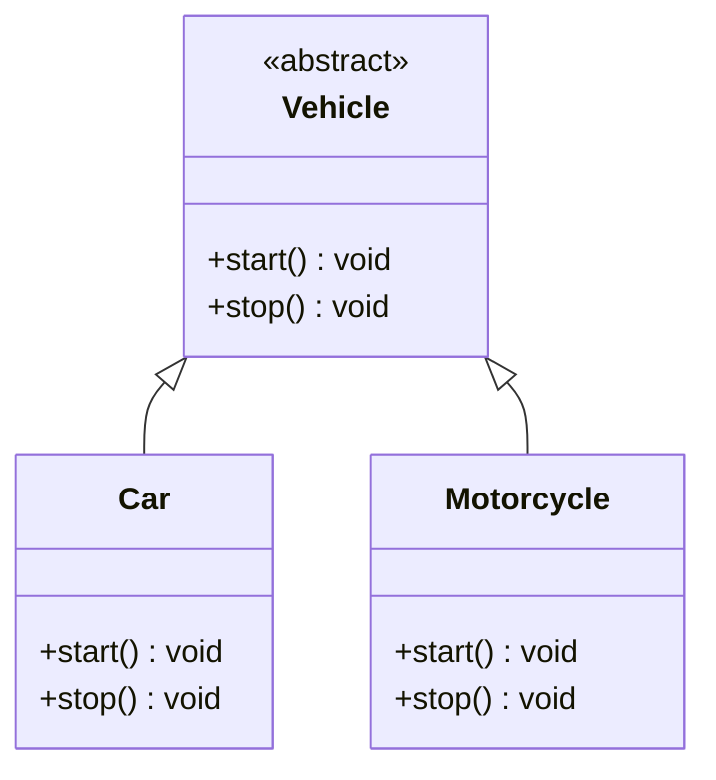

```mermaid

classDiagram
    class Vehicle {
        <<abstract>>
        +start() void
        +stop() void
    }

    class Car {
        +start() void
        +stop() void
    }

    class Motorcycle {
        +start() void
        +stop() void
    }

    Vehicle <|-- Car
    Vehicle <|-- Motorcycle


```
